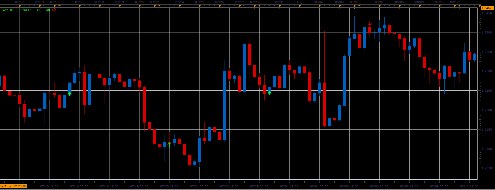

# Day&Time signal indicator

> Source: https://fxcodebase.com/code/viewtopic.php?f=17&t=36114  
> Forum: 17 · Topic 36114 · 10 post(s)

---

## Day&Time signal indicator

**Alexander.Gettinger** · Tue Apr 30, 2013 5:03 pm

The indicator produces a signal at the specified time and day of the week.
UP - if current close < previous day open,
DN - if current close > previous day open.

 

Download:

 [DayTime.lua](files/60731/DayTime.lua)

The indicator was revised and updated

---

## Re: Day&Time signal indicator

**Alexander.Gettinger** · Thu Jun 13, 2013 11:31 am

MQL4 version of this indicator: [viewtopic.php?f=38&t=40837](https://fxcodebase.com/code/viewtopic.php?f=38&t=40837)

---

## Re: Day&Time signal indicator

**easytrading** · Sun Dec 21, 2014 1:34 am

hello Development Team,

is it posible to keep the indicator continuing giving signals each time the candle closes please, with out need to setting it every hour until the end of that day?

your help is much appreciated.

---

## Re: Day&Time signal indicator

**Apprentice** · Sun Dec 21, 2014 4:05 am

U can use Time Until End indicator and similar ones.
[viewtopic.php?f=17&t=61398&p=96819&hilit=candle+close#p96819](https://fxcodebase.com/code/viewtopic.php?f=17&t=61398&p=96819&hilit=candle+close#p96819)
or New Candle Alert Signal
[viewtopic.php?f=29&t=3856](https://fxcodebase.com/code/viewtopic.php?f=29&t=3856)

---

## Re: Day&Time signal indicator

**easytrading** · Sun Dec 21, 2014 6:23 pm

sorry Apprentice, but that is not what i ment !!as you see this indicator is giving signal one time only at a specified hour of a day choosen at the indicator parameters and then it stops giving signals unless u choose another hour to activated again.my request please, is to put an option in the parameters to keep the indicator giving signals when the bar closes each hour.your help is much apprecited.

---

## Re: Day&Time signal indicator

**Apprentice** · Tue Dec 23, 2014 3:27 am

What aboutTime Until End indicator or / and Time Until End indicator?
You'll find links for them in my previous post

---

## Re: Day&Time signal indicator

**Coondawg71** · Tue Jun 16, 2015 4:14 pm

Can we please request "minute" parameter added to this indicator?

Fox example:

The indicator now offers a directional arrow on just the hour. I would like to have the ability to know how a particular time frame closes within this hour such as the first five minute price bar with the hour of 08:00. So I need an arrow on the closing of 08:05

I tried myself to no avail.

Thanks,

sjc

---

## Re: Day&Time signal indicator

**Apprentice** · Wed Jun 17, 2015 2:28 am

Day of the week is irrelevant?

---

## Re: Day&Time signal indicator

**Coondawg71** · Wed Jun 17, 2015 5:56 am

Good question, sorry, could have been more specific.

The point of the option was to see how the trading pressure within the first five minute price bar of each hour influences the outcome of the whole hourly bar throughout the day. So yes, day is relevant in that manner. I was going to test it in current form first. But if you are able to amend the current script to simply include all trading days for each time frame would be a real time saver and surely a load off the computer.

In all, we would want:

Days: Monday through Friday
Hours: 00:00-23:00 (All)
Minute(time frame): 00:00-00:55 (within the hour)

Hope that makes sense.

Thanks!

sjc

---

## Re: Day&Time signal indicator

**Apprentice** · Tue Jul 04, 2017 9:21 am

The indicator was revised and updated.
