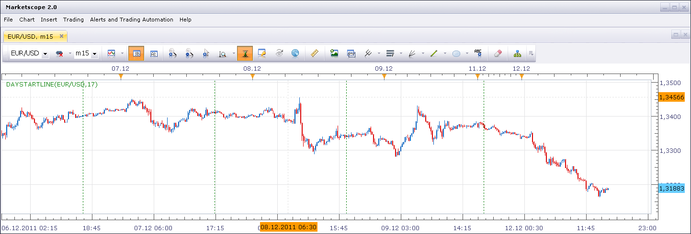
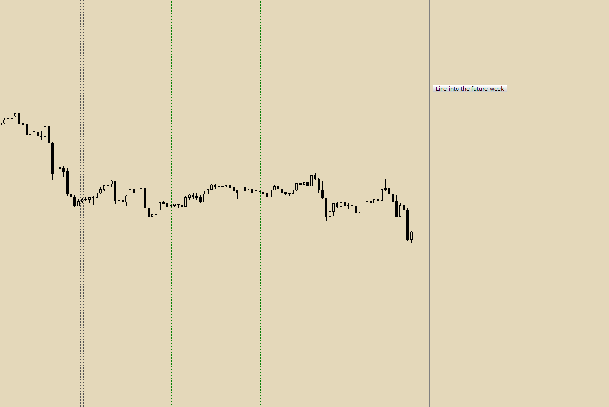

# Daystart vertical line

> Source: https://fxcodebase.com/code/viewtopic.php?f=17&t=9511  
> Forum: 17 · Topic 9511 · 26 post(s)

---

## Daystart vertical line

**Nikolay.Gekht** · Mon Dec 12, 2011 3:51 pm

The simple indicator which just draws a vertical line at the beginning of chose hour (17:00EST by default).

 



Download:

 [daystartline.lua](files/20433/daystartline.lua)

```lua
function Init()
    indicator:name("Day Start Line");
    indicator:description("The indicator draws a vertical line at the specified time");
    indicator:requiredSource(core.Bar);
    indicator:type(core.Indicator);

    indicator.parameters:addGroup("Parameters");
    indicator.parameters:addInteger("hour", "Hour (EST)", "Hour at start of which the line must be drawn", 17, 0, 23);
    indicator.parameters:addGroup("Style");
    indicator.parameters:addColor("clr", "Color", "", core.rgb(0, 127, 0));
    indicator.parameters:addInteger("width", "Width", "", 1, 1, 5);
    indicator.parameters:addInteger("style", "Style", "", core.LINE_DOT);
    indicator.parameters:setFlag("style", core.FLAG_LEVEL_STYLE);
end

local source;
local dummy, host;
local hour, clr, width, style;
local canwork, error;

function Prepare(onlyname)
    source = instance.source;
    clr = instance.parameters.clr;
    width = instance.parameters.width;
    style = instance.parameters.style;
    hour = instance.parameters.hour;
    host = core.host;

    local s, e = core.getcandle(source:barSize(), 0, host:execute("getTradingDayOffset"), 0);
    canwork = not(math.floor(e - s) >= 1);

    if not canwork then
        errtext = "The indicator must be applied on intraday charts";
        if onlyname then
            assert(false, errtext);
        else
            core.host:execute("setStatus", "error:" .. errtext);
        end
    end

    local name;
    name = profile:id() .. "(" .. source:name() .. "," .. hour .. ")";
    instance:name(name);

    if onlyname then
        return ;
    end

    dummy = instance:addStream("D", core.Line, name .. ".D", "D", clr, 0);
end

local last_s = nil;
local id = 0;

function Update(period, mode)
    if not canwork then
        return ;
    end

    -- calculation restarted
    if period == 0 then
        host:execute("removeAll");
        id = 0;
    end

    local s = source:serial(period);

    if last_s ~= nil and s == last_s then
        return ;
    end

    last_s = s;

    local date = source:date(period);
    local t = core.dateToTable(date);
    if t.min == 0 and t.hour == hour then
        id = id + 1;
        host:execute("drawLine", id, date, 0, date, 100000, clr, style, width, core.formatDate(host:execute("convertTime", core.TZ_EST, core.TZ_TS, date)));
    end
end
```

---

## Re: Daystart vertical line

**mfoste1** · Mon Dec 12, 2011 4:53 pm

as borat would say...."Very Nice!"

thanks nikolay

---

## Re: Daystart vertical line

**nazaar** · Mon Dec 12, 2011 5:23 pm

Brilliant, thank you!

---

## Re: Daystart vertical line

**nazaar** · Thu Dec 15, 2011 1:27 pm

thank you again for making this simple yet very **useful**tool.

Is it possible, on the daily chart, add the option to place a vertical line on the 1st of each month?

---

## Re: Daystart vertical line

**santanae** · Mon Dec 19, 2011 9:46 am

Love this Indicator thanks

 I just started learning how to create (code) indicators and going through the docs and downloaded the tools to code.I wanted to ask you if there is away to create an indicator to just draw a horizontal line at exactly the close of each trading day (17:00 EST). I'm trying to work on something and I wanted to see if there was a way to do that.
Any assistance is apprecaited

---

## Re: X bars back

**nazaar** · Wed Jan 11, 2012 12:30 pm

Thanks again for the useful and very helpful indicator.

Taking the concept of this indicator I was wondering if you could create another indicator similar to it?

I am looking for an indicator that can count and indicate X bars back. For example, identify the 9th or 13th or 21st bar back. The identifying mark can be a vertical line running through the bar only (instead of a full vertical line) or an symbol place by above or below the X bar back.

thanks in advance.

---

## Re: Daystart vertical line

**Apprentice** · Wed Jan 11, 2012 4:41 pm

Your request has been added to the developmental cue.

---

## Re: Daystart vertical line

**Apprentice** · Sat Jan 14, 2012 6:51 am

Requested can be found here.
[viewtopic.php?f=17&t=11079&p=23420#p23420](https://fxcodebase.com/code/viewtopic.php?f=17&t=11079&p=23420#p23420)

---

## Re: WEEK START LINE - vertical line

**nazaar** · Tue Feb 28, 2012 1:18 pm

Hello,

The **daystarline**time divider has served very well on the lower time line charts but it produces to many lines to frequently on the higher time lines.

could you please add a new time divider indicator similar to the daystartline?

Please add a **week start line** tool. The weekly start would be Sunday 17:00 or 18:00.

thanks in advance.

---

## Re: Daystart vertical line

**Apprentice** · Wed Feb 29, 2012 5:14 am

Your request is added to the development list.

---

## Re: Daystart vertical line

**FxGump** · Mon Sep 10, 2012 6:16 am

I am also interested in the week start line. Is it now available?

---

## Re: Daystart vertical line

**Surasit** · Wed Nov 07, 2012 8:27 pm

Hello,
Is there any week start line available here?
Thanks in advance.

---

## Re: Daystart vertical line

**Apprentice** · Thu Nov 08, 2012 9:47 am

Try My version
[viewtopic.php?f=17&t=11079&p=43962#p43962](https://fxcodebase.com/code/viewtopic.php?f=17&t=11079&p=43962#p43962)

---

## Re: Daystart vertical line

**algotime** · Wed May 11, 2016 9:09 pm

Hello,

Is there a strategy similar to this? What i am looking for is a automated strategy that looks back at the previous days high and day low and on next session open it places entry order (x) amount of pips over high and below the low with a limit, stop, and trailing stop option

For example- eur/usd previous high was 1.1500 and low was 1.1300. At time of close price settled at 1.1435

On the open 5pm est ( maybe have start time interchangeable as asian session is slow typically) the strategy places a buy order at (x) number of pips above the high such as 10 pips (1.1510) and a sell order at (x) number of pips below the low so using 10 pips again (1.1290) once an order gets triggered the opposite order can either stay in place as a reversal is possible or can cancel

This is similar to constant break strategy but uses the previous day and open/close values as its initiation instead of pips

Thanks for any info or development in my search

---

## Re: Daystart vertical line

**Apprentice** · Fri May 13, 2016 1:35 pm

Your request is added to the development list.

---

## Re: Daystart vertical line

**Recursive Trendline** · Tue Aug 29, 2017 8:54 am

Hi Apprentice,

Can we have a mq4 version of the indicator.

Regards,

---

## Re: Daystart vertical line

**Apprentice** · Wed Aug 30, 2017 4:10 am

Your request is added to the development list, Under Id Number 3881
 If someone is interested to do this task, please contact me.

---

## Re: Daystart vertical line

**Alexander.Gettinger** · Tue Sep 05, 2017 11:22 am

MQL4 version of indicator: [viewtopic.php?f=38&t=65056](https://fxcodebase.com/code/viewtopic.php?f=38&t=65056)

---

## Re: Daystart vertical line

**scandisk** · Fri Mar 30, 2018 3:42 pm

Hi Apprentice could you add a line into the future setting or extended lines for day-start.

Thanks

---

## Re: Daystart vertical line

**Apprentice** · Tue Apr 03, 2018 5:01 am

Can you clarify.
Maybe show on the chart example.

---

## Re: Daystart vertical line

**scandisk** · Tue Apr 03, 2018 11:54 am

So I just want a line for the next coming week..

Thanks

 



---

## Re: Daystart vertical line

**Apprentice** · Wed Apr 04, 2018 5:18 am

As we have in DaysWeekSeparator.lua?
[viewtopic.php?f=17&t=11079&p=116236&hilit=week#p116236](https://fxcodebase.com/code/viewtopic.php?f=17&t=11079&p=116236&hilit=week#p116236)

---

## Re: Daystart vertical line

**scandisk** · Wed Apr 04, 2018 11:43 am

> **Apprentice wrote:**
> As we have in DaysWeekSeparator.lua?
> [viewtopic.php?f=17&t=11079&p=116236&hilit=week#p116236](https://fxcodebase.com/code/viewtopic.php?f=17&t=11079&p=116236&hilit=week#p116236)

This doesn't extend into the future??

---

## Re: Daystart vertical line

**Apprentice** · Thu Apr 05, 2018 4:27 am

Your request is added to the development list under Id Number 4099

---

## Re: Daystart vertical line

**Apprentice** · Fri Apr 06, 2018 8:19 am

Try this version.

 [daystartline.lua](files/118506/daystartline.lua)

---

## Re: Daystart vertical line

**chai88888** · Fri Jan 17, 2020 4:44 am

can include in minute thanks
