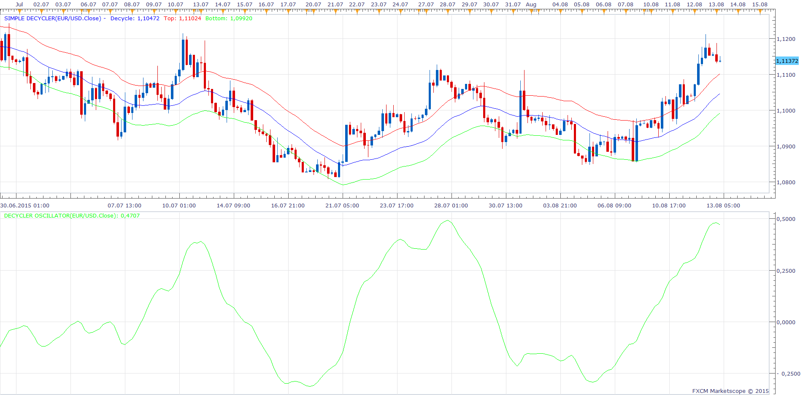

# Decyclers

> Source: https://fxcodebase.com/code/viewtopic.php?f=17&t=62526  
> Forum: 17 · Topic 62526 · 4 post(s)

---

## Decyclers

**Apprentice** · Thu Aug 13, 2015 1:59 am

Based on Article, Decyclers by John F. Ehlers
September 2015 issue of Technical Analysis of Stocks & Commodities

 [Decycler Oscillator.lua](files/101768/Decycler%20Oscillator.lua)

 [Simple Decycler.lua](files/101768/Simple%20Decycler.lua)

The indicator was revised and updated

---

## Re: Decyclers

**tmue2014** · Sun Aug 30, 2015 9:42 pm

Could both of these Decyclers be coded for Mt4 as well please

Thanks in advance

---

## Re: Decyclers

**Alexander.Gettinger** · Mon Aug 31, 2015 11:43 am

> **tmue2014 wrote:**
> Could both of these Decyclers be coded for Mt4 as well please
>
> Thanks in advance

You can find MQL4 indicators here: [viewtopic.php?f=38&t=62615](https://fxcodebase.com/code/viewtopic.php?f=38&t=62615).

---

## Re: Decyclers

**Apprentice** · Wed Jul 19, 2017 7:11 am

The indicator was revised and updated.
