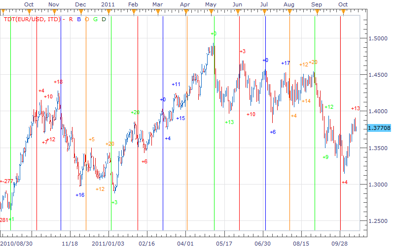

# Delta_Helper

> Source: https://fxcodebase.com/code/viewtopic.php?f=17&t=7353  
> Forum: 17 · Topic 7353 · 7 post(s)

---

## Delta_Helper

**richardtao** · Mon Oct 17, 2011 11:39 pm

The Delta_Helper indicator version 1 is applying to Trading Station II.
This is not a real indicator but a tool to find Delta Phenomenon serial point easier.

The first parameter is "SELC: Select " which defines the time span to draw the vertical line.
The second parameter is "N: Wave Minimum " which defines Minimum Periods to setup a new wave.
The turning points display as the period after the color line.
Because the Delta Phenomenon was restricted by legal issue,
The reference textbook please check:
[https://www.deltasociety.com/content/de ... ll-markets](https://www.deltasociety.com/content/delta-phenomenon-or-hidden-order-all-markets)

 [Delta_Helper.lua](files/16397/Delta_Helper.lua)

The indicator was revised and updated

---

## Problem with vertical lines

**Rectav** · Thu Oct 20, 2011 12:45 pm

Hello Richard,

and thank you for this indicator.

Would it be possible to hide the vertical line. On the daily chart, the vertical lines hide the price.

Regards.

---

## Only the STD selection works

**Rectav** · Fri Oct 21, 2011 12:46 pm

Hello again,

only the STD selection works. The other ones have the following error message:

Error 85: the fifth parameter must be a number.

Cheers.

---

## Re: Delta_Helper

**richardtao** · Mon Oct 24, 2011 12:00 am

hello Rectav,
thanks for using!
the revised as attached.
but you need to select suitable delta interval, otherwise the serial goes too noisy or insufficient.

---

## Re: Delta_Helper

**Rectav** · Tue Oct 25, 2011 2:23 pm

Hello Richard,

and thank you for the improvement.

Regards.

---

## Re: Delta_Helper

**wavebob** · Mon Mar 05, 2012 12:43 am

std does't work very well.

---

## Re: Delta_Helper

**Apprentice** · Thu Mar 23, 2017 2:22 pm

Indicator was revised and updated.
