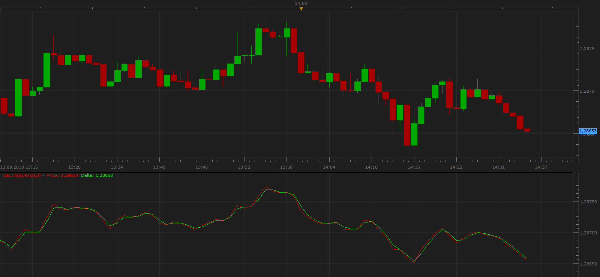
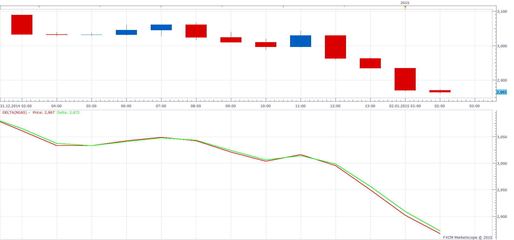

# Delta

> Source: https://fxcodebase.com/code/viewtopic.php?f=17&t=2156  
> Forum: 17 · Topic 2156 · 10 post(s)

---

## Delta

**Apprentice** · Mon Sep 13, 2010 1:36 pm

Based on request.
[viewtopic.php?f=27&t=2153&p=4457&hilit=Delta#p4457](https://fxcodebase.com/code/viewtopic.php?f=27&t=2153&p=4457&hilit=Delta#p4457)

 [Delta.lua](files/4456/Delta.lua)

 [Delta Histogram.lua](files/4456/Delta%20Histogram.lua)

The indicator was revised and updated

---

## Re: Delta

**easytrading** · Tue Dec 30, 2014 12:11 am

hello Apprentice,

this indicator is showing only Delta line ,the price line is not showing .your help is always appriciated.

Best regards.

---

## Re: Delta

**Apprentice** · Fri Jan 02, 2015 2:47 am

As shown in this test, both lines are shown.
Which currency pair you use?

---

## Re: Delta

**easytrading** · Fri Jan 02, 2015 5:05 pm

hello Apprentice,

I am using EUR/JPY and i try it with all time frames, it dosen't show the price line.

---

## Re: Delta

**Apprentice** · Mon Jan 05, 2015 3:34 am

Probably you have too compressed chart.

---

## Re: Delta

**Alexander.Gettinger** · Thu Jan 08, 2015 4:38 pm

MQL4 version of Delta oscillator: [viewtopic.php?f=38&t=61685](https://fxcodebase.com/code/viewtopic.php?f=38&t=61685).

---

## Re: Delta

**mulligan** · Wed Sep 02, 2015 4:17 am

The nature of the indicator obviously puts the Delta and price lines close together. Changing the location from below to on chart greatly helps the visual separation. That said, the JPY pairs are virtually impossible to see the separation either below or on chart. A dot or arrow to show the cross of price and Delta would be very helpful. An alert or strategy to signal the cross would be awesome.

Thanks

---

## Re: Delta

**Apprentice** · Wed Sep 02, 2015 7:10 am

Arrow option added to Delta.lua
Delta Histogram.lua Added

---

## Re: Delta

**Apprentice** · Wed Sep 02, 2015 7:20 am

Strategy can be found here.
[viewtopic.php?f=31&t=62622](https://fxcodebase.com/code/viewtopic.php?f=31&t=62622)

---

## Re: Delta

**Apprentice** · Wed Jul 26, 2017 9:34 am

The indicator was revised and updated.
