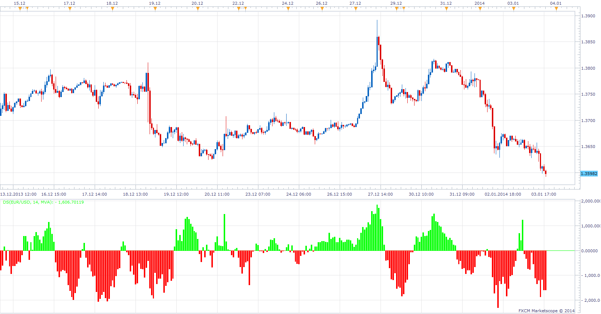

# Demand - Supply

> Source: https://fxcodebase.com/code/viewtopic.php?f=17&t=60169  
> Forum: 17 · Topic 60169 · 6 post(s)

---

## Demand - Supply

**Apprentice** · Fri Jan 03, 2014 12:56 pm

Written according to user specification.
[viewtopic.php?f=27&t=60168](https://fxcodebase.com/code/viewtopic.php?f=27&t=60168)

 [DS.lua](files/91810/DS.lua)

The indicator was revised and updated

---

## Re: Demand - Supply

**Alexander.Gettinger** · Wed Mar 05, 2014 5:15 pm

MQL4 version of Demand - Supply oscillator: [viewtopic.php?f=38&t=60407](https://fxcodebase.com/code/viewtopic.php?f=38&t=60407).

---

## Re: Demand - Supply

**Patrick Sweet** · Thu Mar 06, 2014 9:41 am

Great!
I experience a problem.
When changing MA methods to SMMA or others, the indie does not work.
It is not consistant in that for example on pound/cad it works with 14 periods smma but for usd/cad it does not (the bars go red, above zero and equally long).

Can you recreate this?

It happens when I load lots of data (weeks of 5m data) and then changed between MA algo methods used.

But when it works I am seeing real value!
patrick

---

## Re: Demand - Supply

**Apprentice** · Thu Mar 06, 2014 11:55 am

If you are using Summarizing as Algorithm Type,
moving average method is irrelevant.

As for the moving average method,
you have to find the best method for your trading approach.

---

## Re: Demand - Supply

**Patrick Sweet** · Thu Mar 06, 2014 1:39 pm

Hi,
Not using accumulating algo, using MA.
here is what I get with SMMA, EMA, WMA...see picture...and not all the time....it happens when I add data (lengthen the time is MS screen .... on the same time frame).

---

## Re: Demand - Supply

**Apprentice** · Sun Jun 18, 2017 12:52 pm

The indicator was revised and updated.
