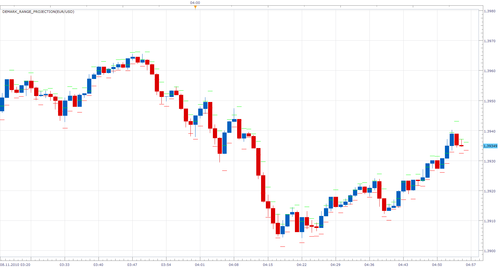

# DeMark Range Projection

> Source: https://fxcodebase.com/code/viewtopic.php?f=17&t=2623  
> Forum: 17 · Topic 2623 · 15 post(s)

---

## DeMark Range Projection

**Apprentice** · Mon Nov 08, 2010 4:56 am

The TD Range Projection, sometimes called TD Pivot Points, provides a range of next session through a simple calculation that uses the open, high, low and close of the previous session.

if close > open then

X = 2H + L + C
Minimum projected = X / 2 - H
Projected max = X / 2 - L

if close < open then
X = H + 2L + C
Minimum projected = X / 2 - H
Projected max = X / 2 - L

else
X = H + L + 2C
Minimum projected = X / 2 - H
Projected max = X / 2 - L

 [DeMark_Range_Projection.lua](files/5904/DeMark_Range_Projection.lua)

One possible application, open long position when a candle closes above period range, and vice versa.

The indicator was revised and updated

---

## Re: DeMark Range Projection

**DS0167** · Mon Nov 08, 2010 5:11 am

the indicator totally freeze my trading station

---

## Re: DeMark Range Projection

**Apprentice** · Mon Nov 08, 2010 5:17 am

This is a new development.
Do you have Pach installed or Newest version of platform.

---

## Re: DeMark Range Projection

**DS0167** · Mon Nov 08, 2010 6:38 am

No... I did not install the patch. Should I ?

---

## Re: DeMark Range Projection

**DS0167** · Mon Nov 08, 2010 6:40 am

Since I have the last version of the trading station...?

---

## Re: DeMark Range Projection

**DS0167** · Mon Nov 08, 2010 2:26 pm

I confirm that the problem is solved with the installation of the very last version. Thank you for your help.

Alexander,

Could it be possible the get this indicator on a daily range projection (instead of candle)?

And after that only the Tom Demark lines will be missing

Kind regards,
and all the best to this great Fxcodebase Team.
DS0167

---

## Re: DeMark Range Projection

**Apprentice** · Mon Nov 08, 2010 4:54 pm

Added to developmental cue.

---

## Re: DeMark Range Projection

**bammbamm** · Tue Nov 09, 2010 1:20 pm

TD Propulsion is a good one to have as well.

Thankyou programmers, your work is greatly appreciated.

---

## Re: DeMark Range Projection

**Apprentice** · Tue Nov 09, 2010 3:15 pm

I agree, collect materials on this indicator,
You can speed up development,
If you have sample code or web reference.

---

## Re: DeMark Range Projection

**bammbamm** · Wed Nov 10, 2010 3:16 pm

TD Propulsion - After a low, the market rallies, pulls back by at least 23.6% (bloomberg terminal use 25%) of that initial rally. Multiply the pullback low by 23.6% (25%) to identify the trigger point and the same low by 47.2% (50%) to identify an exhaustion point. The pullback low must not be lower than the low that started the rally.
ie. Market low 9835, market high 11205 11205-9835=1370 1370 x 23.6%=323
 We need a pullback low to be lower than 11205-323=10882
 Say a pullback low is 10650 then the trigger point is 10650+323=10973 and exhaustion point is
 10650+(2x323)=11296

The opposite for market falls.

In reality, I found that using the low and the closing price of the high bar works better (or high and closing price of the low bar for drops) and sometimes the exhaustion point acts as a second trigger point to a higher exhaustion point. ie in the above example trigger2=11296 and exhaustion point is 11296+323=11619
I use a modified fib from the low to the high close bar (23.6, 38.2, 50) to identify the future pullback low and whichever the pullback low touches, use that to project the price. eg pullback low touches the 38.2, multiply by 38.2% I enter the data into a spreadsheet and manually draw the projection lines.
If an indicator was developed, maybe it should have the option of using low to high or low to high close for uptrend or high to low or high to low close for downtrend etc Hope this helps.

---

## Re: DeMark Range Projection

**DS0167** · Thu Dec 30, 2010 6:16 pm

Gentlemen,

This indicator is freezing my trading station again... for your information

Kind regards,
Danielle

---

## Re: DeMark Range Projection

**Apprentice** · Fri Dec 31, 2010 9:41 am

Danielle,

Does it happen to the Beta or Regular.
In what time frame and for which currency pair.

---

## Re: DeMark Range Projection

**DS0167** · Fri Dec 31, 2010 10:08 am

It is on the Beta, TF 4h and currency GBP/USD

---

## Re: DeMark Range Projection

**Jeffreyvnlk** · Mon Sep 08, 2014 12:16 pm

> **Apprentice wrote:**
>
>
> DeMark_Range_Projection.png
>
>
>
> The TD Range Projection, sometimes called TD Pivot Points, provides a range of next session through a simple calculation that uses the open, high, low and close of the previous session.
>
> if close > open then
>
> X = 2H + L + C
> Minimum projected = X / 2 - H
> Projected max = X / 2 - L
>
> if close < open then
> X = H + 2L + C
> Minimum projected = X / 2 - H
> Projected max = X / 2 - L
>
> else
> X = H + L + 2C
> Minimum projected = X / 2 - H
> Projected max = X / 2 - L
>
>
>
>
> DeMark_Range_Projection.lua
>
>
>
> One possible application, open long position when a candle closes above period range, and vice versa.

Interesting to see Demark and Welles Wilder improved Owen Taylor's concept

---

## Re: DeMark Range Projection

**Apprentice** · Thu Jun 29, 2017 6:05 am

The indicator was revised and updated.
