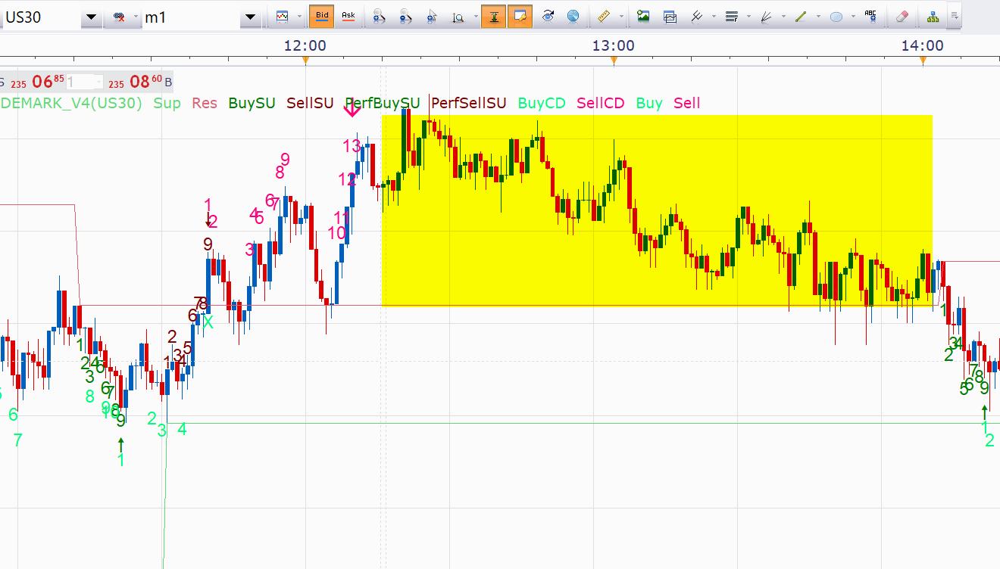
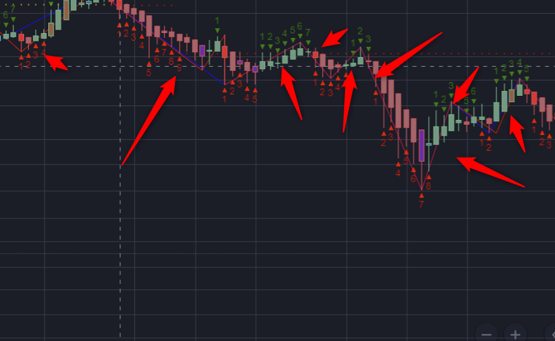

# DeMark Sequential (work in progress)

> Source: https://fxcodebase.com/code/viewtopic.php?f=17&t=646  
> Forum: 17 · Topic 646 · 27 post(s)

---

## DeMark Sequential (work in progress)

**Tortoise** · Wed Apr 14, 2010 7:53 pm

Hi all,

I'm working on a TDSequential indicator based on Jason Perl's book DeMark Indicators (Bloomberg 2008). So-far I've done the TDSetup and the TDST Levels. I am posting the work here for your enjoyment and, hopefully, further development and collaboration.

Please feel free to modify, develop, alter, extend, etc, the code. But please post your improvements and experiences in this forum so we can all benefit.

Notes on the Indicator:
1. I'm not an experienced programmer, so obviously the code is not entirely robust and it's not at all optimised. But that's not the point at the moment - I'm just trying to get something that works.
2. TDSetup places the numbers 1 to 9 above the bars in red (sell setup) or below in green (buy setup). The rules are described in Jason Perl's book mentioned above.
3. The current bar is not included until it closes.
4. A developing setup is numbered, but if the setup is broken then those numbers get deleted (i.e. you might have numbers 1 to 8, then they simply disappear at the close of the next bar: this is because the setup was broken before it completed).
5. The TDST Levels look really messy, I know.
6. TDST levels are re-calculated at the end of each applicable completed setup (i.e. support after a sell setup, resistance after a buy setup). The applicable TDST Level line is then re-drawn at the new level, back to bar #1 of the setup that just completed. Prior to bar 1 of the completed setup, the previous TDST level is shown. That means you can roll back and see what the TDST levels were at some time in the past.
7. Next on the agenda is to identify a 'perfected setup', and then to add the TDCountdown indications.

Okay, that's it. The code is shown below.
Enjoy.
Tortoise.

```lua
-- This indicator is a work in progress.
-- It is being written by the user 'Tortoise' on the FXCodebase.com forum.

-- All users are welcome to use and modify the code, but please would you be kind enough
-- to post your improvements and experiences on the FXCodebase.com forum so that we can
-- all benefit from your experience.

-- The intent is to produce a fully functional 'TDSequential' indicator as described
-- by Jason Perl in the book 'DeMark Indicators', Bloomberg 2008.

-- This is version 1.2, completed on the 15th April 2010
-- So-far the indicator contains 'TDSetup' and 'TDST Levels'
-- TDSetup shows the numbers 1 to 9 of a setup sequence.
-- The current bar is not included until it closes.
-- TDST Levels are calculated at the close of each complete setup (i.e. on the completion
-- of bar 9).  The TDST Level line then jumps to that level, starting at bar 1 (i.e. it is
-- re-painted back 8 bars).  The lines look messy, but they allow you to see what the TDST
-- Levels were during each Setup sequence in the past.

-- Next job is to identify a Perfected Setup, then to add TD Countdown.

function Init()
    indicator:name("Tortoise's TDSetup with TDST");
    indicator:description("TD Setup & TDST based on Jason Perl's Book");
    indicator:requiredSource(core.Bar);
    indicator:type(core.Indicator);
    indicator.parameters:addInteger("Lookback", "No. of Bars to Look Back", "No. of Bars to Look Back", 4, 1, 25);
    indicator.parameters:addColor("BuySU_color", "Color of Buy Setup", "Color of Buy Setup", core.rgb(0, 127, 0));
    indicator.parameters:addColor("SellSU_color", "Color of Sell Setup", "Color of Sell Setup", core.rgb(127, 0, 0));
    indicator.parameters:addColor("TDSTSup_color", "Color of TDST Support", "Color of TDST Support", core.rgb(80, 200, 100));
    indicator.parameters:addColor("TDSTRes_color", "Color of TDST Resistance", "Color of TDST Resistance", core.rgb(200, 80, 100));
end

-- Parameters block
local first = 3;
local source = nil;

-- Streams block
local BuySU, SellSU = nil, nil;

-- Routine
function Prepare()
    source = instance.source;
    first = source:first();
    lookback = instance.parameters.Lookback;
    BuySUCount, SellSUCount = 0, 0;
    TDSTSupVal, TDSTResVal = 0, 0;
    InBuySU, InSellSU, BuySUComplete, SellSUComplete = false, false, false, false;
    LastCompleteBuySU, LastCompleteSellSU = 0, 0;
    BuyBookmark, SellBookmark = 1, 2;
    local name = profile:id() .. "(" .. source:name() .. ")";
    instance:name(name);
    BuySU = instance:createTextOutput ("BuySetup", "BuySetup", "Arial", 10, core.H_Center, core.V_Bottom, instance.parameters.BuySU_color, 0);
    SellSU = instance:createTextOutput ("SellSetup", "SellSetup", "Arial", 10, core.H_Center, core.V_Top, instance.parameters.SellSU_color, 0);
    TDSTSup = instance:addStream ("Sup", core.Line, "TDST Support Line", "Sup", instance.parameters.TDSTSup_color, first);
    TDSTRes = instance:addStream ("Res", core.Line, "TDST Resistance Line", "Res", instance.parameters.TDSTRes_color, first);
end

function Update(period)
    if period > lookback and period < source:size() - 1 and source:hasData(period) then
        if InBuySU == true and BuySUCount < 9 then
        -- we're currently in an uncompleted prospective TD Buy Setup.
            if source.close[period] < source.close[period - lookback] then
            -- the setup remains intact
                BuySUCount = BuySUCount + 1;
                BuySU:set(period, source.low[period], BuySUCount);
                if BuySUCount == 9 then
                    -- The TD Buy Setup has just completed.
                    BuySUComplete = true;
                    InBuySU = false;
                    -- calculate the new TDST Resistance level.
                    TDSTResVal = math.max(source.high[period - 8], source.high[period - 7], source.high[period - 6], source.high[period - 5]);
                    -- draw the new TDST Resistance level back to bar #1 of the TDSetup.
                    core.drawLine(TDSTRes, core.range(period - 8, period), TDSTResVal, period - 8, TDSTResVal, period);       
                end
            else
            -- the setup has been broken
                for a = 1, BuySUCount, 1 do
                -- clear away the existing setup numbers
                    BuySU:set(period - a, source.low[period - a], " ");
                end
                -- reset the TD Buy Setup tracking variables
                InBuySU, BuySUCount = false, 0;
            end
        elseif InSellSU == true and SellSUCount < 9 then
        -- we're currently in an uncompleted prospective TD Sell Setup.
            if source.close[period] > source.close[period - lookback] then
            -- the setup remains intact
                SellSUCount = SellSUCount + 1;
                SellSU:set(period, source.high[period], SellSUCount);
                if SellSUCount == 9 then
                    -- The TD Sell Setup has just completed.
                    SellSUComplete = true;
                    InSellSU = false;
                    -- calculate a new TDST Support level.
                    TDSTSupVal = math.min(source.low[period - 8], source.low[period - 7], source.low[period - 6], source.low[period - 5]);
                    -- draw the new TDST Support level back to bar #1 of the TDSetup.
                    core.drawLine(TDSTSup, core.range(period - 8, period), TDSTSupVal, period - 8, TDSTSupVal, period);       
                end
            else
            -- the setup has been broken
                for a = 1, SellSUCount, 1 do
                -- clear away the existing setup numbers
                    SellSU:set(period - a, source.high[period - a], " ");
                end
                -- reset the TD Buy Setup tracking variables
                InSellSU, SellSUCount = false, 0;
            end
        end

        if InBuySU == false and InSellSU == false then
            -- we're not currently in any possible TD Setup.  Check whether one is just starting.
            if source.close[period - 1] > source.close[period - 1 - lookback] and source.close[period] < source.close[period - lookback] then
            -- a Bearish TD Price Flip has occurred.  This is bar 1 of a possible TD Buy Setup.
                InBuySU, BuySUComplete = true, false;
                BuySUCount, SellSUCount = 1, 0;
                BuySU:set(period, source.low[period], BuySUCount);
            elseif source.close[period - 1] < source.close[period - 1 - lookback] and source.close[period] > source.close[period - lookback] then
            -- a Bullish TD Price Flip has occurred.  This is bar 1 of a possible TD Sell Setup.
                InSellSU, SellSUComplete = true, false;
                SellSUCount, BuySUCount = 1, 0;
                SellSU:set(period, source.high[period], SellSUCount);
            end
        end
    -- extend the existing TDST Level lines up to the current bar.
    core.drawLine(TDSTRes, core.range(period - 1, period), TDSTResVal, period - 1, TDSTResVal, period);       
    core.drawLine(TDSTSup, core.range(period - 1, period), TDSTSupVal, period - 1, TDSTSupVal, period);       
    end
end
```

MT4 / MQ4 version
[viewtopic.php?f=38&t=64473&p=111135#p111135](https://fxcodebase.com/code/viewtopic.php?f=38&t=64473&p=111135#p111135)

---

## Re: DeMark Sequential (work in progress)

**Gidien** · Fri Apr 16, 2010 1:00 am

Hi Tortoise,

i add the perfect Setup to your indicator. Please verify, if this my correct understanding of the perfect setup.

 [DEMARK.lua](files/1194/DEMARK.lua)

---

## Re: DeMark Sequential (work in progress)

**Gidien** · Fri Apr 16, 2010 3:39 am

Next Version with TD Countdown.

Hope i unsterstand the Countdown correct.
A Countdown ist start , if perfect buy or sell setup occur.
A buy Countdown stops, if a new perfect sell setup occur and reverse for sell countdown.

please check the code and let me know.

 [DEMARK_V1.lua](files/1200/DEMARK_V1.lua)

---

## Version 1.3 with Setup Perfection

**Tortoise** · Mon Apr 19, 2010 5:55 am

> **Gidien wrote:**
> Hi Tortoise,
>
> i add the perfect Setup to your indicator. Please verify, if this my correct understanding of the perfect setup.
>
>
>
>
> DEMARK.lua

Hey Gidien. Nice work, very fast too!

Your understanding is correct, except that the setup can be perfected later. It doesn't just have to be perfected on count 9. In Jason Perl's book it's unclear whether you ever stop waiting for a perfection.

I've modified your code, which I've now called version 1.3, so that it keeps waiting until perfection and then shows an arrow. That is sometimes confusing because an arrow pops up for no apparent reason quite a long time after the setup was completed, so I have added a wait limit which the user can change. In the default setting, if perfection still has not occurred after 13 more bars then it stops looking.

I had a quick look at your countdown too. It looks great! Thanks for that. I'll have a closer look with Jason Perl's book in hand later (I'm still getting to know the indicators myself). Aber jetzt ist Feierabend.

Best Regards.

```lua
--[[
   This indicator is a work in progress.
   It is a collaborative effort being written by users on the FXCodebase.com forum,
   based on chapter 1 of Jason Perl's book 'DeMark Indicators' (Bloomberg 2008).

   All users are welcome to use and modify the code, but please would you be kind enough
   to post your improvements and experiences on the FXCodebase.com forum so that we can
   all benefit from your experience.

   TRADEMARK NOTE:  All the DeMark indicator names containing "TD" are registered trademarks.
   Would users modifying the code please be careful to avoid using these trademarks, unless you
   have written permission from Market Studies or Thomas DeMark.
   Our intent is to use the ~logic~ behind Tom DeMark's indicators.
   There's no need to use the same indicator names.  After all, we might have made some mistakes...

   This is version 1.3, completed on the 19th of April 2010
   Version 1.2 was the first shared version.  It contained the 1-9 setup count and setup trend levels.
   Version 1.3 includes an arrow once the setup is 'perfected'.  The user can set how long to wait
   for perfection.
]]

function Init()
    indicator:name("DeMark Sequential Indicator");
    indicator:description("Sequential Indicator based on Chapter 1 of Jason Perl's Book 'DeMark Indicators', Bloomberg 2008");
    indicator:requiredSource(core.Bar);
    indicator:type(core.Indicator);
    indicator.parameters:addInteger("Lookback", "No. of Bars to Look Back", "No. of Bars to Look Back", 4, 1, 25);
    indicator.parameters:addColor("BuySU_color", "Buy Setup Color", "Color of Buy Setup Digits and Arrow", core.rgb(0, 127, 0));
    indicator.parameters:addColor("SellSU_color", "Sell Setup Color", "Color of Sell Setup Digits and Arrow", core.rgb(127, 0, 0));
    indicator.parameters:addColor("TrendSup_color", "Color of Trend Support", "Color of Trend Support", core.rgb(100, 220, 120));
    indicator.parameters:addColor("TrendRes_color", "Color of Trend Resistance", "Color of Trend Resistance", core.rgb(220, 100, 120));
    indicator.parameters:addInteger("Perfection_Wait", "Perfection Wait", "No. of Bars to Keep Looking for Setup Perfection", 13, 0, 300);
end

-- Parameters block
local first = 3;
local source = nil;
local point;
-- Streams block
local BuySU, SellSU = nil, nil;

-- Routine
function Prepare()
    source = instance.source;
    first = source:first();
    lookback = instance.parameters.Lookback;
    waitlimit = instance.parameters.Perfection_Wait;
    point = source:pipSize();
    BuySUCount, SellSUCount = 0, 0;
    TrendSupVal, TrendResVal = 0, 0;
    Bar67Low, Bar67High = 0, 0;
    SellPerfWaitCount, BuyPerfWaitCount = 0, 0;
    InBuySU, InSellSU, BuySUComplete, SellSUComplete = false, false, false, false;
    SeekingBuyPerfection, SeekingSellPerfection = false, false;
    local name = profile:id() .. "(" .. source:name() .. ")";
    instance:name(name);
    BuySU = instance:createTextOutput ("BuySU", "Buy Setup Numbers", "Arial", 10, core.H_Center, core.V_Bottom, instance.parameters.BuySU_color, 0);
    SellSU = instance:createTextOutput ("SellSU", "Sell Setup Numbers", "Arial", 10, core.H_Center, core.V_Top, instance.parameters.SellSU_color, 0);
    TrendSup = instance:addStream ("Sup", core.Line, "Trend Support Line", "Sup", instance.parameters.TrendSup_color, first);
    TrendRes = instance:addStream ("Res", core.Line, "Trend Resistance Line", "Res", instance.parameters.TrendRes_color, first);
    BuyPSU = instance:createTextOutput ("PerfBuySU", "Perfected Buy Setup Arrows", "Wingdings 3", 18, core.H_Center, core.V_Bottom, instance.parameters.BuySU_color, 0);
    SellPSU = instance:createTextOutput ("PerfSellSU", "Perfected Sell Setup Arrows", "Wingdings 3", 18, core.H_Center, core.V_Top, instance.parameters.SellSU_color, 0);
end

function Update(period)
    if period > lookback and period < source:size() - 1 and source:hasData(period) then
        if InBuySU == true and BuySUCount < 9 then
        -- we're currently in an uncompleted prospective buy setup sequence.
            if source.close[period] < source.close[period - lookback] then
            -- the setup remains intact
                BuySUCount = BuySUCount + 1;
                BuySU:set(period, source.low[period], BuySUCount);
                if BuySUCount == 9 then
                    -- The buy setup sequence has just completed.
                    BuySUComplete = true;
                    InBuySU = false;
                    Bar67Low = math.min(source.low[period - 3], source.low[period - 2]);
                    -- calculate the new Trend Resistance level.
                    TrendResVal = math.max(source.high[period - 8], source.high[period - 7], source.high[period - 6], source.high[period - 5], source.high[period - 4], source.high[period - 3]);
                    -- draw the new Trend Resistance level back to bar #1 of the setup sequence.
                    core.drawLine(TrendRes, core.range(period - 8, period), TrendResVal, period - 8, TrendResVal, period);   
                    -- looking for perfect Setup
                    if  (source.low[period] <= Bar67Low) or (source.low[period-1] <= Bar67Low) then
                        BuyPSU:set(period, source.low[period]- 5*point, "\143", "Perfected Buy Setup");
                        SeekingBuyPerfection = false;
                    else
                        SeekingBuyPerfection = true;
                        BuyPerfWaitCount = 0;
                    end
                end
            else
            -- the setup has been broken
                for a = 1, BuySUCount, 1 do
                -- clear away the existing setup numbers
                    BuySU:set(period - a, source.low[period - a], " ");
                end
                -- reset the buy setup tracking variables
                InBuySU, BuySUCount = false, 0;
            end
        elseif InSellSU == true and SellSUCount < 9 then
        -- we're currently in an uncompleted prospective sell setup sequence.
            if source.close[period] > source.close[period - lookback] then
            -- the setup remains intact
                SellSUCount = SellSUCount + 1;
                SellSU:set(period, source.high[period], SellSUCount);
                if SellSUCount == 9 then
                    -- The sell setup sequence has just completed.
                    SellSUComplete = true;
                    InSellSU = false;
                    Bar67High = math.max(source.high[period - 3], source.high[period - 2]);
                    -- calculate a new Trend Support level.
                    TrendSupVal = math.min(source.low[period - 8], source.low[period - 7], source.low[period - 6], source.low[period - 5]);
                    -- draw the new Trend Support level back to bar #1 of the setup sequence.
                    core.drawLine(TrendSup, core.range(period - 8, period), TrendSupVal, period - 8, TrendSupVal, period);
                    -- looking for perfect Setup
                    if  (source.high[period] >= Bar67High) or (source.high[period-1] >= Bar67High) then
                        SellPSU:set(period, source.high[period]+ 5*point, "\144", "Perfected Sell Setup");
                        SeekingSellPerfection = false;
                    else
                        SeekingSellPerfection = true;
                        SellPerfWaitCount = 0;
                    end     
                end
            else
            -- the setup has been broken
                for a = 1, SellSUCount, 1 do
                -- clear away the existing setup numbers
                    SellSU:set(period - a, source.high[period - a], " ");
                end
                -- reset the buy setup tracking variables
                InSellSU, SellSUCount = false, 0;
            end
        end
        if SeekingSellPerfection == true and SellPerfWaitCount <= waitlimit then
        -- a sell setup has recently completed, but it has not been perfected
            if (source.high[period] >= Bar67High) then
            -- setup has just been perfected
                SeekingSellPerfection = false;
                SellPSU:set(period, source.high[period], "\144", "Perfected Sell Setup");
            else
                SellPerfWaitCount = SellPerfWaitCount + 1;
            end
        elseif SeekingBuyPerfection == true and BuyPerfWaitCount <= waitlimit then
        -- a buy setup has recently completed, but it has not been perfected
            if (source.low[period] <= Bar67Low) then
            -- setup has just been perfected
                SeekingBuyPerfection = false;
                BuyPSU:set(period, source.low[period], "\143", "Perfected Buy Setup");
            else
                BuyPerfWaitCount = BuyPerfWaitCount + 1;
            end
        end
        if InBuySU == false and InSellSU == false then
            -- we're not currently in any possible setup sequence.  Check whether one is just starting.
            if source.close[period - 1] > source.close[period - 1 - lookback] and source.close[period] < source.close[period - lookback] then
            -- a bearish price flip has occurred.  This is bar 1 of a possible buy setup sequence.
                InBuySU, InSellSU, BuySUComplete = true, false, false;
                BuySUCount, SellSUCount = 1, 0;
                BuySU:set(period, source.low[period], BuySUCount);
            elseif source.close[period - 1] < source.close[period - 1 - lookback] and source.close[period] > source.close[period - lookback] then
            -- a bullish price flip has occurred.  This is bar 1 of a possible sell setup sequence.
                InSellSU, InBuySU, SellSUComplete = true, false, false;
                SellSUCount, BuySUCount = 1, 0;
                SellSU:set(period, source.high[period], SellSUCount);
            end
        end
    -- extend the existing Trend Level lines up to the current bar.
    core.drawLine(TrendRes, core.range(period - 1, period), TrendResVal, period - 1, TrendResVal, period);       
    core.drawLine(TrendSup, core.range(period - 1, period), TrendSupVal, period - 1, TrendSupVal, period);       
    end
end
```

---

## Version 1.4 with Countdown

**Tortoise** · Wed Apr 21, 2010 2:38 am

> **Gidien wrote:**
> Next Version with TD Countdown.
>
> Hope i unsterstand the Countdown correct.
> A Countdown ist start , if perfect buy or sell setup occur.
> A buy Countdown stops, if a new perfect sell setup occur and reverse for sell countdown.
>
> please check the code and let me know.

Countdown is a bit complicated. It can start any time after a completed setup (perfect or not). The rules for cancelling or re-cycling a countdown are quite complicated so I have only included the most basic ones here: The countdown is cancelled if a setup occurs in the opposite direction (marked with 'X'). Countdown returns to 1 if a setup occurs in the same direction (for programming simplicity).

The code for version 1.4 is shown below. This is more or less a complete basic DeMark sequential indicator. As mentioned above, the real DeMark indicators have a lot of extra, subtle rules. This indicator is very similar to a DeMark sequential indicator, but **it is not a proper TD Sequential indicator**. Please use with caution.

In particular, remember that the purpose of the indicator is to try to predict trend exhaustion (reversal), which means you're trying to pick the top or bottom. This is always going to be a risky business. For best results, use this indicator together with any momentum indicator that you trust. Do **not** enter a trade if the current move clearly still has momentum. This indicator can quite brilliantly pick a top or bottom sometimes, but it can also really stupidly keep telling you to get in against a strong trend.

Enjoy using it, and please post your experiences in this forum for us all to share.

Regards,
Tortoise.

```lua
--[[
   This indicator is a work in progress.
   It is a collaborative effort being written by users on the FXCodebase.com forum,
   based on chapter 1 of Jason Perl's book 'DeMark Indicators' (Bloomberg 2008).

   All users are welcome to use and modify the code, but please would you be kind enough
   to post your improvements and experiences on the FXCodebase.com forum so that we can
   all benefit from your experience.

   TRADEMARK NOTE:  All the DeMark indicator names consisting of "TD" are registered trademarks.
   Would users modifying the code please be careful to avoid using these trademarks, unless you
   have written permission from Market Studies or Thomas DeMark.
   Our intent is to use the ~logic~ behind Tom DeMark's indicators, not necessarily to exactly
   replicate the real DeMark indicators.

   This is version 1.4
   Version 1.2 was the first shared version.  It contained the 1-9 setup count and setup trend levels.
   Version 1.3 included 'perfected' setup.
   Version 1.4 includes the 1-13 countdown.  A completed buy or sell countdown results in a basic
   buy or sell signal.  The countdown is cancelled if a setup completes in the opposite direction,
   and it starts back at 1 if a new setup completes in the same direction.
]]

function Init()
    indicator:name("DeMark Sequential Indicator");
    indicator:description("Sequential Indicator based on Chapter 1 of Jason Perl's Book 'DeMark Indicators', Bloomberg 2008");
    indicator:requiredSource(core.Bar);
    indicator:type(core.Indicator);
    indicator.parameters:addGroup("Options");
    indicator.parameters:addBoolean("ShowPerf", "Show Setup Perfection?", "Whether or not to show arrows on perfected setups.", true);
    indicator.parameters:addBoolean("ShowCDown", "Show Countdown", "Whether of not to show the countdown after a setup.", true);
    indicator.parameters:addInteger("Perfection_Wait", "Perfection Wait", "No. of Bars to Keep Looking for Setup Perfection", 13, 0, 300);
    indicator.parameters:addInteger("Lookback", "Setup Look-Back", "No. of Bars to Look Back in Setup Calculations", 4, 1, 25);
    indicator.parameters:addGroup("Colors");
    indicator.parameters:addColor("BuySU_color", "Buy Setup Color", "Color of Buy Setup Digits and Arrow", core.rgb(0, 127, 0));
    indicator.parameters:addColor("SellSU_color", "Sell Setup Color", "Color of Sell Setup Digits and Arrow", core.rgb(127, 0, 0));
    indicator.parameters:addColor("TrendSup_color", "Color of Trend Support", "Color of Trend Support", core.rgb(100, 220, 120));
    indicator.parameters:addColor("TrendRes_color", "Color of Trend Resistance", "Color of Trend Resistance", core.rgb(220, 100, 120));
    indicator.parameters:addColor("BuyCNT_color", "Color of Buy Countdown", "Color of Buy Countdown", core.rgb(0, 255, 127));
    indicator.parameters:addColor("SellCNT_color", "Color of Sell Countdown", "Color of Sell Countdown", core.rgb(255, 0, 127));
end

-- Parameters block
local first;
local source = nil;
-- Streams block
local BuySU, SellSU = nil, nil;
local bCountdown = 0;
local sCountdown = 0;
local BuyCDTest, SellCDTest = nil, nil;

-- Routine
function Prepare()
    source = instance.source;
    first = source:first();
    lookback = instance.parameters.Lookback;
    waitlimit = instance.parameters.Perfection_Wait;
    showperf = instance.parameters.ShowPerf;
    showcdown = instance.parameters.ShowCDown;
    BuySUCount, SellSUCount = 0, 0;
    TrendSupVal, TrendResVal = 0, 0;
    Bar67Low, Bar67High = 0, 0;
    SellPerfWaitCount, BuyPerfWaitCount = 0, 0;
    InBuySU, InSellSU = false, false;
    SeekingBuyPerfection, SeekingSellPerfection = false, false;
    InBuyCD, InSellCD = false, false;
    BuyDoppelganger, SellDoppelganger = false, false;
    local name = profile:id() .. "(" .. source:name() .. ")";
    instance:name(name);
    BuySU = instance:createTextOutput ("BuySU", "Buy Setup 1 to 9", "Arial", 10, core.H_Center, core.V_Bottom, instance.parameters.BuySU_color, 0);
    SellSU = instance:createTextOutput ("SellSU", "Sell Setup 1 to 9", "Arial", 10, core.H_Center, core.V_Top, instance.parameters.SellSU_color, 0);
    TrendSup = instance:addStream ("Sup", core.Line, "Trend Support Line", "Sup", instance.parameters.TrendSup_color, first);
    TrendRes = instance:addStream ("Res", core.Line, "Trend Resistance Line", "Res", instance.parameters.TrendRes_color, first);
    BuyPSU = instance:createTextOutput ("PerfBuySU", "Perfected Buy Setup Arrows", "Wingdings 3", 12, core.H_Center, core.V_Bottom, instance.parameters.BuySU_color, 0);
    SellPSU = instance:createTextOutput ("PerfSellSU", "Perfected Sell Setup Arrows", "Wingdings 3", 12, core.H_Center, core.V_Top, instance.parameters.SellSU_color, 0);
    BuyCNT = instance:createTextOutput ("BuyCD", "Buy Countdown 1 to 13", "Arial", 10, core.H_Center, core.V_Bottom, instance.parameters.BuyCNT_color, 0);
    SellCNT = instance:createTextOutput ("SellCD", "Sell Countdown 1 to 13", "Arial", 10, core.H_Center, core.V_Top, instance.parameters.SellCNT_color, 0);
    BuyCNTS = instance:createTextOutput ("Buy", "Basic Buy Signal", "Wingdings", 14, core.H_Center, core.V_Bottom, instance.parameters.BuyCNT_color, 0);
    SellCNTS = instance:createTextOutput ("Sell", "Basic Sell Signal", "Wingdings", 14, core.H_Center, core.V_Top, instance.parameters.SellCNT_color, 0);
end

function Update(period)
    if period > lookback and period < source:size() - 1 and source:hasData(period) then
        if InBuySU == true and BuySUCount < 9 then
        -- we're currently in an uncompleted prospective buy setup sequence.
            if source.close[period] < source.close[period - lookback] then
            -- the setup remains intact
                BuySUCount = BuySUCount + 1;
                BuySU:set(period, source.low[period], BuySUCount, "Buy Setup Count 1 to 9");
                if BuySUCount == 9 then
                    -- The buy setup sequence has just completed.
                    InBuySU, InBuyCD = false, true;
                    if InSellCD == true then
                        InSellCD = false;
                        SellCNT:set(period, source.high[period], "X", "Sell Countdown Cancelled");
                    end
                    Bar67Low = math.min(source.low[period - 3], source.low[period - 2]);
                    -- calculate the new Trend Resistance level.
                    TrendResVal = math.max(source.high[period - 8], source.high[period - 7], source.high[period - 6], source.high[period - 5], source.high[period - 4], source.high[period - 3]);
                    -- draw the new Trend Resistance level back to bar #1 of the setup sequence.
                    core.drawLine(TrendRes, core.range(period - 8, period), TrendResVal, period - 8, TrendResVal, period);   
                    -- looking for perfect Setup
                    if showperf == true and  (source.low[period] <= Bar67Low or source.low[period-1] <= Bar67Low) then
                        BuyPSU:set(period, source.low[period], "\010\143", "Perfected Buy Setup");
                        SeekingBuyPerfection = false;
                    elseif showperf == true then
                        SeekingBuyPerfection = true;
                        BuyPerfWaitCount = 0;
                    end
                    -- start countdown?
                    if showcdown == true and source.close[period] <= source.low[period - 2] then
                        bCountdown = 1;
                        BuyCNT:set(period, source.low[period], "\010\010" .. bCountdown, "Buy Countdown 1 to 13");
                        BuyDoppelganger = true;
                    elseif showcdown == true then
                        bCountdown = 0;
                        BuyDoppelganger = false;
                    end
                end
            else
            -- the setup has been broken
                for a = 1, BuySUCount, 1 do
                -- clear away the existing setup numbers
                    BuySU:setNoData(period - a);
                end
                -- reset the buy setup tracking variables
                InBuySU, BuySUCount = false, 0;
            end
        elseif InSellSU == true and SellSUCount < 9 then
        -- we're currently in an uncompleted prospective sell setup sequence.
            if source.close[period] > source.close[period - lookback] then
            -- the setup remains intact
                SellSUCount = SellSUCount + 1;
                SellSU:set(period, source.high[period], SellSUCount, "Sell Setup Count 1 to 9");
                if SellSUCount == 9 then
                    -- The sell setup sequence has just completed.
                    InSellSU, InSellCD = false, true;
                    if InBuyCD == true then
                        InBuyCD = false;
                        BuyCNT:set(period, source.low[period], "X", "Buy Countdown Cancelled");
                    end
                    Bar67High = math.max(source.high[period - 3], source.high[period - 2]);
                    -- calculate a new Trend Support level.
                    TrendSupVal = math.min(source.low[period - 8], source.low[period - 7], source.low[period - 6], source.low[period - 5]);
                    -- draw the new Trend Support level back to bar #1 of the setup sequence.
                    core.drawLine(TrendSup, core.range(period - 8, period), TrendSupVal, period - 8, TrendSupVal, period);
                    -- looking for perfect Setup
                    if showperf == true and (source.high[period] >= Bar67High or source.high[period-1] >= Bar67High) then
                        SellPSU:set(period, source.high[period], "\144\010", "Perfected Sell Setup");
                        SeekingSellPerfection = false;
                    elseif showperf == true then
                        SeekingSellPerfection = true;
                        SellPerfWaitCount = 0;
                    end
                    -- start countdown?
                    if showcdown == true and source.close[period] >= source.high[period - 2] then
                        sCountdown = 1;
                        SellCNT:set(period, source.high[period], sCountdown .. "\010\010", "Sell Countdown 1 to 13");
                        SellDoppelganger = true;
                    elseif showcdown == true then
                        sCountdown = 0;
                        SellDoppelganger = false;
                    end     
                end
            else
            -- the setup has been broken
                for a = 1, SellSUCount, 1 do
                -- clear away the existing setup numbers
                    SellSU:setNoData(period - a);
                end
                -- reset the buy setup tracking variables
                InSellSU, SellSUCount = false, 0;
            end
        end
        if showperf == true and SeekingSellPerfection == true and SellPerfWaitCount <= waitlimit then
        -- a sell setup has recently completed, but it has not been perfected
            if (source.high[period] >= Bar67High) then
            -- setup has just been perfected
                SeekingSellPerfection = false;
                SellPSU:set(period, source.high[period], "\144", "Perfected Sell Setup");
            else
                SellPerfWaitCount = SellPerfWaitCount + 1;
            end
        end
        if showperf == true and SeekingBuyPerfection == true and BuyPerfWaitCount <= waitlimit then
        -- a buy setup has recently completed, but it has not been perfected
            if (source.low[period] <= Bar67Low) then
            -- setup has just been perfected
                SeekingBuyPerfection = false;
                BuyPSU:set(period, source.low[period], "\143", "Perfected Buy Setup");
            else
                BuyPerfWaitCount = BuyPerfWaitCount + 1;
            end
        end
    -- Countdown Calculations
        if showcdown == true and InBuyCD == true and BuyDoppelganger == false then
            if bCountdown < 12 and source.close[period] <= source.low[period - 2] then
                -- countdown.
                bCountdown = bCountdown + 1;
                BuyCNT:set(period, source.low[period], "\010" .. bCountdown, "Buy Countdown 1 to 13");
                if bCountdown == 8 then
                    BuyCDTest = source.close[period];
                end
            elseif bCountdown == 12 and source.close[period] <= source.low[period - 2] and source.low[period] <= BuyCDTest then
                -- we have countdown bar 13:  a completed countdown, which could be used as a buy signal.
                bCountdown = 13;
                InBuyCD = false;
                BuyCNT:set(period, source.low[period], "\010" .. bCountdown, "Buy Countdown 1 to 13");
                BuyCNTS:set(period, source.low[period], "\010\010\225", "Basic Buy Signal");
            elseif bCountdown == 12 and source.close[period] <= source.low[period - 2] then
                -- this WOULD be bar 13 but it's still above bar 8 of the countdown.
                BuyCNT:set(period, source.low[period], "\010+", "Count 13 (buy signal) has been deferred");
            end
        else
            BuyDoppelganger = false;
        end
        if showcdown == true and InSellCD == true and SellDoppelganger == false then
            if sCountdown < 12 and source.close[period] >= source.high[period - 2] then
                -- countdown.
                sCountdown = sCountdown + 1;
                SellCNT:set(period, source.high[period], sCountdown .. "\010", "Sell Countdown 1 to 13");
                if sCountdown == 8 then
                    SellCDTest = source.close[period];
                end
            elseif sCountdown == 12 and source.close[period] >= source.high[period - 2] and source.high[period] >= SellCDTest then
                -- we have countdown bar 13:  a completed countdown, which could be used as a sell signal.
                sCountdown = 13;
                InSellCD = false;
                SellCNT:set(period, source.high[period], sCountdown .. "\010", "Sell Countdown 1 to 13");
                SellCNTS:set(period, source.high[period], "\226\010\010", "Basic Sell Signal");
            elseif sCountdown == 12 and source.close[period] >= source.high[period - 2] then
                -- this WOULD be bar 13 but it's still below bar 8 of the countdown.
                SellCNT:set(period, source.high[period], "+\010", "Count 13 (sell signal) has been deferred");
            end
        else
            SellDoppelganger = false;
        end
    -- If there's not currently a setup sequence happening, check if a new one is just starting.
        if InBuySU == false and InSellSU == false then
            if source.close[period - 1] > source.close[period - 1 - lookback] and source.close[period] < source.close[period - lookback] then
            -- a bearish price flip has occurred.  This is bar 1 of a possible buy setup sequence.
                InBuySU, InSellSU = true, false;
                BuySUCount, SellSUCount = 1, 0;
                BuySU:set(period, source.low[period], BuySUCount);
            elseif source.close[period - 1] < source.close[period - 1 - lookback] and source.close[period] > source.close[period - lookback] then
            -- a bullish price flip has occurred.  This is bar 1 of a possible sell setup sequence.
                InSellSU, InBuySU = true, false;
                SellSUCount, BuySUCount = 1, 0;
                SellSU:set(period, source.high[period], SellSUCount);
            end
        end
    -- extend the existing Trend Level lines up to the current bar.
    core.drawLine(TrendRes, core.range(period - 1, period), TrendResVal, period - 1, TrendResVal, period);       
    core.drawLine(TrendSup, core.range(period - 1, period), TrendSupVal, period - 1, TrendSupVal, period);       
    end
end
```

---

## Re: DeMark Sequential (work in progress)

**bammbamm** · Tue May 18, 2010 2:38 pm

Good work. Not being able to code, I was hoping that somebody would write some of the Demark indicators for this platform.
Thankyou.

---

## Re: DeMark Sequential (work in progress)

**Nikolay.Gekht** · Tue May 18, 2010 4:39 pm

> Not being able to code,

Even if you cannot code you can help us to develop. Approximately half of the time is usually spent to find the formula and rules of usage, examples, explanations and so on. So, if you exactly know what you wanna to have - please feel free to describe it here. It will dramatically simplify work to prepare new indicators. So, any ideas are welcome.

---

## Re: DeMark Sequential (work in progress)

**bammbamm** · Fri May 21, 2010 4:09 am

Ok, here goes then!
Since the tdst line is very important to the setup counts, is it possible to amend the code to continue the tdst line until either a) price closes above or below a support or resistance tdst or b) another same type tdst forms (as happens in the current code).

Also, is it possible to add code to define the risk level once either a 9 bar setup or 13 bar countdown finishes - eg in the case of a sell setup (9)- the risk level is the true range of highest bar in the 1 - 9 count added to it's high and in the case of sell countdown (13) the true range of the highest bar in the 1 to 13 count (the bar needn't have a number above it) added to it's high.

One of the best free 'versions' of the sequential I've seen is for ninjatrader - it combines the setup, tdst, sequential and combo in one code.

---

## Re: DeMark Sequential (work in progress)

**bammbamm** · Fri Jul 09, 2010 4:09 pm

Hi tortoise,
Hope you are well.

Would it be possible to amend the countdown part of the code to create an additional indicator - the aggressive sequential? Perl mentions it in his book at the end of the chapter on sequential.

The setup phase is exactly the same as the sequential but the countdown phase is different. Rather than comparing the close with the high (or low) 2 bars earlier for the 13 countdowns, it compares the low with the low 2 bars earlier for the buy countdown or the high with the high 2 bars earlier for the sell countdown. Sometimes it allows an earlier entry.

I had a look through the code but wasn't confident enough to find the relevant section to change it.

Best wishes.

---

## Re: DeMark Sequential (work in progress)

**DS0167** · Fri Oct 22, 2010 10:03 am

It would be nice if someone can continue this work as it is a very good indicator.

I put the last version on my chart and it is obvious it is not yet good even if it is also obvious that the biggest work has been done

Kind regards,
DS0167

---

## Re: DeMark Sequential (work in progress)

**DS0167** · Fri Oct 22, 2010 10:14 am

Sorry Image reposted...

If this can help as it is very simply explained.

Kind regards
DS0167

---

## Re: DeMark Sequential (work in progress)

**mddhfx** · Wed Nov 23, 2011 5:47 pm

Is it possible for someone to fix this indicator (demark.lua) to function properly with the new TSII platform update? It does not stay up to date with current time. Any of the versions would be great, please! Thank you in advance.

---

## Re: DeMark Sequential (work in progress)

**richardtao** · Sun Nov 27, 2011 9:30 pm

hello all
if your were interested, you could also check my first post
"Adaptive TD Sequential" the TDI indicator.
[viewtopic.php?f=17&t=3126](https://fxcodebase.com/code/viewtopic.php?f=17&t=3126)
for your reference.

---

## Re: DeMark Sequential (work in progress)

**FinnRe** · Fri Feb 08, 2013 9:31 am

With regards to recycling, I believe the requirement is that a completed set up inside the countdown goes on to form a clear run of 18 successive closes which all exceed the close 4 bars ago - in other words, two setups, back to back, in the same direction, which start inside the countdown. I think the countdown then starts from bar 9 of the first of these setups. Hope this is of some use to you coding guys.

With regards to Combo, I wouldn't worry about it here as it is an indicator in its own right, and will probably confuse things. Also it doesn't use the recycle, which would further complicate any attempt to create a unified indicator from these two distinct ones.

---

## Re: Version 1.4 with Countdown

**Jeffreyvnlk** · Mon Sep 08, 2014 12:25 am

> **Tortoise wrote:**
>
>
> > **Gidien wrote:**
> > Next Version with TD Countdown.
> >
> > Hope i unsterstand the Countdown correct.
> > A Countdown ist start , if perfect buy or sell setup occur.
> > A buy Countdown stops, if a new perfect sell setup occur and reverse for sell countdown.
> >
> > please check the code and let me know.
>
>
>
> Countdown is a bit complicated. It can start any time after a completed setup (perfect or not). The rules for cancelling or re-cycling a countdown are quite complicated so I have only included the most basic ones here: The countdown is cancelled if a setup occurs in the opposite direction (marked with 'X'). Countdown returns to 1 if a setup occurs in the same direction (for programming simplicity).
>
> The code for version 1.4 is shown below. This is more or less a complete basic DeMark sequential indicator. As mentioned above, the real DeMark indicators have a lot of extra, subtle rules. This indicator is very similar to a DeMark sequential indicator, but **it is not a proper TD Sequential indicator**. Please use with caution.
>
> In particular, remember that the purpose of the indicator is to try to predict trend exhaustion (reversal), which means you're trying to pick the top or bottom. This is always going to be a risky business. For best results, use this indicator together with any momentum indicator that you trust. Do **not** enter a trade if the current move clearly still has momentum. This indicator can quite brilliantly pick a top or bottom sometimes, but it can also really stupidly keep telling you to get in against a strong trend.
>
> Enjoy using it, and please post your experiences in this forum for us all to share.
>
> Regards,
> Tortoise.
>
>
> Code: [Select all](https://fxcodebase.com/code/)
> `--[[
>    This indicator is a work in progress.
>    It is a collaborative effort being written by users on the FXCodebase.com forum,
>    based on chapter 1 of Jason Perl's book 'DeMark Indicators' (Bloomberg 2008).
>
>    All users are welcome to use and modify the code, but please would you be kind enough
>    to post your improvements and experiences on the FXCodebase.com forum so that we can
>    all benefit from your experience.
>
>    TRADEMARK NOTE:  All the DeMark indicator names consisting of "TD" are registered trademarks.
>    Would users modifying the code please be careful to avoid using these trademarks, unless you
>    have written permission from Market Studies or Thomas DeMark.
>    Our intent is to use the ~logic~ behind Tom DeMark's indicators, not necessarily to exactly
>    replicate the real DeMark indicators.
>
>    This is version 1.4
>    Version 1.2 was the first shared version.  It contained the 1-9 setup count and setup trend levels.
>    Version 1.3 included 'perfected' setup.
>    Version 1.4 includes the 1-13 countdown.  A completed buy or sell countdown results in a basic
>    buy or sell signal.  The countdown is cancelled if a setup completes in the opposite direction,
>    and it starts back at 1 if a new setup completes in the same direction.
> ]]
>
> function Init()
>     indicator:name("DeMark Sequential Indicator");
>     indicator:description("Sequential Indicator based on Chapter 1 of Jason Perl's Book 'DeMark Indicators', Bloomberg 2008");
>     indicator:requiredSource(core.Bar);
>     indicator:type(core.Indicator);
>     indicator.parameters:addGroup("Options");
>     indicator.parameters:addBoolean("ShowPerf", "Show Setup Perfection?", "Whether or not to show arrows on perfected setups.", true);
>     indicator.parameters:addBoolean("ShowCDown", "Show Countdown", "Whether of not to show the countdown after a setup.", true);
>     indicator.parameters:addInteger("Perfection_Wait", "Perfection Wait", "No. of Bars to Keep Looking for Setup Perfection", 13, 0, 300);
>     indicator.parameters:addInteger("Lookback", "Setup Look-Back", "No. of Bars to Look Back in Setup Calculations", 4, 1, 25);
>     indicator.parameters:addGroup("Colors");
>     indicator.parameters:addColor("BuySU_color", "Buy Setup Color", "Color of Buy Setup Digits and Arrow", core.rgb(0, 127, 0));
>     indicator.parameters:addColor("SellSU_color", "Sell Setup Color", "Color of Sell Setup Digits and Arrow", core.rgb(127, 0, 0));
>     indicator.parameters:addColor("TrendSup_color", "Color of Trend Support", "Color of Trend Support", core.rgb(100, 220, 120));
>     indicator.parameters:addColor("TrendRes_color", "Color of Trend Resistance", "Color of Trend Resistance", core.rgb(220, 100, 120));
>     indicator.parameters:addColor("BuyCNT_color", "Color of Buy Countdown", "Color of Buy Countdown", core.rgb(0, 255, 127));
>     indicator.parameters:addColor("SellCNT_color", "Color of Sell Countdown", "Color of Sell Countdown", core.rgb(255, 0, 127));
> end
>
> -- Parameters block
> local first;
> local source = nil;
> -- Streams block
> local BuySU, SellSU = nil, nil;
> local bCountdown = 0;
> local sCountdown = 0;
> local BuyCDTest, SellCDTest = nil, nil;
>
> -- Routine
> function Prepare()
>     source = instance.source;
>     first = source:first();
>     lookback = instance.parameters.Lookback;
>     waitlimit = instance.parameters.Perfection_Wait;
>     showperf = instance.parameters.ShowPerf;
>     showcdown = instance.parameters.ShowCDown;
>     BuySUCount, SellSUCount = 0, 0;
>     TrendSupVal, TrendResVal = 0, 0;
>     Bar67Low, Bar67High = 0, 0;
>     SellPerfWaitCount, BuyPerfWaitCount = 0, 0;
>     InBuySU, InSellSU = false, false;
>     SeekingBuyPerfection, SeekingSellPerfection = false, false;
>     InBuyCD, InSellCD = false, false;
>     BuyDoppelganger, SellDoppelganger = false, false;
>     local name = profile:id() .. "(" .. source:name() .. ")";
>     instance:name(name);
>     BuySU = instance:createTextOutput ("BuySU", "Buy Setup 1 to 9", "Arial", 10, core.H_Center, core.V_Bottom, instance.parameters.BuySU_color, 0);
>     SellSU = instance:createTextOutput ("SellSU", "Sell Setup 1 to 9", "Arial", 10, core.H_Center, core.V_Top, instance.parameters.SellSU_color, 0);
>     TrendSup = instance:addStream ("Sup", core.Line, "Trend Support Line", "Sup", instance.parameters.TrendSup_color, first);
>     TrendRes = instance:addStream ("Res", core.Line, "Trend Resistance Line", "Res", instance.parameters.TrendRes_color, first);
>     BuyPSU = instance:createTextOutput ("PerfBuySU", "Perfected Buy Setup Arrows", "Wingdings 3", 12, core.H_Center, core.V_Bottom, instance.parameters.BuySU_color, 0);
>     SellPSU = instance:createTextOutput ("PerfSellSU", "Perfected Sell Setup Arrows", "Wingdings 3", 12, core.H_Center, core.V_Top, instance.parameters.SellSU_color, 0);
>     BuyCNT = instance:createTextOutput ("BuyCD", "Buy Countdown 1 to 13", "Arial", 10, core.H_Center, core.V_Bottom, instance.parameters.BuyCNT_color, 0);
>     SellCNT = instance:createTextOutput ("SellCD", "Sell Countdown 1 to 13", "Arial", 10, core.H_Center, core.V_Top, instance.parameters.SellCNT_color, 0);
>     BuyCNTS = instance:createTextOutput ("Buy", "Basic Buy Signal", "Wingdings", 14, core.H_Center, core.V_Bottom, instance.parameters.BuyCNT_color, 0);
>     SellCNTS = instance:createTextOutput ("Sell", "Basic Sell Signal", "Wingdings", 14, core.H_Center, core.V_Top, instance.parameters.SellCNT_color, 0);
> end
>
> function Update(period)
>     if period > lookback and period < source:size() - 1 and source:hasData(period) then
>         if InBuySU == true and BuySUCount < 9 then
>         -- we're currently in an uncompleted prospective buy setup sequence.
>             if source.close[period] < source.close[period - lookback] then
>             -- the setup remains intact
>                 BuySUCount = BuySUCount + 1;
>                 BuySU:set(period, source.low[period], BuySUCount, "Buy Setup Count 1 to 9");
>                 if BuySUCount == 9 then
>                     -- The buy setup sequence has just completed.
>                     InBuySU, InBuyCD = false, true;
>                     if InSellCD == true then
>                         InSellCD = false;
>                         SellCNT:set(period, source.high[period], "X", "Sell Countdown Cancelled");
>                     end
>                     Bar67Low = math.min(source.low[period - 3], source.low[period - 2]);
>                     -- calculate the new Trend Resistance level.
>                     TrendResVal = math.max(source.high[period - 8], source.high[period - 7], source.high[period - 6], source.high[period - 5], source.high[period - 4], source.high[period - 3]);
>                     -- draw the new Trend Resistance level back to bar #1 of the setup sequence.
>                     core.drawLine(TrendRes, core.range(period - 8, period), TrendResVal, period - 8, TrendResVal, period);   
>                     -- looking for perfect Setup
>                     if showperf == true and  (source.low[period] <= Bar67Low or source.low[period-1] <= Bar67Low) then
>                         BuyPSU:set(period, source.low[period], "\010\143", "Perfected Buy Setup");
>                         SeekingBuyPerfection = false;
>                     elseif showperf == true then
>                         SeekingBuyPerfection = true;
>                         BuyPerfWaitCount = 0;
>                     end
>                     -- start countdown?
>                     if showcdown == true and source.close[period] <= source.low[period - 2] then
>                         bCountdown = 1;
>                         BuyCNT:set(period, source.low[period], "\010\010" .. bCountdown, "Buy Countdown 1 to 13");
>                         BuyDoppelganger = true;
>                     elseif showcdown == true then
>                         bCountdown = 0;
>                         BuyDoppelganger = false;
>                     end
>                 end
>             else
>             -- the setup has been broken
>                 for a = 1, BuySUCount, 1 do
>                 -- clear away the existing setup numbers
>                     BuySU:setNoData(period - a);
>                 end
>                 -- reset the buy setup tracking variables
>                 InBuySU, BuySUCount = false, 0;
>             end
>         elseif InSellSU == true and SellSUCount < 9 then
>         -- we're currently in an uncompleted prospective sell setup sequence.
>             if source.close[period] > source.close[period - lookback] then
>             -- the setup remains intact
>                 SellSUCount = SellSUCount + 1;
>                 SellSU:set(period, source.high[period], SellSUCount, "Sell Setup Count 1 to 9");
>                 if SellSUCount == 9 then
>                     -- The sell setup sequence has just completed.
>                     InSellSU, InSellCD = false, true;
>                     if InBuyCD == true then
>                         InBuyCD = false;
>                         BuyCNT:set(period, source.low[period], "X", "Buy Countdown Cancelled");
>                     end
>                     Bar67High = math.max(source.high[period - 3], source.high[period - 2]);
>                     -- calculate a new Trend Support level.
>                     TrendSupVal = math.min(source.low[period - 8], source.low[period - 7], source.low[period - 6], source.low[period - 5]);
>                     -- draw the new Trend Support level back to bar #1 of the setup sequence.
>                     core.drawLine(TrendSup, core.range(period - 8, period), TrendSupVal, period - 8, TrendSupVal, period);
>                     -- looking for perfect Setup
>                     if showperf == true and (source.high[period] >= Bar67High or source.high[period-1] >= Bar67High) then
>                         SellPSU:set(period, source.high[period], "\144\010", "Perfected Sell Setup");
>                         SeekingSellPerfection = false;
>                     elseif showperf == true then
>                         SeekingSellPerfection = true;
>                         SellPerfWaitCount = 0;
>                     end
>                     -- start countdown?
>                     if showcdown == true and source.close[period] >= source.high[period - 2] then
>                         sCountdown = 1;
>                         SellCNT:set(period, source.high[period], sCountdown .. "\010\010", "Sell Countdown 1 to 13");
>                         SellDoppelganger = true;
>                     elseif showcdown == true then
>                         sCountdown = 0;
>                         SellDoppelganger = false;
>                     end     
>                 end
>             else
>             -- the setup has been broken
>                 for a = 1, SellSUCount, 1 do
>                 -- clear away the existing setup numbers
>                     SellSU:setNoData(period - a);
>                 end
>                 -- reset the buy setup tracking variables
>                 InSellSU, SellSUCount = false, 0;
>             end
>         end
>         if showperf == true and SeekingSellPerfection == true and SellPerfWaitCount <= waitlimit then
>         -- a sell setup has recently completed, but it has not been perfected
>             if (source.high[period] >= Bar67High) then
>             -- setup has just been perfected
>                 SeekingSellPerfection = false;
>                 SellPSU:set(period, source.high[period], "\144", "Perfected Sell Setup");
>             else
>                 SellPerfWaitCount = SellPerfWaitCount + 1;
>             end
>         end
>         if showperf == true and SeekingBuyPerfection == true and BuyPerfWaitCount <= waitlimit then
>         -- a buy setup has recently completed, but it has not been perfected
>             if (source.low[period] <= Bar67Low) then
>             -- setup has just been perfected
>                 SeekingBuyPerfection = false;
>                 BuyPSU:set(period, source.low[period], "\143", "Perfected Buy Setup");
>             else
>                 BuyPerfWaitCount = BuyPerfWaitCount + 1;
>             end
>         end
>     -- Countdown Calculations
>         if showcdown == true and InBuyCD == true and BuyDoppelganger == false then
>             if bCountdown < 12 and source.close[period] <= source.low[period - 2] then
>                 -- countdown.
>                 bCountdown = bCountdown + 1;
>                 BuyCNT:set(period, source.low[period], "\010" .. bCountdown, "Buy Countdown 1 to 13");
>                 if bCountdown == 8 then
>                     BuyCDTest = source.close[period];
>                 end
>             elseif bCountdown == 12 and source.close[period] <= source.low[period - 2] and source.low[period] <= BuyCDTest then
>                 -- we have countdown bar 13:  a completed countdown, which could be used as a buy signal.
>                 bCountdown = 13;
>                 InBuyCD = false;
>                 BuyCNT:set(period, source.low[period], "\010" .. bCountdown, "Buy Countdown 1 to 13");
>                 BuyCNTS:set(period, source.low[period], "\010\010\225", "Basic Buy Signal");
>             elseif bCountdown == 12 and source.close[period] <= source.low[period - 2] then
>                 -- this WOULD be bar 13 but it's still above bar 8 of the countdown.
>                 BuyCNT:set(period, source.low[period], "\010+", "Count 13 (buy signal) has been deferred");
>             end
>         else
>             BuyDoppelganger = false;
>         end
>         if showcdown == true and InSellCD == true and SellDoppelganger == false then
>             if sCountdown < 12 and source.close[period] >= source.high[period - 2] then
>                 -- countdown.
>                 sCountdown = sCountdown + 1;
>                 SellCNT:set(period, source.high[period], sCountdown .. "\010", "Sell Countdown 1 to 13");
>                 if sCountdown == 8 then
>                     SellCDTest = source.close[period];
>                 end
>             elseif sCountdown == 12 and source.close[period] >= source.high[period - 2] and source.high[period] >= SellCDTest then
>                 -- we have countdown bar 13:  a completed countdown, which could be used as a sell signal.
>                 sCountdown = 13;
>                 InSellCD = false;
>                 SellCNT:set(period, source.high[period], sCountdown .. "\010", "Sell Countdown 1 to 13");
>                 SellCNTS:set(period, source.high[period], "\226\010\010", "Basic Sell Signal");
>             elseif sCountdown == 12 and source.close[period] >= source.high[period - 2] then
>                 -- this WOULD be bar 13 but it's still below bar 8 of the countdown.
>                 SellCNT:set(period, source.high[period], "+\010", "Count 13 (sell signal) has been deferred");
>             end
>         else
>             SellDoppelganger = false;
>         end
>     -- If there's not currently a setup sequence happening, check if a new one is just starting.
>         if InBuySU == false and InSellSU == false then
>             if source.close[period - 1] > source.close[period - 1 - lookback] and source.close[period] < source.close[period - lookback] then
>             -- a bearish price flip has occurred.  This is bar 1 of a possible buy setup sequence.
>                 InBuySU, InSellSU = true, false;
>                 BuySUCount, SellSUCount = 1, 0;
>                 BuySU:set(period, source.low[period], BuySUCount);
>             elseif source.close[period - 1] < source.close[period - 1 - lookback] and source.close[period] > source.close[period - lookback] then
>             -- a bullish price flip has occurred.  This is bar 1 of a possible sell setup sequence.
>                 InSellSU, InBuySU = true, false;
>                 SellSUCount, BuySUCount = 1, 0;
>                 SellSU:set(period, source.high[period], SellSUCount);
>             end
>         end
>     -- extend the existing Trend Level lines up to the current bar.
>     core.drawLine(TrendRes, core.range(period - 1, period), TrendResVal, period - 1, TrendResVal, period);       
>     core.drawLine(TrendSup, core.range(period - 1, period), TrendSupVal, period - 1, TrendSupVal, period);       
>     end
> end`

Excellent works. Without it my eyes sored because of counting crazily.
Thanks

---

## TD combo

**Jeffreyvnlk** · Mon Sep 08, 2014 12:53 pm

Appreciated if TD Combo will be release sooner

---

## Re: TD combo

**Jeffreyvnlk** · Sun Sep 28, 2014 5:56 am

> **Jeffreyvnlk wrote:**
> Appreciated if TD Combo will be release sooner

After finish reading both books by him and Tom Demark as well, I realize that there is a big different btw them. Tom said the countdown not begin if set up not finish And **INTERSECTION NOT OCCURS** (The new science of Technical Analysis,TD, p.151). I recommend to read straight to Demark's books rather than the one by another author trying to interpret what Demark truly saying

Hope someone notice that and code accordingly.Thanks

---

## Re: DeMark Sequential (work in progress)

**blackrhino** · Mon Feb 13, 2017 1:12 pm

Great work on this so far, I was wondering if we could get a mt4 version of DEMARK_V1.lua it would be greatly appreciated. I am very interested in the tdst lines as they appear in trading station

---

## Re: DeMark Sequential (work in progress)

**Apprentice** · Wed Feb 15, 2017 6:08 am

Your request is added to the development list, Under Id Number 3743
 If someone is interested to do this task, please contact me.

---

## Re: DeMark Sequential (work in progress)

**efh123** · Mon Sep 04, 2017 9:10 am

hi there,

i tested the v1.4 but i have to refresh evey candle. if i use it in lower TF.
can you please fix this?

best regards

lus

---

## Please add FORCE REFRESH

**NinjaFX** · Fri Sep 29, 2017 7:10 am

Hello,

This version 1.4 is excellent, but if someone knows a line of code which could be added to make 'counts' refresh with each new candle, since now on a 15M chart for example, manual refresh is needed (F5). Please add the automatic refresh on each new candle and this indicator will be amazing..

Thank you..

---

## Re: DeMark Sequential (work in progress)

**Apprentice** · Mon Oct 02, 2017 4:54 am

Your request is added to the development list under Id Number 3911

---

## Re: Please add FORCE REFRESH

**Alexander.Gettinger** · Mon Oct 02, 2017 2:38 pm

> **NinjaFX wrote:**
> Hello,
>
> This version 1.4 is excellent, but if someone knows a line of code which could be added to make 'counts' refresh with each new candle, since now on a 15M chart for example, manual refresh is needed (F5). Please add the automatic refresh on each new candle and this indicator will be amazing..
>
> Thank you..

Please, try this version of the indicator.
I added the parameter "Refresh time" for automatic refresh.

 [DEMARK_V4.lua](files/115216/DEMARK_V4.lua)

---

## Re: Please add FORCE REFRESH

**NinjaFX** · Mon Oct 02, 2017 4:17 pm

Works!
Thank you.
Much appreciated..

---

## Re: DeMark Sequential (work in progress)

**Apprentice** · Mon Sep 24, 2018 10:01 am

The Indicator was revised and updated.

---

## Re: DeMark Sequential (work in progress)

**Daveatt** · Mon Jan 07, 2019 5:40 am

Hi everyone and FXcodebase team

Thanks so much for this great work
I'd like to get an alternative version with a few updates please

1) My understanding is that the Demark countdown should occurs within consecutive candles. But here, we see it's not always the case (see image below)

[https://www.tradingview.com/chart/BTCUS ... equential/](https://www.tradingview.com/chart/BTCUSD/2MJxxId6-Tom-Demark-Sequential-T-D-Sequential/)

 



Would it be possible to make a version respecting this criteria ?

2) I see that the indicator is drawing lines.
As per the link above, could we add also for visibility the high/low diagonal trendlines for each countdown (please see image below)

 



3) Could be the same as my point 1) but worth raising just in case. Some large sequences of candles are not numbered at all. Not sure to understand why

4/ By default, the counting will go until 13 and then reset. Could we add the option to change this via indicator input (i.e. if I set "9", the counting will go from 1 to 9 and then reset) ?

Thanks for reading and answering
Daveatt

---

## Re: DeMark Sequential (work in progress)

**Daveatt** · Fri Jan 18, 2019 7:20 am

Hi everyone

Hope you're doing well

Did you have time to have a look ?

Thanks
Daveatt
