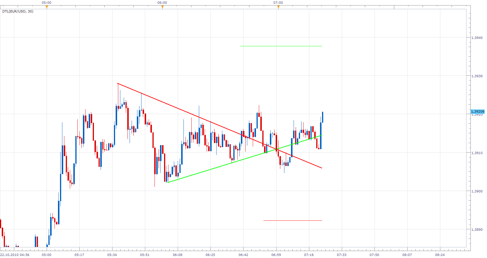
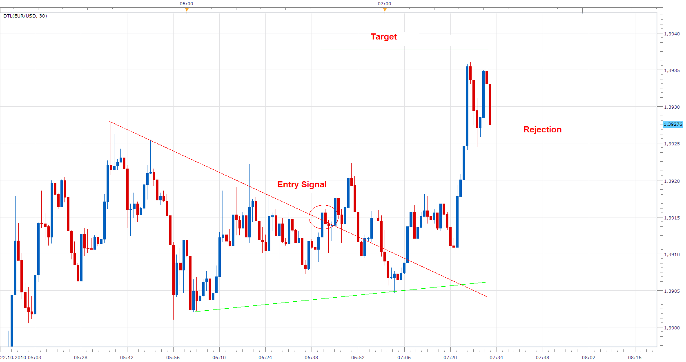
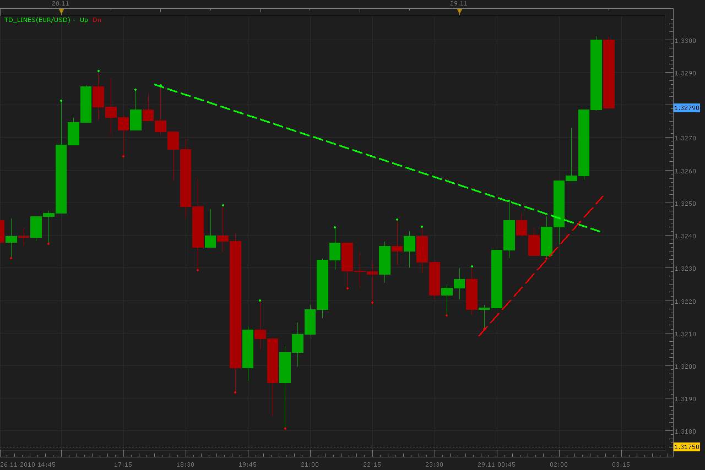
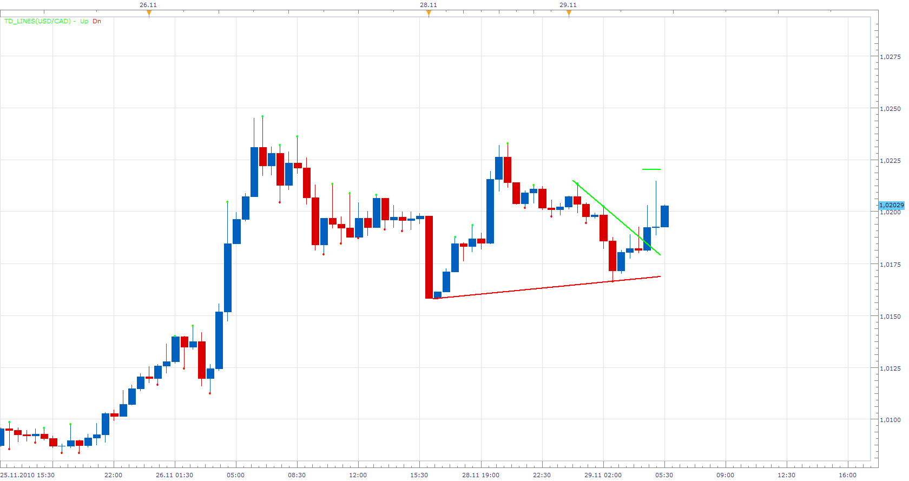
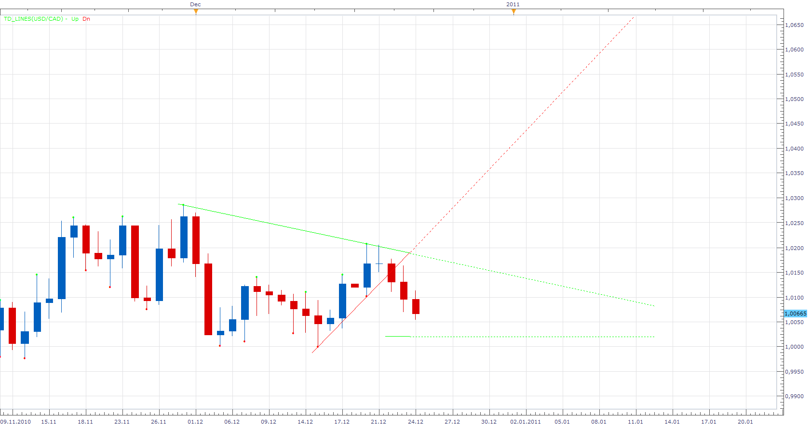

# Demark Trend Lines

> Source: https://fxcodebase.com/code/viewtopic.php?f=17&t=2483  
> Forum: 17 · Topic 2483 · 63 post(s)

---

## Demark Trend Lines

**Apprentice** · Fri Oct 22, 2010 6:25 am

Demark trend lines are drawn from Swing High and Swing Low points.
Swing High is a local maximum, which preceded or followed by a lower maximum candles.
Swing Low is a local minimum, which preceded or followed by a higher minimum candles.

Demark trend lines Crossover gives a Buy or Sell signals.

Distance from the trend line to the farthest extremes is equal to the distance from the point of breaking a trend line to the profit goal.

 

Fractal Version by Alex

 [TD_Lines.lua](files/5437/TD_Lines.lua)

I added a Line Extension and TD Line Target for Alex Fractal version.

Trend Line Version

 [DTL.lua](files/5437/DTL.lua)

For use with Strategys Version

 [TDL.lua](files/5437/TDL.lua)

To work, you should install, AutomaticTrendLine indicator.
[viewtopic.php?f=17&t=2467](https://fxcodebase.com/code/viewtopic.php?f=17&t=2467)

---

## Re: Demark Trend Lines

**DS0167** · Fri Oct 22, 2010 6:40 am

Many thanks to you !

All the best
DS0167

---

## Re: Demark Trend Lines

**DS0167** · Fri Oct 22, 2010 6:43 am

The indicator asked me for ATL.lua...? is it normal ?

Thank you

---

## Re: Demark Trend Lines

**Apprentice** · Fri Oct 22, 2010 6:57 am

Is it.
You have to install it.
This version is still in development.

---

## Re: Demark Trend Lines

**DS0167** · Mon Nov 01, 2010 9:10 am

Hello,

After few days testing this indicator and it seems it is not exactly the translation of the TD Lines mq4 into lua...am I wrong?

Thank you in advance for you answer.

Kind regards,
DS0167

---

## Re: Demark Trend Lines

**Apprentice** · Sun Nov 07, 2010 11:05 am

Alex is working on a final version, hopefully It will be completed soon.

---

## Re: Demark Trend Lines

**Checkz** · Fri Nov 12, 2010 3:36 am

I ACTUALLY THINK THAT THIS IS A VERY GOOD INDICATOR AND I HOPE THAT THE NEW VERSION WILL NOT OVER RIDE THIS ONE. IN OTHER WORDS PLEASE KEEP THIS ONE THE WAY THAT IT IS.

---

## Re: Demark Trend Lines

**DS0167** · Fri Nov 12, 2010 7:05 am

I agree with checkz, this is a Very good indicator and it should continue to be as it is BUT it is not the true TDLines (Tom Demark) and I really hope Alex will find time to translate the mq4 provided in lua.

Apprentice I confirm that the "Apprentice Trend lines" are very GOOD, helpful and reliable

Kind regards
DS0167

---

## Re: Demark Trend Lines

**Alexander.Gettinger** · Mon Nov 29, 2010 3:08 am

Other version of Demark trend lines.
Indicator finds TD points and draw trend lines.

 

Download:

 [TD_Lines.lua](files/6428/TD_Lines.lua)

---

## Re: Demark Trend Lines

**Apprentice** · Mon Nov 29, 2010 5:37 am

TD Line Target added, for Alex Version.

 [TD_Lines.lua](files/6436/TD_Lines.lua)

---

## Re: Demark Trend Lines

**DS0167** · Mon Nov 29, 2010 4:51 pm

> **bammbamm wrote:**
> Nice work. Is there any way of selecting the TD Points level or is it fixed?

Hello bammbamm

Awaiting the future update, when using the "Fractal parameter" it provides a very good TDLines since it uses the 2 bars before and after the TD_points which is consider by Tom Demark as truth criteria of TD-points.

I ask the same question and realized after the Fractal does the minimum required for TD-points.

Regards,
DS0167

---

## Re: Demark Trend Lines

**gimmegimme** · Mon Dec 13, 2010 4:36 pm

is it possible for someone to code a system with this indi?

---

## Re: Demark Trend Lines

**gimmegimme** · Wed Dec 15, 2010 1:42 pm

or a version that shows higher time frames? like the 1 or 4 hour trend lines on the 15m chart?

---

## Re: Demark Trend Lines

**Apprentice** · Wed Dec 15, 2010 3:56 pm

Your request has been added to developmental cue

---

## Re: Demark Trend Lines

**gimmegimme** · Fri Dec 17, 2010 1:11 pm

thank you

---

## Re: Demark Trend Lines

**Apprentice** · Fri Dec 24, 2010 6:44 am

I added a Line Extension for Alex Fractal version.

 [TD_Lines.lua](files/6973/TD_Lines.lua)

---

## Re: Demark Trend Lines

**craige** · Fri Dec 24, 2010 10:20 am

Dear

I really don't know how to use this indicator, could you explain it for me or us in detail? and could this indicator show the buy or sell signal?

thank you very much

---

## Re: Demark Trend Lines

**Apprentice** · Fri Dec 24, 2010 10:36 am

Happy to.

There are several versions, but the basics are as follows.

Demark trend lines are drawn from Swing High and Swing Low points.
Swing High is a local maximum, which preceded or followed by a lower maximum candles.
Swing Low is a local minimum, which preceded or followed by a higher minimum candles.

Demark trend lines Crossover gives a Buy or Sell signals.

Distance from the trend line to the farthest extremes is equal to the distance from the point of breaking a trend line to the profit goal.

This is the shortest possible description.
The best advice I can give you is to find other materials, all available on internet,
 or an experienced trader who has experience with this setup.

---

## Re: Demark Trend Lines

**lucky777** · Fri Dec 24, 2010 10:46 am

Hi, Apprentice,

The demark trend lines indicator which you are writing when shall we expect to be ready roughly t please.
Lucky777

---

## Re: Demark Trend Lines

**Apprentice** · Fri Dec 24, 2010 11:00 am

Indicator is ready (As I recall).
The problem is the trend line indicator (function), which indicator use.
I can not tell you with certainty.

---

## Re: Demark Trend Lines

**DS0167** · Fri Dec 24, 2010 11:25 am

I confirm this indicator is totally ready and works perfectly ! thank you Apprentice

This only thing that may be improved in the future is the option of TDLines levels.

Tom Demark in his books explains that their is 8 level of TDPoints that allow to draw the TDLines.

The Alex's version already allows us to get the Level 1 (with no Fractal) and the Level 2 (with Fractal).

But all the TDLines' fan and Tom Demark himself agree to say that the level 1 remains the best one for the breakout strategy.

For those who want to "dig" about TDLines (the qualifiers and so on) [http://forex-strategies-revealed.com/files/user/TDTL.pdf](http://forex-strategies-revealed.com/files/user/TDTL.pdf).

The only thing we -really- need from our brilliant FXCodeBase team now is the signal on the cross (option for closed candle) of the line

Merry Christmas to all
DS0167

---

## Re: Demark Trend Lines

**dlouisbriggs** · Mon Jan 10, 2011 8:13 am

Is there a way to graphically review the drawing of the TD Lines and Targets for the past? I assume that each time the strategy hits the target or is rejected, that the old lines are removed from the screen and new lines are drawn. It would be instructive to visually observe the success or failure of the lines in the past to determine under which market conditions the strategy performed at its best. Thank you.

---

## Re: Demark Trend Lines

**luigipg** · Mon May 16, 2011 12:31 pm

Hi, can someone update the this indicator "Demark Trend Lines" so that we can choose the level of TD_points on which draw the TD_TL? Also can add a signal when a candle closes (and/or crossover) beyond TD_TL? Thanks in advance and also for all your work. Luigi!

---

## Re: Demark Trend Lines

**DS0167** · Thu Jun 02, 2011 3:38 pm

Hello,

Like luigipg, I would like to see this indicator update with the 8 levels of TD Points available which would make this indicator awsome

Perhaps useing the advance fractal indicator could help to make it easier to create?

All the best
Danielle

---

## Re: Demark Trend Lines

**trendwatch** · Fri Sep 28, 2012 2:28 am

Hi, could we have a signal for this indi please? The signal should alert when a new candle opens 'outside' the trendline (or: when the target appears).

Thanks!

---

## Re: Demark Trend Lines

**Apprentice** · Sat Sep 29, 2012 3:31 am

Your request is added to the development list.

---

## Re: Demark Trend Lines

**rtsayers** · Tue May 28, 2013 1:56 pm

The DTL indicator is not refreshing and I downloaded the newest version of the ATL so just wondering if you could fix please.

Thanks

---

## Re: Demark Trend Lines

**volnmar** · Fri Oct 03, 2014 10:41 am

Can you please code strategy for td_lines indicator? Open after cross line (close/live) fix TP fix SL.

---

## Re: Demark Trend Lines

**7510109079** · Tue Mar 10, 2015 7:00 am

May I also ask for a 'no-repaint' option for the TD_LINES indicator as **dlouisbriggs** mentioned above.

If the current lines can be a different colour to all past lines that would be great.

If it is too difficult to code to draw past/historic indicator lines, then an indicator that just keeps lines as they happen in real time is OK

TIA

---

## Re: Demark Trend Lines

**Apprentice** · Wed Mar 11, 2015 5:48 am

Your request is added to the development list.

---

## Re: Demark Trend Lines

**7510109079** · Wed Mar 11, 2015 5:57 am

excellent thx.

And dont worry about the colour request. Not necessary

---

## Re: Demark Trend Lines

**7510109079** · Thu Mar 12, 2015 8:22 am

anyone interested in reading about DeMark's work:

Demark: [ftp://212.119.243.242/Public/Software/podborka-knig-po-forex%5Btorrentino.ru%5D/www.247free.org/DeMark,%20Tom%20-%20The%20New%20Science%20Of%20Technical%20Analysis.pdf](ftp://212.119.243.242/Public/Software/podborka-knig-po-forex%5Btorrentino.ru%5D/www.247free.org/DeMark,%20Tom%20-%20The%20New%20Science%20Of%20Technical%20Analysis.pdf)

Perl: [http://www.forexfactory.com/attachment.php?attachmentid=910547&d=1330688234](http://www.forexfactory.com/attachment.php?attachmentid=910547&d=1330688234)

---

## Re: Demark Trend Lines

**7510109079** · Fri Mar 13, 2015 6:40 am

Quick request.

Please can we be able to specify dot size with an option to not display them at all

TIA

---

## Re: Demark Trend Lines

**Apprentice** · Mon Mar 16, 2015 3:00 am

Which version is of your interest.

---

## Re: Demark Trend Lines

**7510109079** · Mon Mar 16, 2015 6:21 am

Hi Apprentice,

I would go with the more recent one that uses the extension lines please

TIA

---

## Re: Demark Trend Lines

**7510109079** · Tue Mar 17, 2015 4:18 am

here's a nice example of m30 TD lines on an m5 chart. Price hits target which then becomes resistance

---

## Re: Demark Trend Lines

**7510109079** · Wed Apr 15, 2015 7:04 am

Has anyone else noticed how sometimes (not always) the TD lines dont quite plot from dot to dot? The lines sometimes display a small parallel offset to the dots.

This can happen regardless of FractalasTD = Y/N or what TF is used

This may be a small error but its crucial as we are dealing with support/resistance lines which need to be in the right place.

Apprentice, can you please check why this is as I regularly use this indicator,
TIA

---

## Re: Demark Trend Lines

**RVK2211** · Mon Apr 20, 2015 12:01 am

Hi,

Are you able to point me to the lastest version of this indicator... there appear to be a few versions of these floating around and none of them seem to version labelled.

Thx

---

## Re: Demark Trend Lines

**Apprentice** · Mon Apr 20, 2015 4:05 am

Try version posted Fri Dec 24, 2010 1:44 pm

---

## Re: Demark Trend Lines

**7510109079** · Sun Apr 26, 2015 11:26 am

any solution for the offset lines. Can you reproduce this glitch?

---

## Re: Demark Trend Lines

**4x4partners** · Tue Apr 28, 2015 5:08 am

Hi - There seem to be several versions posted here. Would you kindly let me know which is the most recent?

Thanks!

---

## Re: Demark Trend Lines

**Apprentice** · Wed Apr 29, 2015 4:20 am

Try version posted Fri Dec 24, 2010 1:44 pm By Alex

---

## Re: Demark Trend Lines

**7510109079** · Thu Apr 30, 2015 5:20 am

1. Can you allow user to specify variable size for marker dots

2. Any thoughts on how to get the lines aligning on market dots accurately

TIA

---

## Re: Demark Trend Lines

**7510109079** · Fri May 15, 2015 9:56 am

bump

---

## Re: Demark Trend Lines

**7510109079** · Mon May 25, 2015 8:27 am

Any progress on a prior request to build in an option to keep historic lines?

Each set of 3 historic lines could be given a random colour to differentiate them from other sets

---

## Re: Demark Trend Lines

**7510109079** · Mon Jun 08, 2015 10:45 am

bumpy bump bump

---

## Re: Demark Trend Lines

**7510109079** · Mon Jul 13, 2015 8:26 am

Apprentice, can you spare some time to address prior requests?
TIA

---

## Re: Demark Trend Lines

**Jagalz** · Mon Aug 03, 2015 2:34 pm

Hi, could we have a( signal-STRATEGY for this indi please?
when the target appears).

---

## Re: Demark Trend Lines

**7510109079** · Fri Oct 02, 2015 4:04 am

4 month bump. Still finding this indictor incredibly useful.

Mario, please could you implement a history/repaint option, whereby we can turn re-paint on/off so the lines can be made to not re-paint if the users chooses that option

many thx in advance

---

## Re: Demark Trend Lines

**Apprentice** · Thu Oct 08, 2015 4:30 am

Your request is added to the development list.

---

## Re: Demark Trend Lines

**7510109079** · Thu Oct 08, 2015 9:35 am

thx

---

## Re: Demark Trend Lines

**7510109079** · Tue Feb 02, 2016 10:51 am

bump-any progress on building a 'no-repaint' option into this incredibly useful indicator?
thx in adv

---

## Re: Demark Trend Lines

**7510109079** · Wed Feb 24, 2016 6:42 am

bump to top

---

## Re: Demark Trend Lines

**Cactus** · Wed Jul 27, 2016 12:02 pm

I dream of a reliable trend line indicator

---

## Re: Demark Trend Lines

**MC. Trend Trader** · Thu Jul 06, 2017 5:36 pm

Hello.

May i request a HIGHLY ADAPTABLE Strategy based on TD_Lines.Lua

Strategy Time Frame: 1min

TD_Line Time Frame: 4H

Color Line Up crossing over: No Action/Buy / Sell or Close Position.
Color Line Up crossing under: No Action/Buy / Sell or Close Position.

Color Line Dn crossing over: No Action/Buy / Sell or Close Position.
Color Line Dn crossing under: No Action/Buy / Sell or Close Position.

Option: Position close at Target Line Yes / No

Best Regards

---

## Re: Demark Trend Lines

**Apprentice** · Mon Jul 10, 2017 3:57 pm

Your request is added to the development list, Under Id Number 3822
 If someone is interested to do this task, please contact me.

---

## Re: Demark Trend Lines

**Apprentice** · Wed Aug 23, 2017 6:14 am

Try this version.
[viewtopic.php?f=31&t=65015&p=114367#p114367](https://fxcodebase.com/code/viewtopic.php?f=31&t=65015&p=114367#p114367)

---

## Re: Demark Trend Lines

**Apprentice** · Wed Sep 12, 2018 5:38 am

The Indicator was revised and updated.

---

## Re: Demark Trend Lines

**nbats7979** · Wed May 06, 2020 3:31 am

Hi,

This indicator is very good but is it possible to have a version without the dots displaying on the candles? Just the lines and extension would be great thanks.

---

## Re: Demark Trend Lines

**Apprentice** · Wed May 06, 2020 4:15 am

Your request is added to the development list.
Development reference 1234.

---

## Re: Demark Trend Lines

**nbats7979** · Wed May 06, 2020 4:19 am

Just for clarity it is the TD_lines version. Thanks.

---

## Re: Demark Trend Lines

**Apprentice** · Wed May 06, 2020 5:16 am

Try this version.

 [TDL.lua](files/133612/TDL.lua)

---

## Re: Demark Trend Lines

**nbats7979** · Wed May 06, 2020 6:50 am

Fantastic thanks!
