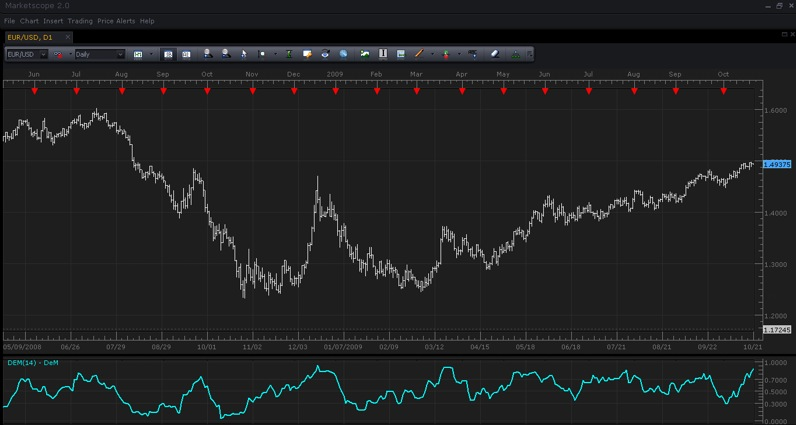

# DeMarker Oscillator [Upd Nov, 03 10]

> Source: https://fxcodebase.com/code/viewtopic.php?f=17&t=22  
> Forum: 17 · Topic 22 · 6 post(s)

---

## DeMarker Oscillator [Upd Nov, 03 10]

**admin** · Tue Oct 20, 2009 5:25 pm

**DESCRIPTION:**
DeMarker indicator compares the most current price action to the previous period’s price to determine the demand of the instrument in question. Usually this indicator identifies price exhaustion and also can identify market highs and lows.

**PURPOSE OF "DeMarker":**
For most part, traders use DeMarker for indentifying the risk of the levels in which they place a transaction. Values over 60 are indicators of lower volatility and lower risk, when on other had reading lower than 40 usually indicates that risk is increasing.

**UPDATES**
Nov, 03 2010, ng: new feature:
1) Choice for smoothing method (MVA, EMA and so on)
2) Choice for line style
3) Choice for levels and level drawing styles

 



*DeMarker Screenshot.*

**DOWNLOAD:**
(last version)

 [dem.lua](files/23/dem.lua)

(previous version)

```lua
-- initializes the indicator
function Init()
    indicator:name("DeMarker");
    indicator:description("")
    indicator:requiredSource(core.Bar);
    indicator:type(core.Oscillator);

    indicator.parameters:addGroup("Parameters");
    indicator.parameters:addInteger("N", "Number of periods for smoothing", "", 14);
    indicator.parameters:addString("MA", "Smoothing Method", "The methods marked by an asterisk (*) require the appropriate indicators to be loaded.", "MVA");
    indicator.parameters:addStringAlternative("MA", "MVA", "", "MVA");
    indicator.parameters:addStringAlternative("MA", "EMA", "", "EMA");
    indicator.parameters:addStringAlternative("MA", "LWMA", "", "LWMA");
    indicator.parameters:addStringAlternative("MA", "TMA", "", "TMA");
    indicator.parameters:addStringAlternative("MA", "SMMA*", "", "SMMA");
    indicator.parameters:addStringAlternative("MA", "Vidya (1995)*", "", "VIDYA");
    indicator.parameters:addStringAlternative("MA", "Vidya (1992)*", "", "VIDYA92");
    indicator.parameters:addStringAlternative("MA", "Wilders*", "", "WMA");

    indicator.parameters:addGroup("Style");
    indicator.parameters:addColor("C", "Color", "", core.rgb(0, 127, 127));
    indicator.parameters:addInteger("W", "Width", "", 1, 1, 5);
    indicator.parameters:addInteger("S", "Style", "", core.LINE_SOLID);
    indicator.parameters:setFlag("S", core.FLAG_LINE_STYLE);

    indicator.parameters:addGroup("Levels");
    indicator.parameters:addDouble("Level1", "Low Risk Level", "", 0.6, 0, 1);
    indicator.parameters:addDouble("Level2", "High Risk Level", "", 0.4, 0, 1);
    indicator.parameters:addColor("LC", "Main level color", "", core.rgb(0, 127, 127));
    indicator.parameters:addInteger("LW", "Main level width", "", 2, 1, 5);
    indicator.parameters:addInteger("LS", "Main level style", "", core.LINE_DOT);
    indicator.parameters:setFlag("LS", core.FLAG_LINE_STYLE);
    indicator.parameters:addColor("LC1", "Aux level color", "", core.rgb(0, 127, 127));
    indicator.parameters:addInteger("LW1", "Aux level width", "", 1, 1, 5);
    indicator.parameters:addInteger("LS1", "Aux level style", "", core.LINE_DOT);
    indicator.parameters:setFlag("LS1", core.FLAG_LINE_STYLE);
end

local source;
local first;
local out;
local max;
local min;
local smax;
local smin;
local n;

-- process parameters and prepare for calculations
function Prepare()
    assert(core.indicators:findIndicator(instance.parameters.MA) ~= nil, "Please download and install " ..  instance.parameters.MA .. ".lua");

    n = instance.parameters.N;
    source = instance.source;

    max = instance:addInternalStream(source:first() + 1);
    min = instance:addInternalStream(source:first() + 1);
    smax = core.indicators:create(instance.parameters.MA, max, n);
    smin = core.indicators:create(instance.parameters.MA, min, n);
    first = smax.DATA:first();
    name = profile:id() .. "(" .. source:name() .. "," .. instance.parameters.MA  .. "," .. n .. ")";
    instance:name(name);
    out = instance:addStream("DeM", core.Line, name .. ".DeM", "DeM", instance.parameters.C, first);
    out:setWidth(instance.parameters.W);
    out:setStyle(instance.parameters.S);
    out:addLevel(0, instance.parameters.LS1, instance.parameters.LW1, instance.parameters.LC1);
    out:addLevel(instance.parameters.Level2, instance.parameters.LS, instance.parameters.LW, instance.parameters.LC);
    out:addLevel(0.5, instance.parameters.LS1, instance.parameters.LW1, instance.parameters.LC1);
    out:addLevel(instance.parameters.Level1, instance.parameters.LS, instance.parameters.LW, instance.parameters.LC);
    out:addLevel(1, instance.parameters.LS1, instance.parameters.LW1, instance.parameters.LC1);
end

-- Indicator calculation routine
function Update(period, mode)
    if (period > source:first() + 1) then
        if (source.high[period] > source.high[period - 1]) then
            max[period] = source.high[period] - source.high[period - 1]
        else
            max[period] = 0;
        end
        if (source.low[period] < source.low[period - 1]) then
            min[period] = source.low[period - 1] - source.low[period];
        else
            min[period] = 0;
        end
    end
    smax:update(mode);
    smin:update(mode);
    if (period >= first) then
        local vmax;
        local vmin;
        vmax = smax.DATA[period];
        vmin = smin.DATA[period];
        if (vmax == 0 and vmin == 0) then
            out[period] = nil;
        else
            out[period] = vmax / (vmax + vmin);
        end
    end
end
```

Tags: DeMarker, indicator, Marketscope, oscillator, Trading Station, FXCM, dbFX

---

## Re: DeMarker Oscillator [Upd Nov, 03 10]

**Nikolay.Gekht** · Wed Nov 03, 2010 7:04 pm

updated
1) choice for smoothing method
2) line styles
3) levels and level styles

---

## Re: DeMarker Oscillator [Upd Nov, 03 10]

**Jeffreyvnlk** · Mon Sep 15, 2014 1:41 am

> **Nikolay.Gekht wrote:**
> updated
> 1) choice for smoothing method
> 2) line styles
> 3) levels and level styles

Appreciated if you could give an edited version with no smoothing

---

## Re: DeMarker Oscillator [Upd Nov, 03 10]

**Apprentice** · Wed Sep 17, 2014 11:48 am

[dem without smoothing.lua](files/95968/dem%20without%20smoothing.lua)

---

## Re: DeMarker Oscillator [Upd Nov, 03 10]

**Jeffreyvnlk** · Wed Sep 17, 2014 2:19 pm

> **Apprentice wrote:**
>
>
> dem without smoothing.lua

Fantastic. Thank Apprentice !

---

## Re: DeMarker Oscillator [Upd Nov, 03 10]

**Apprentice** · Mon Mar 05, 2018 2:33 pm

The Indicator was revised and updated.
