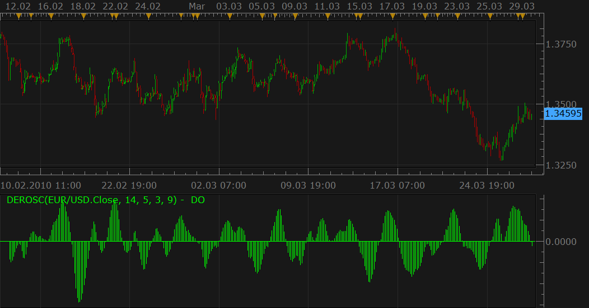

# Derivative Oscillator (DEROSC)

> Source: https://fxcodebase.com/code/viewtopic.php?f=17&t=537  
> Forum: 17 · Topic 537 · 4 post(s)

---

## Derivative Oscillator (DEROSC)

**Nikolay.Gekht** · Mon Mar 29, 2010 1:37 pm

> **Laurus12 wrote:**
> This is another indicator by Constance Brown. The Derivative Oscillator is a triple smoothed RSI that incorporates two EMA's and one SMA. It was specifically developed to resolve problems associated with complex market corrections where data becomes choppy and congested. Second, it was developed for reentering when there is a very strong trend. Both problems would seem contradictive, but in fact it can be used as a guide in both environments. It is meant to be used with mentioned environments and not all the time. It is not recommended in time frames below 30min.

The formula is:

EMA(EMA(RSI(14), 5)), 3) - MVA(EMA(EMA(RSI(14), 5)), 3), 9)

 



 [DEROSC.lua](files/926/DEROSC.lua)

```lua
-- Indicator profile initialization routine
-- Defines indicator profile properties and indicator parameters
function Init()
    indicator:name("Derivative Oscillator");
    indicator:description("Derivative Oscillator as mentioned in Constance Brown's book Technical Analysys for Trading Professional.");
    indicator:requiredSource(core.Tick);
    indicator:type(core.Oscillator);

    indicator.parameters:addInteger("RSI_N", "RSI Periods", "No description", 14);
    indicator.parameters:addInteger("EMA_N1", "EMA(RSI) periods", "No description", 5);
    indicator.parameters:addInteger("EMA_N2", "EMA(EMA(RSI)) periods", "No description", 3);
    indicator.parameters:addInteger("MVA_N", "MVA(EMA(EMA(RSI))) periods", "No description", 9);
    indicator.parameters:addColor("DO_color", "Color of DO", "Color of DO", core.rgb(0, 255, 0));
end

-- Indicator instance initialization routine
-- Processes indicator parameters and creates output streams
-- Parameters block
local RSI_N;
local EMA_N1;
local EMA_N2;
local MVA_N;

local RSI;
local EMA1;
local EMA2;
local MVA;

local first;
local source = nil;

-- Streams block
local DO = nil;

-- Routine
function Prepare()
    RSI_N = instance.parameters.RSI_N;
    EMA_N1 = instance.parameters.EMA_N1;
    EMA_N2 = instance.parameters.EMA_N2;
    MVA_N = instance.parameters.MVA_N;
    source = instance.source;
    RSI = core.indicators:create("RSI", source, RSI_N);
    EMA1 = core.indicators:create("EMA", RSI.DATA, EMA_N1);
    EMA2 = core.indicators:create("EMA", EMA1.DATA, EMA_N2);
    MVA = core.indicators:create("MVA", EMA2.DATA, MVA_N);
    first = MVA.DATA:first();
    local name = profile:id() .. "(" .. source:name() .. ", " .. RSI_N .. ", " .. EMA_N1 .. ", " .. EMA_N2 .. ", " .. MVA_N .. ")";
    instance:name(name);
    DO = instance:addStream("DO", core.Bar, name, "DO", instance.parameters.DO_color, first);
end

-- Indicator calculation routine
function Update(period, mode)
    RSI:update(mode);
    EMA1:update(mode);
    EMA2:update(mode);
    MVA:update(mode);

    if period >= first then
        DO[period] = EMA2.DATA[period] - MVA.DATA[period];
    end
end
```

---

## Re: Derivative Oscillator

**veyron89890** · Fri Jul 29, 2016 10:22 am

hello is possible to have a diffent color for descending and ascending bar ?

Thank you

---

## Re: Derivative Oscillator

**Apprentice** · Tue Aug 02, 2016 7:20 am

Color Mode Option Added.

---

## Re: Derivative Oscillator

**Apprentice** · Fri Aug 31, 2018 5:17 am

The indicator was revised and updated.
