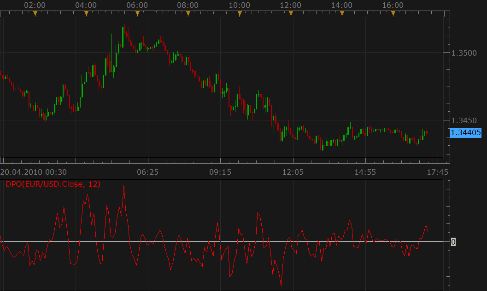

# Detrend Price Oscillator

> Source: https://fxcodebase.com/code/viewtopic.php?f=17&t=716  
> Forum: 17 · Topic 716 · 3 post(s)

---

## Detrend Price Oscillator

**Nikolay.Gekht** · Tue Apr 20, 2010 4:24 pm

Detrended Price Oscillator eliminates the trend effect of price movement.

The formula is
DPO = PRICE - MVA(PRICE, (N / 2 + 1))
(if N = 12, DPO is the same as the DiNapoli Detrend Oscillator).

 

Download the indicator:

 [DPO.lua](files/1301/DPO.lua)

The indicator was revised and updated

---

## Re: Detrend Price Oscillator

**disilvapattahk** · Wed Jan 14, 2015 11:17 pm

The positive value of the indicator forecasts higher prices. The negative value forecasts the lower prices. Chande also recommends to user 3-day smoothing line as a trigger. When the oscillator falls below or crosses above the trigger line it shows a change of the trend.

---

## Re: Detrend Price Oscillator

**Apprentice** · Tue Jul 18, 2017 7:43 am

The indicator was revised and updated.
