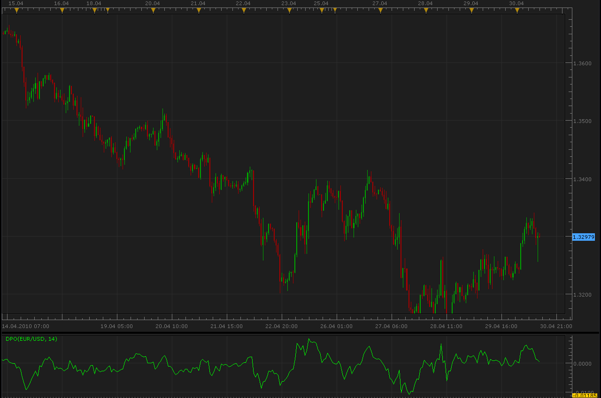
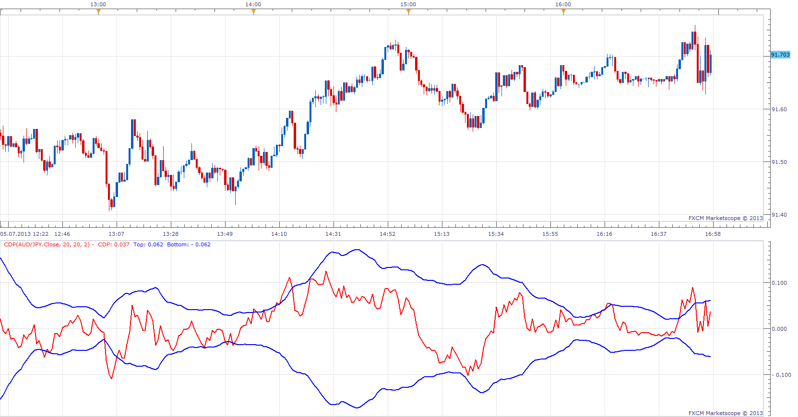
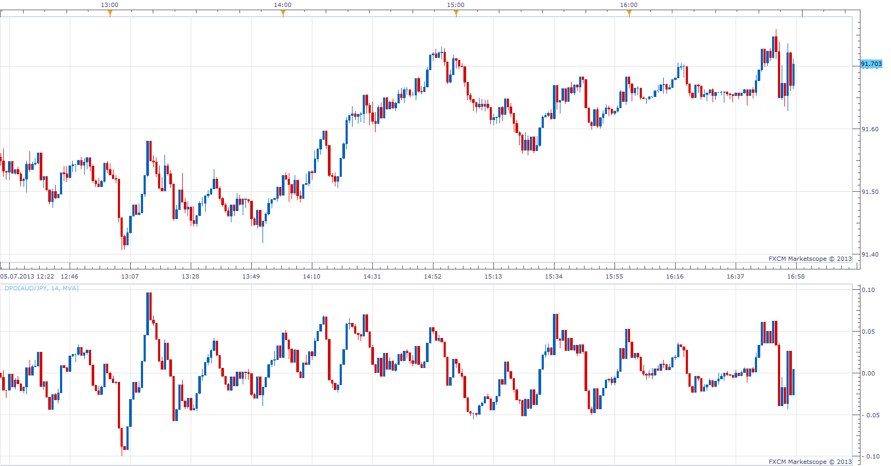

# Detrended Price Oscillator (DPO)

> Source: https://fxcodebase.com/code/viewtopic.php?f=17&t=895  
> Forum: 17 · Topic 895 · 18 post(s)

---

## Detrended Price Oscillator (DPO)

**Alexander.Gettinger** · Fri Apr 30, 2010 11:22 am

Detrended Price Oscillator eliminates the trend effect of price movement. This simplifies the process of finding out cycles and levels of outbidding/resale.

Long-term cycles consist of several shorter cycles. Analyzing such short components helps to define crucial moments of the cycle's development. DPO gives a chance to eliminate the influence on prices of long-term cycles.

Calculations:

DPO = CLOSE - SMA (CLOSE, (N / 2 + 1))

Where:
SMA — a simple moving average;
CLOSE — the closing price;
N — the period of the cycle (if N is equal to 12, DPO resembles the DiNapoli Detrend Oscillator).

 

 [DPO.lua](files/1637/DPO.lua)

 

 [MTF MCP DPO Heat Map.lua](files/1637/MTF%20MCP%20DPO%20Heat%20Map.lua)

MCP MTF version.
[viewtopic.php?f=17&t=70687](https://fxcodebase.com/code/viewtopic.php?f=17&t=70687)

---

## Re: Detrended Price Oscillator (DPO)

**Nikolay.Gekht** · Fri Apr 30, 2010 3:08 pm

BTW, we already have one implementation of the Detrend Price Oscillator.
[viewtopic.php?f=17&t=716](https://fxcodebase.com/code/viewtopic.php?f=17&t=716)

---

## Centered Detrend Price (CDP)

**Apprentice** · Sun Jul 07, 2013 6:32 am

	CDP = close - AvgofClose[Period/2];

 [CDP.lua](files/73252/CDP.lua)

 [CDP with Alert.lua](files/73252/CDP%20with%20Alert.lua)

Compatibility issue fixed.
_Alert Helper is not longer needed.

---

## Detrended Price Oscillator Bar

**Apprentice** · Sun Jul 07, 2013 6:44 am

 [DPO Bar.lua](files/73255/DPO%20Bar.lua)

 [DPO Bar with Alert.lua](files/73255/DPO%20Bar%20with%20Alert.lua)

Compatibility issue fixed.
_Alert Helper is not longer needed.

---

## Re: Detrended Price Oscillator (DPO)

**juju1024** · Sun Jul 14, 2013 8:48 am

Hi,

Can you create or convert dpo bar for mt4 if do not exist ?

thanks

---

## Re: Detrended Price Oscillator (DPO)

**Apprentice** · Sun Jul 14, 2013 11:02 am

Your request is added to the development list.

---

## Re: Detrended Price Oscillator (DPO)

**Apprentice** · Mon Sep 09, 2013 7:44 am

MT4 version of DPO Bar can be found here.
[viewtopic.php?f=38&t=59433](https://fxcodebase.com/code/viewtopic.php?f=38&t=59433)

---

## Re: Detrended Price Oscillator (DPO)

**Coondawg71** · Fri Apr 03, 2015 4:36 am

Can we please request Alert function added to DPO Bar indicator.

I would like Alert to be triggered upon closing value of bar crossing "0" center line.

Thanks!!!

sjc

---

## Re: Detrended Price Oscillator (DPO)

**Apprentice** · Fri Apr 03, 2015 7:15 am

DPO Bar with Alert.lua Added.

---

## Re: Detrended Price Oscillator (DPO)

**Coondawg71** · Tue Apr 07, 2015 6:18 am

DPO with alert is working nicely, thanks!

Can we please request a MTF MCP DPO Bar Dashboard.

If we can please have a simple colored arrow up or down in relation the DPO bar crossing the Zero center line would be appreciated.

And if possible, if we can have the "bell alarm" visual alert old dashboards used to have which would signify the indicator value crossing the threshold. MVA Dashboard is a good reference, unless you have a better solution.

Thanks!

sjc

---

## Re: Detrended Price Oscillator (DPO)

**Coondawg71** · Tue Apr 07, 2015 2:29 pm

Can we please request Alert functions added to CDP (Centered Detrended Price).

1.) Alert would be triggered upon CDP value breach of Zero center line.

2.) Alert would be triggered upon PRICE touch/cross of deviation band like our VABB indicator with Alert.

3.) Alert would be triggered upon CDP value touch/cross of deviation band.

Thanks!!!

sjc

---

## Re: Detrended Price Oscillator (DPO)

**Apprentice** · Wed Apr 08, 2015 7:26 am

CDP with Alert.lua added

---

## Re: Detrended Price Oscillator (DPO)

**Coondawg71** · Thu Apr 09, 2015 11:17 am

DPO with Alert is working great! Thank You.

We can further enhance the use of this indicator if we can please request the addition of Alerts upon the breach of user input on the upper and lower deviation values. User set values would be necessary as the values of the DPO deviations would change depending on time frame and currency. Minimum value of .0010 up to maximum of 50.00 should cover all time frames and currency ranges.

Please ADD these options to the most current version of DPO with Alert (which as now alerts upon crossing of center line).

Thanks!!!

sjc

---

## Re: Detrended Price Oscillator (DPO)

**Apprentice** · Sun Apr 12, 2015 9:11 am

Additional alerts added.

---

## Re: Detrended Price Oscillator (DPO)

**Apprentice** · Sun Dec 06, 2015 7:35 am

Compatibility issue fixed.
_Alert Helper is not longer needed.

---

## Re: Detrended Price Oscillator (DPO)

**Apprentice** · Mon Aug 14, 2017 4:04 am

The indicator was revised and updated.

---

## Re: Detrended Price Oscillator (DPO)

**Apprentice** · Sun Sep 17, 2017 9:48 am

MTF MCP DPO Heat Map.lua added.

---

## Re: Detrended Price Oscillator (DPO)

**Apprentice** · Sun Feb 04, 2018 8:39 am

The Indicator was revised and updated.
