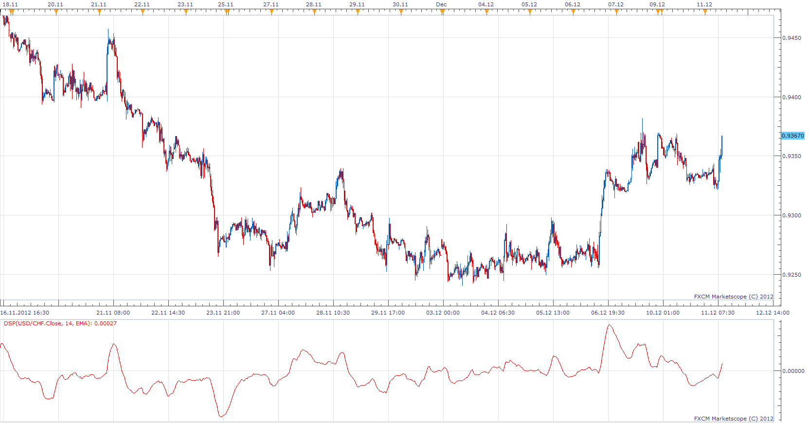
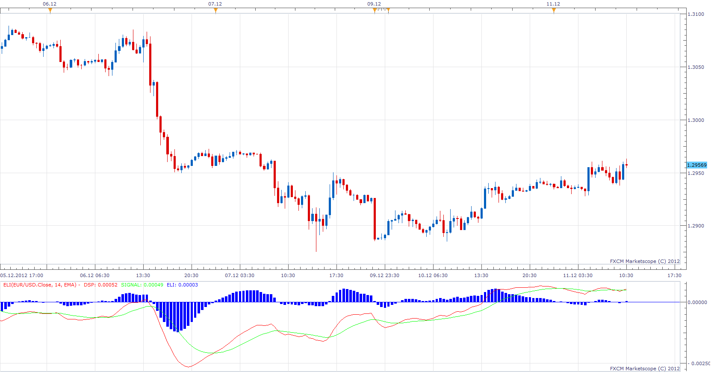

# Detrended Synthetic Price

> Source: https://fxcodebase.com/code/viewtopic.php?f=17&t=27612  
> Forum: 17 · Topic 27612 · 9 post(s)

---

## Detrended Synthetic Price

**Apprentice** · Tue Dec 11, 2012 3:50 am

This DSP is computed by subtracting
a half-cycle exponential moving average (EMA) from the quarter cycle
exponential moving average.

 [DSP.lua](files/48287/DSP.lua)

 [ADSP.lua](files/48287/ADSP.lua)

 [ADSP with Averages.lua](files/48287/ADSP%20with%20Averages.lua)

For ADSP with Averages u have to install Averages indicator.
[viewtopic.php?f=17&t=2430](https://fxcodebase.com/code/viewtopic.php?f=17&t=2430)

The indicator was revised and updated

---

## Ehlers Leading Indicator

**Apprentice** · Tue Dec 11, 2012 4:42 am

Ehlers Leading Indicator gives an advanced indication of a cyclic turning point.
 It is computed by subtracting the simple moving average of the detrended synthetic price from the detrended synthetic price.

 [ELI.lua](files/48291/ELI.lua)

---

## Re: Detrended Synthetic Price

**Coondawg71** · Sat Apr 27, 2013 7:50 am

Can we please request a Strategy based on the Ehlers Leading Indicator. I see that this indicator is very useful in at least two different manners which I have listed in two parts, A and B.

Conditions:

Buy/Sell with DSP crossover of Signal.

A.) Please add option of confirmation with a shorter period ELI. Both periods should be in agreement at closing of bar for position to open and remain open. If shorter period is not in agreement with longer period, position is closed.

 

*Using ELI with short period for confirmation of trade direction*

B.) If possible, can use the crossover points of DSP and Signal to plot a horizontal line marker. The horizontal line would mark the price of the bullish/bearish movement of the ELI. The crossover point will be target points for closing positions. Please use green horizontal line for a bullish crossover and red for bearish.

 

Crossover Image illustrates the usage of two periods for Confirmation option.

Target Image illustrates the concept of using last crossover direction for future price target levels.

Further development of this indicator should be directed to developing a ELI Divergence Indicator like the other standard divergence indicators (CCi, Stochastic, RSI, MACD), which is what this indicator truly illustrates in its original fashion. Divergence of indicator crossover and current price direction.

Thanks,

sjc

---

## Re: Detrended Synthetic Price

**Apprentice** · Mon Apr 29, 2013 5:09 am

Your request is added to the development list.

---

## Re: Detrended Synthetic Price

**Coondawg71** · Fri May 24, 2013 5:40 pm

In regards to the ADSP indicator, can we please make this indicator far more useful by adding support for TEMA and DEMA.

Thanks!

sjc

---

## Re: Detrended Synthetic Price

**Apprentice** · Sun Jun 02, 2013 12:02 pm

Your request is added to the development list.

---

## Re: Detrended Synthetic Price

**Apprentice** · Mon Jun 03, 2013 11:42 am

Try ADSP with Averages.

---

## Re: Detrended Synthetic Price

**Alexander.Gettinger** · Wed Aug 14, 2013 3:10 pm

MQL4 version of Detrended Synthetic Price: [http://www.fxcodebase.com/code/viewtopi ... 38&t=59130](http://www.fxcodebase.com/code/viewtopic.php?f=38&t=59130).

---

## Re: Detrended Synthetic Price

**Apprentice** · Fri Jun 09, 2017 7:26 am

The indicator was revised and updated.
