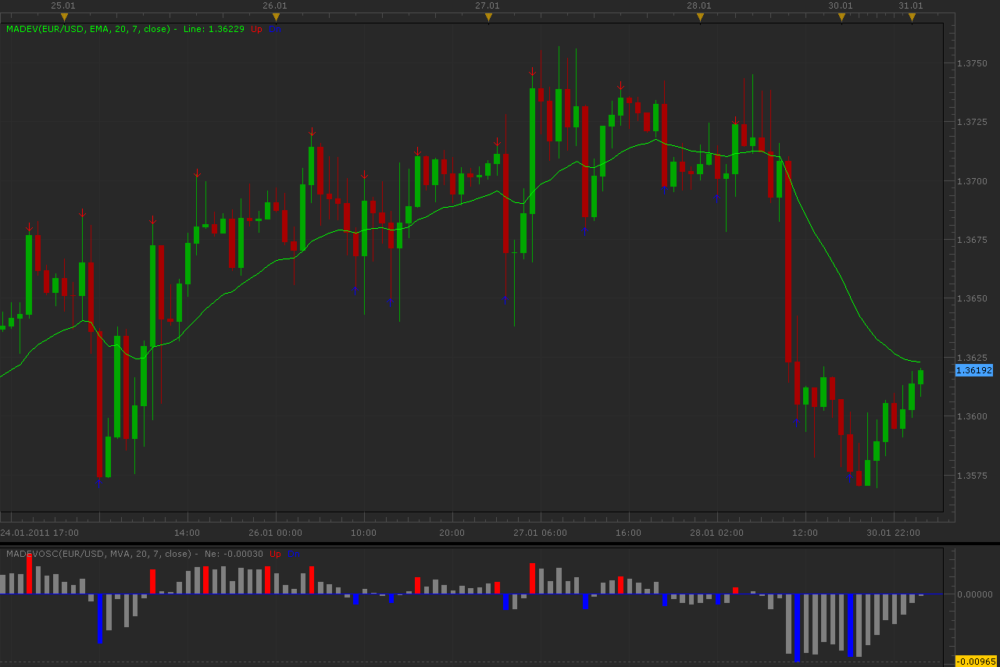

# Deviation from MA

> Source: https://fxcodebase.com/code/viewtopic.php?f=17&t=3293  
> Forum: 17 · Topic 3293 · 5 post(s)

---

## Deviation from MA

**Alexander.Gettinger** · Mon Jan 31, 2011 2:10 am

Indicator show deviation between MA and price.
For find the maximums used [Frame] bars (as for fractals).
Arrow are shown maximums of the deviation of the price from MA.

 

Download:

 [MaDev.lua](files/7818/MaDev.lua)

Also, there is a oscillator version.
Download:

 [MaDevOsc.lua](files/7818/MaDevOsc.lua)

For this indicators must be installed AVERAGES indicator: [viewtopic.php?f=17&t=2430](https://fxcodebase.com/code/viewtopic.php?f=17&t=2430)

The indicator was revised and updated

---

## Re: Deviation from MA

**Alexander.Gettinger** · Mon Jan 31, 2011 10:19 pm

Strategy on this indicator: [viewtopic.php?f=31&t=3297](https://fxcodebase.com/code/viewtopic.php?f=31&t=3297)

---

## Re: Deviation from MA

**craige** · Mon Jan 31, 2011 10:58 pm

Hey Guys

thanks for the great effort

I observed this indicator for 5 hours consecutively, finding it is a lagging indi.

during the process of the observation, after the fifth candle closed, there is a arrow emerged on the second candle.

do I miss something, or I got the wrong parameter setting?

thank you

---

## Re: Deviation from MA

**RJH501** · Sun Sep 18, 2011 3:57 pm

Hello Alexander,

When you get time could you develop a signal that occurs whenever a buy or sell histogram marker occurs?

Thank you,

Richard

---

## Re: Deviation from MA

**Apprentice** · Thu Mar 16, 2017 2:15 pm

Indicator was revised and updated.
