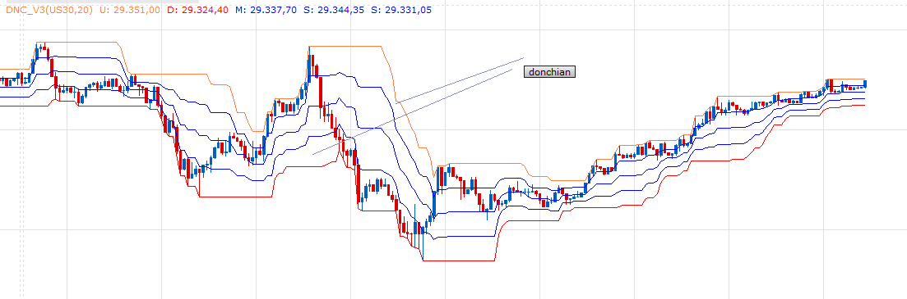

# DFT

> Source: https://fxcodebase.com/code/viewtopic.php?f=17&t=70626  
> Forum: 17 · Topic 70626 · 16 post(s)

---

## DFT

**Apprentice** · Sun Nov 15, 2020 4:23 am

Based on request.
[viewtopic.php?f=27&t=70618](https://fxcodebase.com/code/viewtopic.php?f=27&t=70618)

 [DFT.lua](files/138878/DFT.lua)

MT4 version.
[https://fxcodebase.com/code/viewtopic.php?f=38&t=72848](https://fxcodebase.com/code/viewtopic.php?f=38&t=72848)

---

## Re: DFT

**omgepe** · Mon Nov 16, 2020 10:55 pm

Dear apprentice,

thanks for the script, but seem the donchian channel not working properly,
maybe you could revision the script, something like DNC v3 but the line based on Fibo.

there are 6(six) line (3 Zone)

Zone 1
Upperline
Fiboline = 0.764

Zone 2
Fiboline = 0.618
Fiboline = 0.238

Zone 3
Fiboline = 0.238
Downline

when close enter zone 1 (Close above Fiboline 0.764 - symbol triangle blue)
when close exit zone 1 (Close below Fiboline 0.764 - symbol X)

when close enter zone 3 (Close below Fiboline 0.238 - symbol triangle red)
when close exit zone 3 (Close above Fiboline 0.238 - symbol X)

 

thanks

gp

---

## Re: DFT

**Apprentice** · Tue Nov 17, 2020 6:15 am

Your request is added to the development list.
Development reference 2318.

---

## Re: DFT

**Apprentice** · Thu Nov 19, 2020 3:48 pm

[DFT.lua](files/139009/DFT.lua)

Try this version.

---

## Re: DFT

**omgepe** · Thu Nov 19, 2020 7:37 pm

hi apprentice,

thanks again for the script indicator,
but once again, maybe the donchian channel still not working,
maybe you could revision again or make a new one without ATR prediction and symbol, so the donchian channel can working.
maybe the you can not use this line of script

 

or maybe you can revision DNC v3, but the line of SUB (25% or 50%) replace or add with Fibo line,
Fiboline = 0.238
Fiboline = 0.382
Fiboline = 0.618
Fiboline = 0.764

 

thanks

gp

---

## Re: DFT

**Apprentice** · Fri Nov 20, 2020 3:10 am

Your request is added to the development list.
Development reference 2338.

---

## Re: DFT

**omgepe** · Fri Nov 20, 2020 9:53 pm

dear apprentice,

this is the link for the reference,
[https://www.mql5.com/en/code/11984](https://www.mql5.com/en/code/11984) or
in MT5 [https://www.mql5.com/en/code/12974](https://www.mql5.com/en/code/12974)

thanks

gp

---

## Re: DFT

**Apprentice** · Sun Nov 22, 2020 5:30 am

Can you give an example which explains what's wrong with it?

---

## Re: DFT

**omgepe** · Sun Nov 22, 2020 8:12 pm

hi apprentice,

can you look at this

 

and this is in DNC v3

 

thanks
gp

---

## Re: DFT

**Apprentice** · Mon Nov 23, 2020 1:46 pm

Your request is added to the development list.
Development reference 2348.

---

## Re: DFT

**Apprentice** · Wed Nov 25, 2020 11:36 am

[DFT.lua](files/139136/DFT.lua)

Try this version.

---

## Re: DFT

**omgepe** · Wed Nov 25, 2020 7:26 pm

thanks apprentice

will try it

---

## Re: DFT

**anjarprima** · Thu Aug 25, 2022 12:10 am

> **Apprentice wrote:**
>
>
> DFT.lua
>
>
> Try this version.

sir, can you make this indi into MT4 version please

---

## Re: DFT

**Apprentice** · Fri Aug 26, 2022 4:06 am

We have added your request to the development list.
Development reference 512.

---

## Re: DFT

**anjarprima** · Fri Aug 26, 2022 10:10 am

> **Apprentice wrote:**
> We have added your request to the development list.
> Development reference 512.

ok sir, i'll be waiting

---

## Re: DFT

**Apprentice** · Tue Oct 18, 2022 1:26 am

MT4 version.
[https://fxcodebase.com/code/viewtopic.php?f=38&t=72848](https://fxcodebase.com/code/viewtopic.php?f=38&t=72848)
