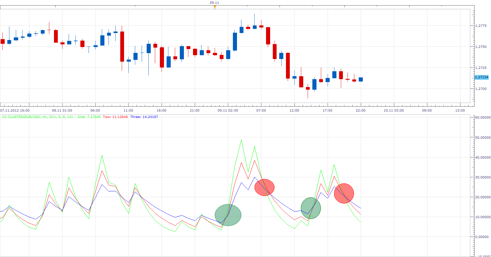

# DI Cluster

> Source: https://fxcodebase.com/code/viewtopic.php?f=17&t=25754  
> Forum: 17 · Topic 25754 · 3 post(s)

---

## DI Cluster

**Apprentice** · Sun Nov 11, 2012 4:39 am

This three in one indicator, draws three lines selected indicators.
You can choose between the ADX, DMI + or / and DMI-.
As described in the latest issue of S & C magazine.

 [DI Cluster.lua](files/44238/DI%20Cluster.lua)

Interpretation, the levels at which cross occurs, are different from cross to cross.
Unlike, regular ADX, or DMI, which have fixed trigger line.
This indicator, have adaptable levels, which are determined by the cross alone.

 

The indicator was revised and updated

---

## Re: DI Cluster

**Alexander.Gettinger** · Thu Oct 23, 2014 9:50 am

MQL4 version of DI Cluster: [viewtopic.php?f=38&t=61368](https://fxcodebase.com/code/viewtopic.php?f=38&t=61368).

---

## Re: DI Cluster

**Apprentice** · Fri Jun 23, 2017 7:22 am

The indicator was revised and updated.
