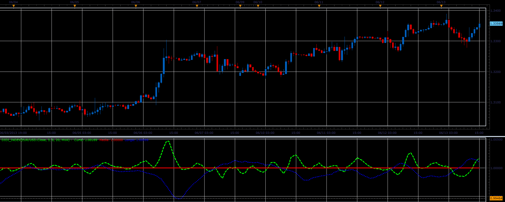

# Didi Index

> Source: https://fxcodebase.com/code/viewtopic.php?f=17&t=41319  
> Forum: 17 · Topic 41319 · 8 post(s)

---

## Didi Index

**Alexander.Gettinger** · Tue Jun 18, 2013 3:18 pm

This indicator is a ported MQL5 indicator from [http://www.mql5.com/en/code/1725](http://www.mql5.com/en/code/1725).

Formulas:
Curta = MA(Curta_Period)/MA(Media_Period),
Media = 1,
Longa = MA(Longa_Period)/MA(Media_Period).

 

Download:

 [Didi_Index.lua](files/67548/Didi_Index.lua)

For this indicator must be installed Averages indicator ([viewtopic.php?f=17&t=2430](https://fxcodebase.com/code/viewtopic.php?f=17&t=2430)).

The indicator was revised and updated

---

## Re: Didi Index

**Alexander.Gettinger** · Tue Jun 18, 2013 3:20 pm

MQL4 version of Didi index: [viewtopic.php?f=38&t=41320](https://fxcodebase.com/code/viewtopic.php?f=38&t=41320)

---

## Re: Didi Index

**Apprentice** · Sat May 27, 2017 11:59 am

Indicator was revised and updated.

---

## Re: Didi Index

**spinemaligna** · Tue Sep 03, 2019 7:19 am

Hi everyone,

Could I ask that this indi be coded as a histogram. It would keep everything neat.

Thanks

Ross

---

## Re: Didi Index

**Apprentice** · Tue Sep 03, 2019 7:45 am

If we choose to have a histogram for all three,
they will overlap.
My advice is to pick one for the histogram.

---

## Re: Didi Index

**spinemaligna** · Wed Sep 04, 2019 6:19 am

Hi Apprentice,

To be specific, could a histogram be coded that would return a green signal when Curta is above Media and a red signal when opposite.
Failing that could a colour coded vertical line be drawn on the chart when the two lines cross.
Thanks

Ross

---

## Re: Didi Index

**Apprentice** · Thu Sep 05, 2019 5:19 am

Try this version.

 [Didi_Index Bar.lua](files/128429/Didi_Index%20Bar.lua)

---

## Re: Didi Index

**spinemaligna** · Thu Sep 05, 2019 10:03 am

Perfect thank you.

Ross
