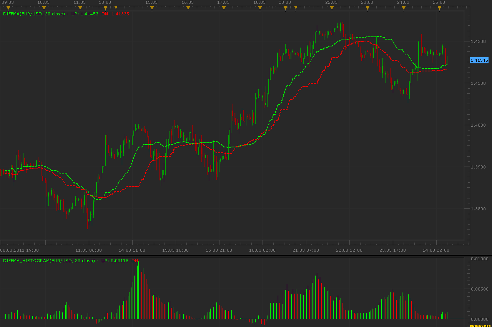

# Diff MA indicator

> Source: https://fxcodebase.com/code/viewtopic.php?f=17&t=3728  
> Forum: 17 · Topic 3728 · 2 post(s)

---

## Diff MA indicator

**Alexander.Gettinger** · Fri Mar 25, 2011 4:16 am

Indicator looks like simple moving average (MVA) with some difference.

UP line is a MVA for [Period] last up-closed bars (close>open) and DN line is a MVA for [Period] last down-closed bars (close<open).

Diff MA Histogram is a difference between UP and DN lines.

 

Download Diff MA:

 [DiffMA.lua](files/9052/DiffMA.lua)

Download Diff MA Histogram:

 [DiffMA_Histogram.lua](files/9052/DiffMA_Histogram.lua)

The indicator was revised and updated

---

## Re: Diff MA indicator

**Apprentice** · Fri Mar 03, 2017 9:12 am

Indicator was revised and updated.
