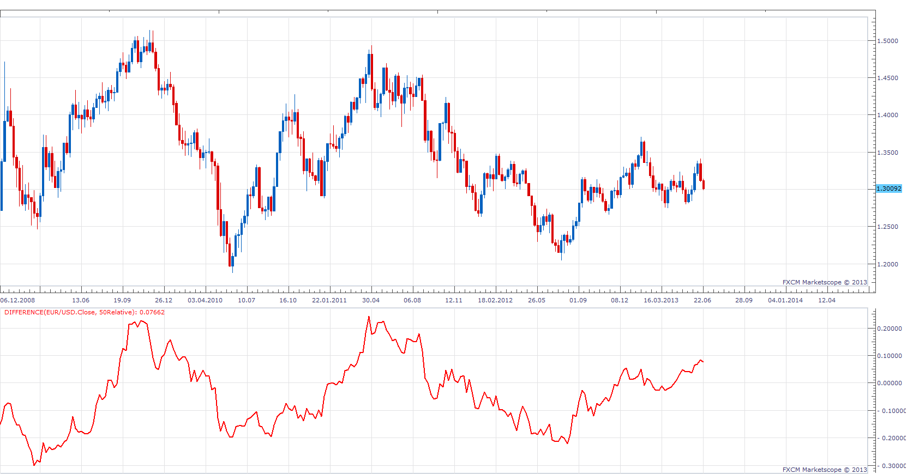
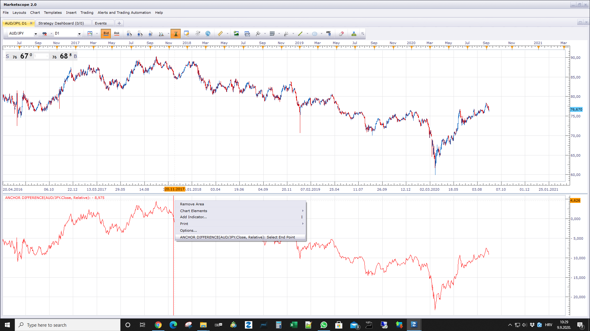

# Difference

> Source: https://fxcodebase.com/code/viewtopic.php?f=17&t=42662  
> Forum: 17 · Topic 42662 · 10 post(s)

---

## Difference

**Apprentice** · Sun Jun 30, 2013 5:50 am

This simple indicator will show the difference from the current period,
and period N periods ago.
The value can be displayed in absolute value.

 [Difference.lua](files/69272/Difference.lua)

 

 [Anchor difference.lua](files/69272/Anchor%20difference.lua)

MQ4/MT4 version.
[viewtopic.php?f=38&t=64838](https://fxcodebase.com/code/viewtopic.php?f=38&t=64838)

---

## Re: Difference

**Apprentice** · Sat Jun 24, 2017 4:51 am

The indicator was revised and updated.

---

## Re: Difference

**Remie9** · Sun Jul 16, 2017 5:30 pm

Hi,

Very useful indicator indeed. Thanks for that.

One question. Is it possible to use this custom indicator in a strategy?

Regards
Jeremie

---

## Re: Difference

**Apprentice** · Mon Jul 17, 2017 4:04 am

Sure, can you specify the entry / exit rules.

---

## Re: Difference

**Apprentice** · Mon Jul 17, 2017 5:01 am

Try this version.
[viewtopic.php?f=31&t=64926&p=113575#p113575](https://fxcodebase.com/code/viewtopic.php?f=31&t=64926&p=113575#p113575)

---

## Re: Difference

**asedic** · Sun Sep 06, 2020 8:29 am

Very good job, thank you. Is it possible to integrate option for calculation of difference between actual value and value at defined fixed point? Thank you.

---

## Re: Difference

**Apprentice** · Mon Sep 07, 2020 1:55 am

Sure.
"Defined fixed point", can you give me an example?
Is it defined by the user?

---

## Re: Difference

**asedic** · Mon Sep 07, 2020 4:31 am

Thank you for fast response, I really appreciate your work.

If we define formula in existing indicator as diff=A1-A2, A1 is actual value, and A2 is value N period ago. Value of A1 and A2 are continuously changing in time, but number of time periods is fixed.

I am interested in difference diff = A1-C where value of C is constant and corresponds to value in some fixed time point, let say at 9:00 am (market opening or any other interesting point ...), and does not change in time.

Maybe definition of fixed time point is problem. In that case integration of option to put constant value manually and calculation of difference between actual value and this constant would be very good solution.

Thank you.

---

## Re: Difference

**Apprentice** · Wed Sep 09, 2020 3:31 am

Try Anchor difference.

---

## Re: Difference

**asedic** · Thu Sep 10, 2020 3:05 am

Thank you.
