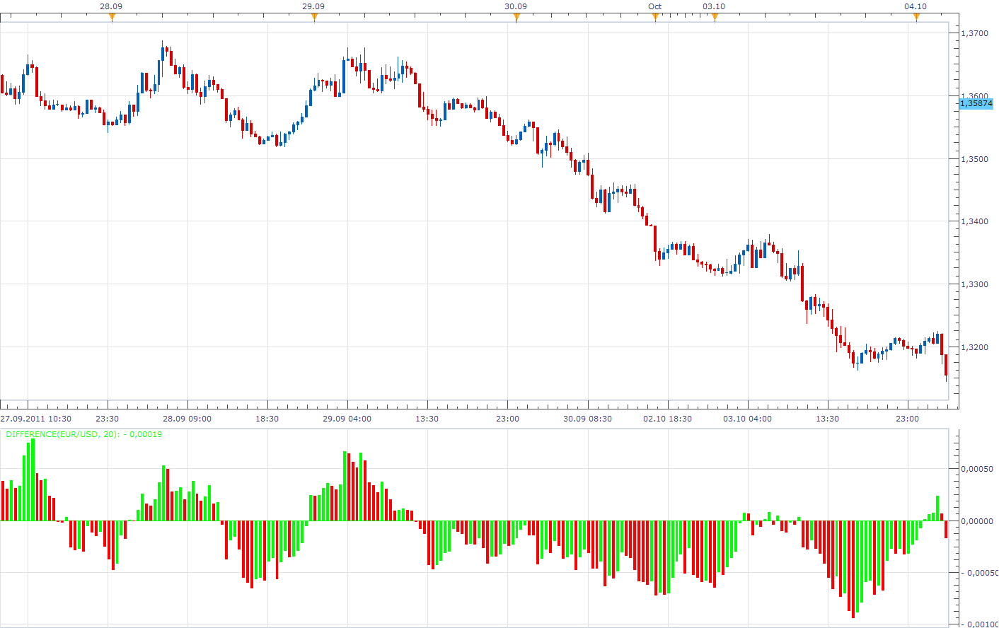
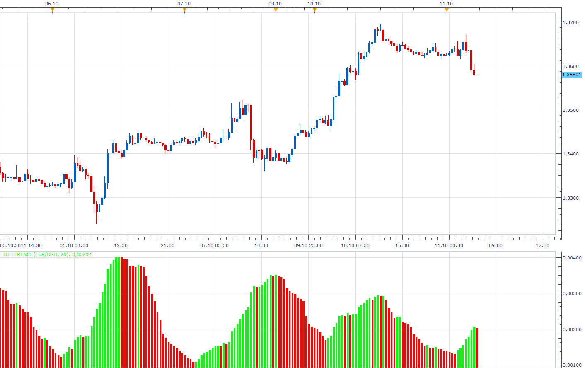

# Difference

> Source: https://fxcodebase.com/code/viewtopic.php?f=17&t=7174  
> Forum: 17 · Topic 7174 · 4 post(s)

---

## Difference

**Apprentice** · Tue Oct 11, 2011 4:28 am

 

The indicator calculates the moving average of difference between high and low, or, close and open.
I have add Raw Data option (do not use moving average).

 [Difference.lua](files/16050/Difference.lua)

The indicator was revised and updated

---

## Re: Difference

**kaya_171** · Tue Oct 11, 2011 4:41 am

Hello Apprentice

very good job thanks a lot

---

## Re: Difference

**Alexander.Gettinger** · Fri Jun 22, 2012 2:31 pm

MQL4 version of this indicator: [viewtopic.php?f=38&t=20490](https://fxcodebase.com/code/viewtopic.php?f=38&t=20490)

---

## Re: Difference

**Apprentice** · Tue Apr 11, 2017 4:58 am

Indicator was revised and updated.
