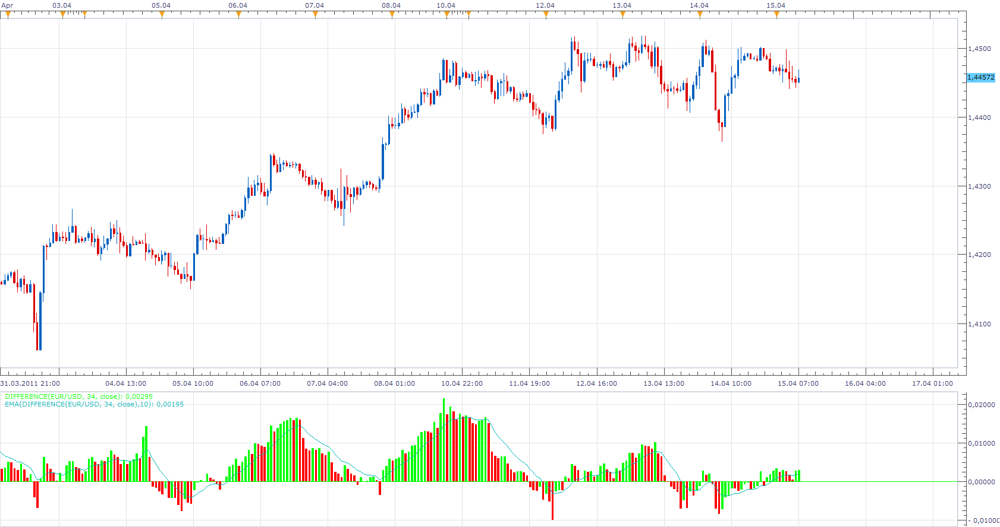

# Difference

> Source: https://fxcodebase.com/code/viewtopic.php?f=17&t=3925  
> Forum: 17 · Topic 3925 · 5 post(s)

---

## Difference

**Apprentice** · Fri Apr 15, 2011 6:59 am

This simple indicator is written upon request.
Price Difference = [Last] - Price [Last-Period]

Compute the difference in price between the closing price and the price N periods ago.

 [Difference.lua](files/9706/Difference.lua)

The indicator was revised and updated

---

## Re: Difference

**vstrelnikov** · Fri Apr 15, 2011 10:11 am

Upd: Modified to support Tick data.

---

## Re: Difference

**Apprentice** · Tue Mar 26, 2013 7:28 am

Relativ (percentage) calculation added.

---

## Re: Difference

**Alexander.Gettinger** · Fri Jun 06, 2014 3:40 pm

MQL4 version of Difference oscillator: [viewtopic.php?f=38&t=60799](https://fxcodebase.com/code/viewtopic.php?f=38&t=60799).

---

## Re: Difference

**Apprentice** · Mon Jun 19, 2017 7:59 am

The indicator was revised and updated.
