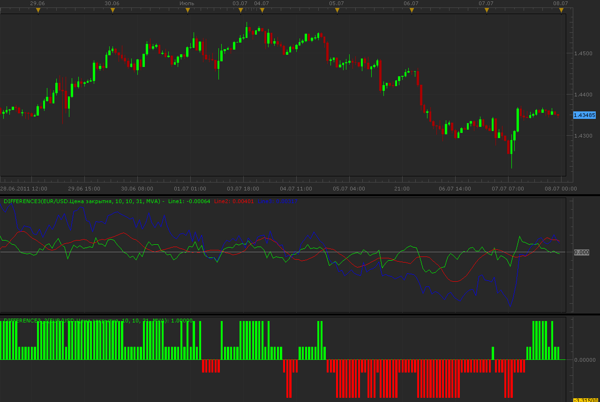

# Difference3 indicator

> Source: https://fxcodebase.com/code/viewtopic.php?f=17&t=5104  
> Forum: 17 · Topic 5104 · 2 post(s)

---

## Difference3 indicator

**Alexander.Gettinger** · Thu Jul 07, 2011 11:35 pm

Indicators is written on request: [viewtopic.php?f=27&t=4919](https://fxcodebase.com/code/viewtopic.php?f=27&t=4919)

Difference3:
Line1[i]=Price[i]-MA[i],
Line2[i]=MA[i]-MA[i-MAShift],
Line3[i]=Price[i]-Price[i-PriceShift].

Difference3_2 is a trigger version, it show what lines have positive or negative values.

 

Download:

 [Difference3.lua](files/12487/Difference3.lua)

 [Difference3_2.lua](files/12487/Difference3_2.lua)

For this oscillators must be installed Averages indicator ([viewtopic.php?f=17&t=2430](https://fxcodebase.com/code/viewtopic.php?f=17&t=2430)).

The indicator was revised and updated

---

## Re: Difference3 indicator

**Apprentice** · Sun Mar 12, 2017 6:24 pm

Indicator was revised and updated.
