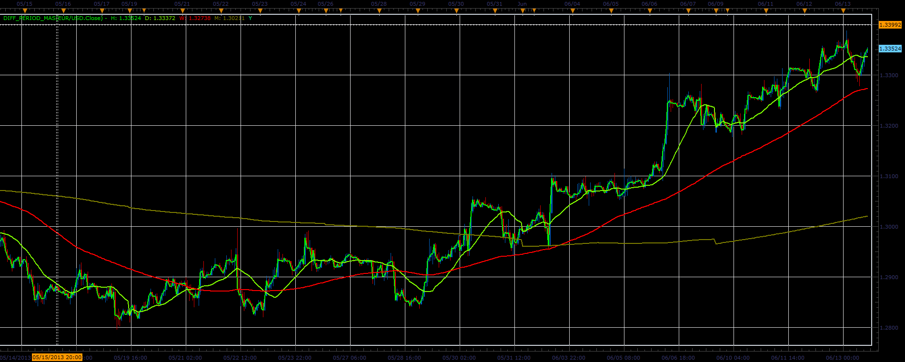

# Different period MAs

> Source: https://fxcodebase.com/code/viewtopic.php?f=17&t=41292  
> Forum: 17 · Topic 41292 · 2 post(s)

---

## Different period MAs

**Alexander.Gettinger** · Tue Jun 18, 2013 12:59 pm

The indicator draws hourly, daily, weekly, monthly and annual simple moving averages.

 

Download:

 [Diff_Period_MAs.lua](files/67513/Diff_Period_MAs.lua)

The indicator was revised and updated

---

## Re: Different period MAs

**Apprentice** · Sat May 27, 2017 11:37 am

Indicator was revised and updated.
