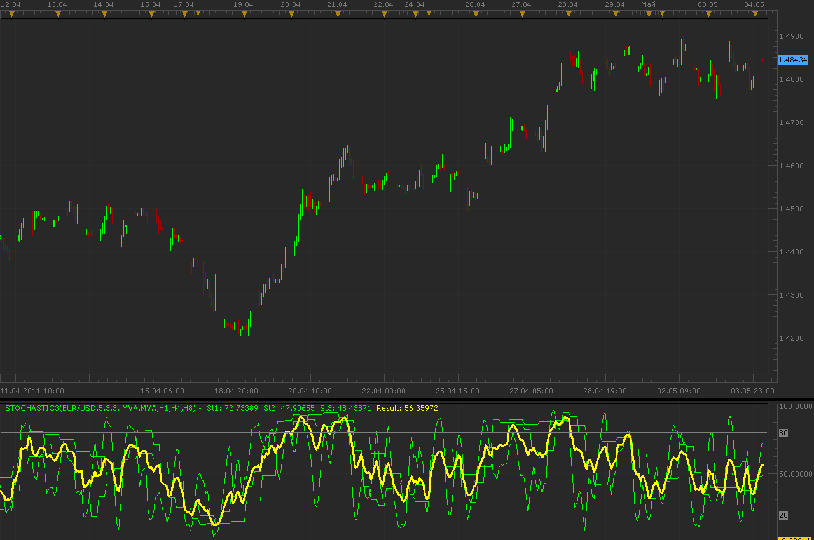

# Different timeframe stochastics

> Source: https://fxcodebase.com/code/viewtopic.php?f=17&t=4110  
> Forum: 17 · Topic 4110 · 3 post(s)

---

## Different timeframe stochastics

**Alexander.Gettinger** · Wed May 04, 2011 3:05 am

Oscillator draw 3 stochastics with different timeframes and their average value as result line.

 

Download:

 [Stochastic3.lua](files/10303/Stochastic3.lua)

The indicator was revised and updated

---

## Re: Different timeframe stochastics

**emjay-short** · Fri Jul 08, 2011 11:57 am

Known as Wallaby by Rob Booker (request was here [viewtopic.php?f=27&t=4933&p=12411&hilit=Wallaby#p12411](https://fxcodebase.com/code/viewtopic.php?f=27&t=4933&p=12411&hilit=Wallaby#p12411))

**The Wallaby** (Stochastic / yellow line) is the average of 3 different time frame Stochastics (ie 5m, 15m, 1H). It should be a good help to identify divergences where you then can try fade new price high or low in a counter trend trade which is in line with the long-term trend, with a tight tight stop. If you want to know how to use it, see this video (YT) and Rob's website below.

- http://www.youtube.com/watch?v=p_mYOBkkTrY
- http://rob.bz/1st-annual-presidents-day-rules-of-trading
- http://rob.bz/how-i-trade-divergence-on-the-short-term-char
- he also got wind that FXCM's MS supports his idea (indicator) now [http://wallaby.me/wallaby-for-fxcm-trad ... -whoa-yeah](http://wallaby.me/wallaby-for-fxcm-trading-station-whoa-yeah) *Apprentice gets in the Screencast a personal shout out*

I attached an example for the USDCHF.
Hope that helps to get an idea of this indicator.

---

## Re: Different timeframe stochastics

**Apprentice** · Thu Mar 16, 2017 5:19 am

Indicator was revised and updated.
