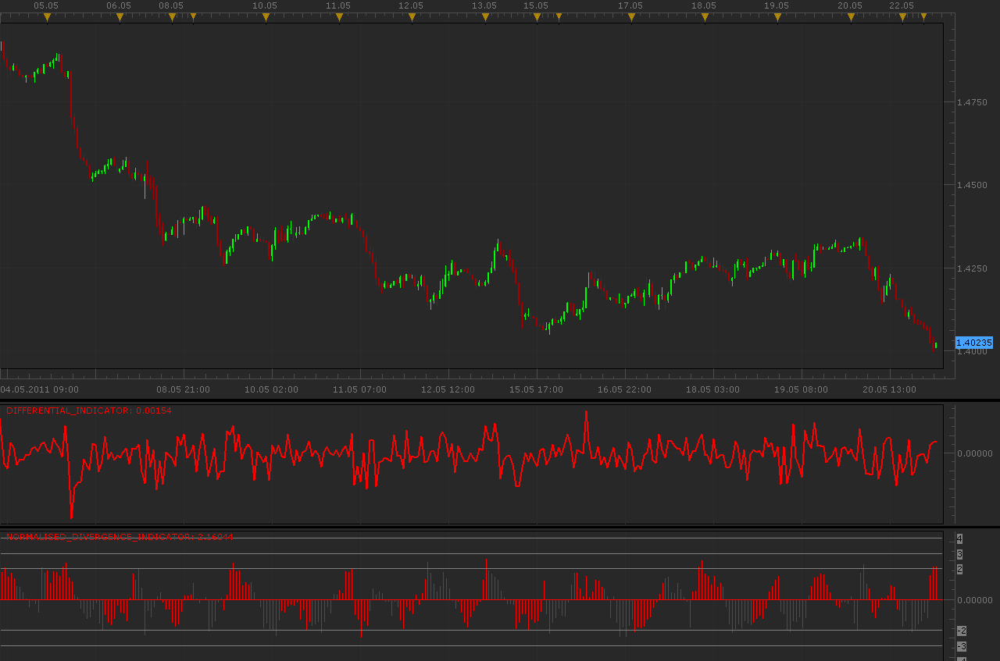

# Differential & Normalised Divergence indicators

> Source: https://fxcodebase.com/code/viewtopic.php?f=17&t=4435  
> Forum: 17 · Topic 4435 · 3 post(s)

---

## Differential & Normalised Divergence indicators

**Alexander.Gettinger** · Mon May 23, 2011 3:19 am

Inquiry for these indicators has entered me on mail.

Formulas:
Differential[i]=Price1[i]-Price2[i], if AsPercentage=false or
Differential[i]=(Price1[i]-Price1[i-1])/Price1[i]-(Price2[i]-Price2[i-1])/Price2[i], where
Price1 is a price of instrument 1 and Price2 is a price of instrument 2.

Normalised Divergence[i]=(Price1[i]-Price2[i]-Avg(Price1-Price2))/StDev(Price1-Price2), where
Avg is a average for range form [i-AveragePeriod] to [i] and StDev is a standard deviation for range form [i-AveragePeriod] to [i].

 

Download Differential indicator:

 [Differential_Indicator.lua](files/10952/Differential_Indicator.lua)

Download Normalised Divergence indicator:

 [Normalised_Divergence_Indicator.lua](files/10952/Normalised_Divergence_Indicator.lua)

The indicator was revised and updated

---

## Re: Differential & Normalised Divergence indicators

**Showman** · Tue May 24, 2011 6:55 pm

Thank you for your endeavours

---

## Re: Differential & Normalised Divergence indicators

**Apprentice** · Sun Mar 12, 2017 6:02 pm

Indicator was revised and updated.
