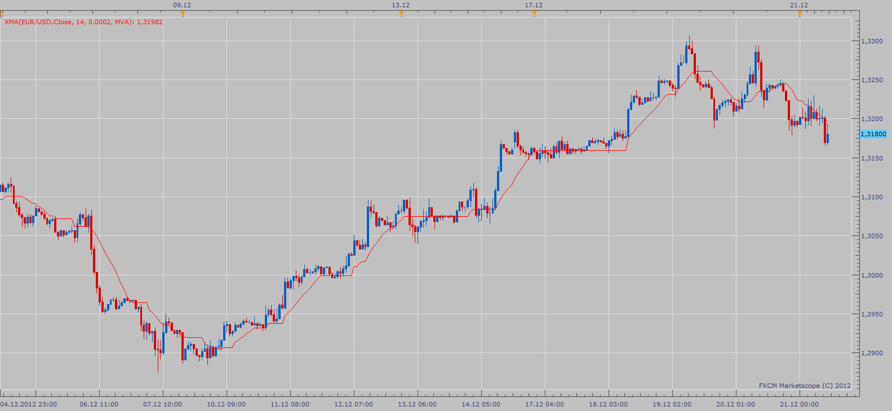

# Digital adaptive Moving Average (XMA)

> Source: https://fxcodebase.com/code/viewtopic.php?f=17&t=27877  
> Forum: 17 · Topic 27877 · 5 post(s)

---

## Digital adaptive Moving Average (XMA)

**Apprentice** · Fri Dec 21, 2012 10:47 am

Digital adaptive Moving Average XMA calculate Moving Averages with a digital filter.
Registers shifts of MA, from period to period,
only if it is higher than the specified step (in pips).

 [XMA.lua](files/48911/XMA.lua)

The indicator was revised and updated

---

## Re: Digital adaptive Moving Average (XMA)

**Alexander.Gettinger** · Mon Sep 22, 2014 11:13 am

MQL4 version of XMA indicator: [viewtopic.php?f=38&t=61221](https://fxcodebase.com/code/viewtopic.php?f=38&t=61221).

---

## Re: Digital adaptive Moving Average (XMA)

**Apprentice** · Sat Jun 24, 2017 5:27 am

The indicator was revised and updated.

---

## Re: Digital adaptive Moving Average (XMA)

**bartwas1** · Fri Oct 09, 2020 6:28 am

hi Apprentice

Does this indicator have a version where different colour indicates positive or negative slope?

B.

---

## Re: Digital adaptive Moving Average (XMA)

**Apprentice** · Tue Oct 13, 2020 8:07 am

[XMA Slope.lua](files/138257/XMA%20Slope.lua)

Try this version.
