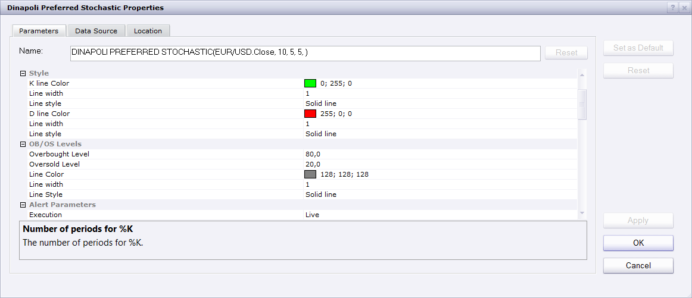
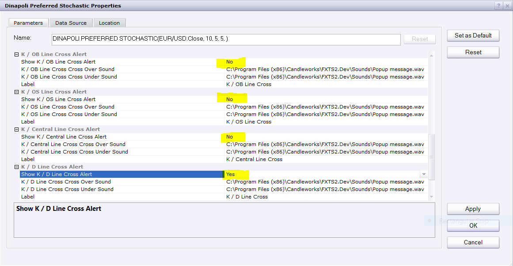

# Dinapoli Preferred Stochastic

> Source: https://fxcodebase.com/code/viewtopic.php?f=17&t=1874  
> Forum: 17 · Topic 1874 · 16 post(s)

---

## Dinapoli Preferred Stochastic

**Apprentice** · Fri Aug 20, 2010 5:16 am

Basically, it is Stochastic, uses a slightly different Smoothing algorithm.

 [Dinapoli Preferred Stochastic.lua](files/3769/Dinapoli%20Preferred%20Stochastic.lua)

The indicator was revised and updated

---

## Re: Dinapoli Preferred Stochastic With Alert

**Apprentice** · Sun Aug 22, 2010 3:57 am

This indicator is designed to use the Bar source.
But it can be adjusted in order to use the individual components.

Tick Based version.

 [Dinapoli Preferred Stochastic.lua](files/3808/Dinapoli%20Preferred%20Stochastic.lua)

Compatibility issue fixed.
_Alert Helper is not longer needed.

---

## Re: Dinapoli Preferred Stochastic

**Alexander.Gettinger** · Thu Jan 08, 2015 5:00 pm

MQL4 version of Dinapoli Preferred Stochastic: [viewtopic.php?f=38&t=61691](https://fxcodebase.com/code/viewtopic.php?f=38&t=61691).

---

## Re: Dinapoli Preferred Stochastic

**Coondawg71** · Fri Apr 03, 2015 3:18 am

Can we please request the Tick version of Dinapoli Preferred Stochastic indicator have 50 centerline added and then Alert function capability.

Thanks!

sjc

---

## Re: Dinapoli Preferred Stochastic

**Apprentice** · Fri Apr 03, 2015 6:23 am

Alert functionality added.

---

## Re: Dinapoli Preferred Stochastic

**Apprentice** · Sun Dec 06, 2015 5:00 am

Compatibility issue fixed.
_Alert Helper is not longer needed.

---

## Re: Dinapoli Preferred Stochastic

**Apprentice** · Wed Mar 08, 2017 2:24 pm

Indicator was revised and updated.

---

## Re: Dinapoli Preferred Stochastic

**easytrading** · Thu Mar 09, 2017 4:34 am

for the Tick Based version ( the second indicator ) :

1 ) the Alert style color is not working .when i change the up & down trend color to different colors it only takes the up trend color for both of them.

2 ) it is not showing the K/D line cross Alert.

could you fix that Apprentice, please ? with many thanks in advance.

---

## Re: Dinapoli Preferred Stochastic

**Apprentice** · Fri Mar 10, 2017 7:16 am

Try it now.

---

## Re: Dinapoli Preferred Stochastic

**scandisk** · Sat Mar 18, 2017 3:05 pm

Hi Apprentice

I wanted to be able change the line thickness of the stochastic lines

Also to be able to change the overbought and sold levels and change the color and thickness..

I wanted a alert and to show a dot or arrow for when the stochastic lines passes down below the upper over bought level and alert and arrow for when the stochastic line passes up above the over sold level.. customizable levels..

Also I wanted a line cross alert so when they cross but be able to disable too..

I wanted a custom setting to change the line distances so they are closer or farther apart..

Thanks

---

## Re: Dinapoli Preferred Stochastic

**Apprentice** · Sun Mar 19, 2017 6:12 am

Try it now.
Alert version is available on second post.

---

## Re: Dinapoli Preferred Stochastic

**easytrading** · Fri Mar 24, 2017 1:32 am

Hello Apprentice :
for the Tick Based version ( second indicator ) :

1 ) could you please, add line style & width .

2 ) it is showing more than one alert when the K/D line cross (when not to show the other crossing but only show K/D crossing Alert). is it possible to fix that ? with many thanks in advance.

---

## Re: Dinapoli Preferred Stochastic

**Apprentice** · Sat Mar 25, 2017 7:02 am

1)

 

2)

 

---

## Re: Dinapoli Preferred Stochastic

**fortcentral** · Sun Jan 13, 2019 12:22 am

Dear Apprentice,
I am not a programmer and since the formula being used for this indicator is not readily apparent, could you please confirm that the description below is what is being calculated. I have based the text below on my understanding of what Joe Dinapoli has recommended in his publicly available material. I ran a check on indicator generated data vs manual calculation using the same price feed and the results are close but a little off in accuracy. Appreciate your advice and help.

Regards,
fortcentral

--------------------------------------------------------------------------------
Indicator: Dinapoli Preferred (Slow) Stochastic
This is a Slow Stochastic Calculation which uses Modified Moving Average (Kaufman New Commodity Trading -- "Average-off Method") to dampen the end-off impact of using the Simple Moving Average Calculation.

------------------------------------------------------------
[viewtopic.php?f=17&t=1874](https://fxcodebase.com/code/viewtopic.php?f=17&t=1874)
------------------------------------------------------------

--> Price source : bars

Calculation for Modified Moving Average (MMAV)
	MMAV(time) = MMAV(time-1) + [P(time)-MMAV(time-1)]/(period)

Note:
1) MMAV(time) is the current time-period Modified Moving Average value
2) MMAV (time-1) is the previous time-period Modified Moving Average value
3) P(time) is the current time-period closing price of bar
4) "n.period" is the total number of bars used in the calculation, i.e the lookback period
5) The starting point of the MMAV calculation is the simple average of the number of "periods" selected for the calculation. The substitution of the simple moving average value for the oldest data item tends to smooth the results even more than a simple moving average and dampens the end-off impact (P. Kaufman, Trading Systems and Methods)

--> User Input Parameters:
1) %Kfast(kf.n.period) - lookback (bars) period for %Kfast calculation
2) %Kslow(ks.n.period) - period for the %Kfast(time) MMAV calculation to produce the %Kslow(time) line
3) %Dslow(ds.n.period) - period for the %Kslow(time) MMAV calculation to produce the %Dslow(time) line
4) Option for choosing line thickness, style and colour for the "%Kslow" and the "%Dslow" lines

Stochastic Calculation:

Fast Stochastic:
	%Kfast(time) = 100*{[P(time)-minLow(kf.n.period)]/[maxHigh(kf.n.period)-minLow(kf.n.period)]}
	%Dfast(time) = "ks.n.period" MMAV of %Kfast values --> uses MMAV formula above

Note:
1) P(time) is the current time-period closing price of bar
2) %Kfast(time) is the %Kfast calculation for the current time-period
2) maxHigh(kf.n.period) is the highest-high price for the selected "kf.n.period" lookback
3) minLow(kf.n.period) is the lowest-low price for the selected "kf.n.period" lookback
4) %Dfast(time) is the current time-period %Dfast calculation using the MMAV formula above

****************************************************************************************************
--> The Dinapoli Preferred (Slow) Stochastic Calculation
	%Kslow(time) = %Dfast(time) -> from above
	%Dslow(time) = "ds.n.period" MMAV of %Kslow(time)

Note:
1) %Kslow(time) is the current time-period value for the %Kslow line [same as %Dfast(time)]
2) %Dslow(time) is the current time-period value for the %Dslow line
3) The %Kslow and %Dslow lines are displayed in a panel at the bottom of the price chart

********************************************************************************************************

---

## Re: Dinapoli Preferred Stochastic

**Apprentice** · Sun Jan 13, 2019 7:33 am

Affirmative.
The specification is correct.

---

## Re: Dinapoli Preferred Stochastic

**fortcentral** · Sun Jan 13, 2019 9:56 am

Thank you for the quick response!
