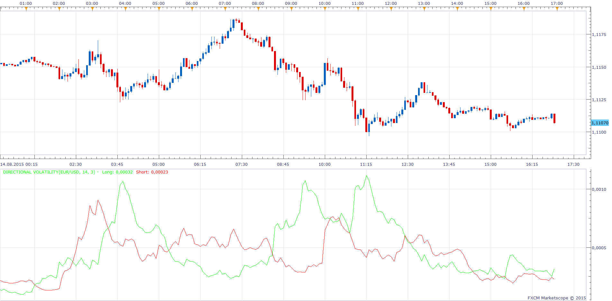

# Directional Volatility

> Source: https://fxcodebase.com/code/viewtopic.php?f=17&t=62540  
> Forum: 17 · Topic 62540 · 3 post(s)

---

## Directional Volatility

**Apprentice** · Sun Aug 16, 2015 6:05 am

Based on request.
[viewtopic.php?f=27&t=62532](https://fxcodebase.com/code/viewtopic.php?f=27&t=62532)
Directional Volatility LONG
Mov((Ref(CLOSE,-1)-LOW),14,E)+ 3*Stdev((Mov((Ref(CLOSE,-1)-LOW),14,E)) ,14 ))
Directional Volatility SHORT
Mov((HIGH-Ref(CLOSE,-1)),14,E)+ 3*Stdev(Mov((HIGH-Ref(CLOSE,-1)),14,E) ,14 ))

 [Directional Volatility.lua](files/101803/Directional%20Volatility.lua)

The indicator was revised and updated

---

## Re: Directional Volatility

**Alexander.Gettinger** · Mon Aug 31, 2015 11:52 am

MQL4 version of Directional Volatility oscillator: [viewtopic.php?f=38&t=62617](https://fxcodebase.com/code/viewtopic.php?f=38&t=62617).

---

## Re: Directional Volatility

**Apprentice** · Wed Jul 19, 2017 7:21 am

The indicator was revised and updated.
