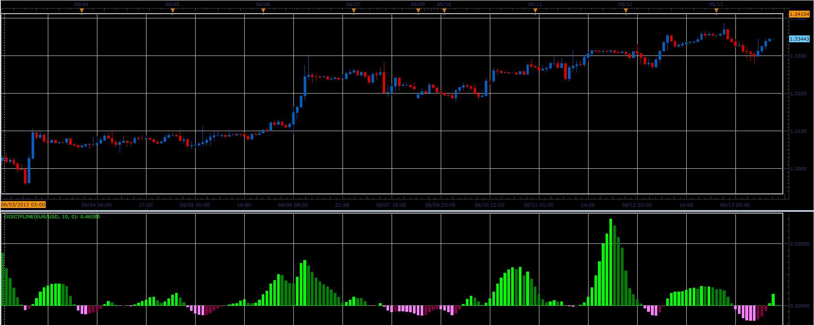

# Discipline oscillator

> Source: https://fxcodebase.com/code/viewtopic.php?f=17&t=41273  
> Forum: 17 · Topic 41273 · 2 post(s)

---

## Discipline oscillator

**Alexander.Gettinger** · Tue Jun 18, 2013 12:00 pm

This indicator is a ported MQL5 indicator from [http://www.mql5.com/en/code/1672](http://www.mql5.com/en/code/1672)

Formulas:
Discipline[i] = (Log(1+Value[i])/(1-Value[i])+Discipline[i-1])/2, where
Log - natural logarithm,
Value[i] = ((Price[i]-Min)/(Max-Min)-0.5*Value[i-1])*2/3,
Max, Min - maximum and minimum price at range from (i-Period+1) to i.

 

Download:

 [Discipline.lua](files/67493/Discipline.lua)

The indicator was revised and updated

---

## Re: Discipline oscillator

**Apprentice** · Tue May 23, 2017 5:48 am

Indicator was revised and updated.
