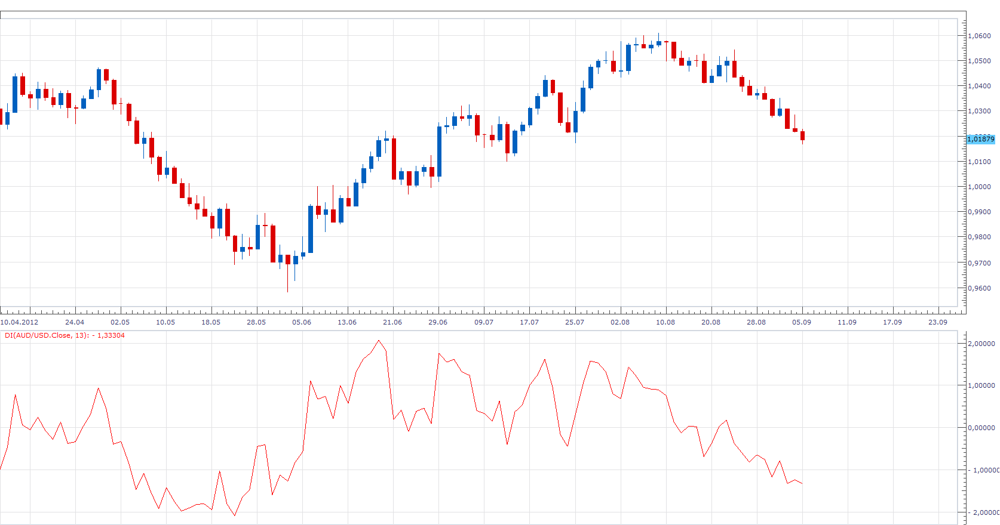
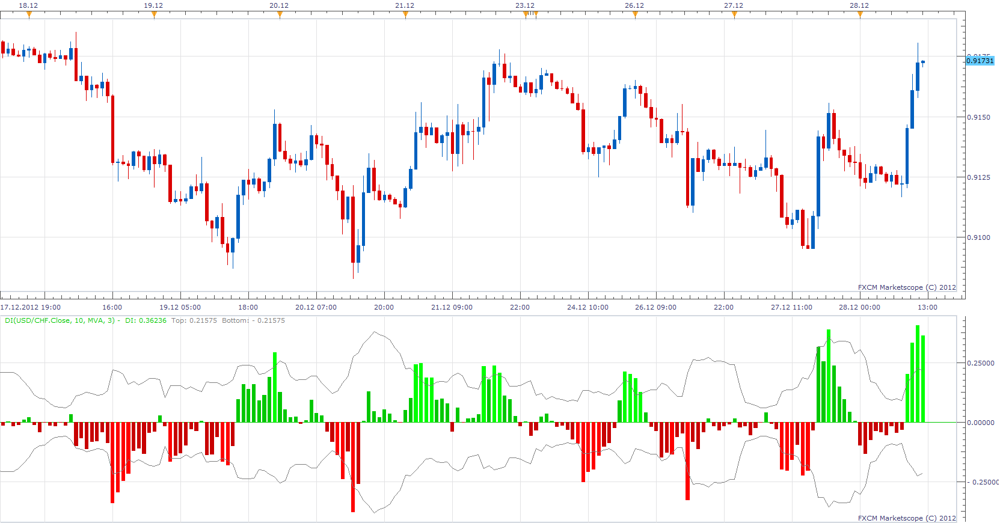

# Disparity Index

> Source: https://fxcodebase.com/code/viewtopic.php?f=17&t=23048  
> Forum: 17 · Topic 23048 · 10 post(s)

---

## Disparity Index

**Apprentice** · Wed Sep 05, 2012 9:11 am

A technical indicator that measures the relative position of the most recent closing price to a selected moving average and reports the value as a percentage. A value greater than zero suggests that the asset is gaining upward momentum, while a value less than zero can be interpreted as a sign that selling pressure is increasing.

Formula
Disparity Index = (Close - MA )/ MA *100

 [DI.lua](files/39720/DI.lua)

 [Averages DI.lua](files/39720/Averages%20DI.lua)

For Averages DI you will need to install averages indicator.
[viewtopic.php?f=17&t=2430&p=5705&hilit=averages#p5705](https://fxcodebase.com/code/viewtopic.php?f=17&t=2430&p=5705&hilit=averages#p5705)

Indicator-based strategy.
[https://fxcodebase.com/code/viewtopic.php?f=31&t=72435](https://fxcodebase.com/code/viewtopic.php?f=31&t=72435)

---

## Re: Disparity Index

**Coondawg71** · Thu Dec 27, 2012 9:49 pm

Can we please request this version of indicator added for development.

Histogram of Disparity Index

Thanks

Sjc

[http://www.mql5.com/en/code/1353](http://www.mql5.com/en/code/1353)

---

## Re: Disparity Index

**Apprentice** · Fri Dec 28, 2012 3:17 am

Your request is added to the development list.

---

## Re: Disparity Index

**Apprentice** · Fri Dec 28, 2012 5:02 am

 [Disparity Index.lua](files/49159/Disparity%20Index.lua)

 [Averages Disparity Index.lua](files/49159/Averages%20Disparity%20Index.lua)

For Averages DI you will need to install averages indicator.
[viewtopic.php?f=17&t=2430&p=5705&hilit=averages#p5705](https://fxcodebase.com/code/viewtopic.php?f=17&t=2430&p=5705&hilit=averages#p5705)

---

## Re: Disparity Index

**Patrick Sweet** · Thu Oct 24, 2013 3:21 pm

Although simple and less sexy than many others, this is very useful.
Could we add the 'Averages' lua to it..that is can we expand the MAs available to include the other more sensative ones.....?

---

## Re: Disparity Index

**Apprentice** · Thu Jul 02, 2015 4:43 am

Averages Disparity Index.lua / Averages DI Added.

---

## Re: Disparity Index

**Mattia** · Thu Nov 24, 2016 6:01 pm

Hi!

It s possible make this indicator in this way:

Disparity Index = ((Close - MA )/ MA *100)*100

for see a bigger range. I think it's better...

_____________________________________________

And its possible make a quantitative version?

X * natural logarithm (Disparity Index1/Disparity IndexN)

Where;
Disparity Index = ((Close - MA )/ MA *100)*100
X= a variable>0 , a positive number
Disparity Index1= the current valor of Disparity Index
Disparity IndexN = Disparity Index of N candelstick ago ( example the previous 5 or 60)
____________________________________________________

I think it's a good indicator.

Thanks!!!

Mattia

---

## Re: Disparity Index

**Apprentice** · Fri Nov 25, 2016 5:39 am

 [DI Modification.lua](files/109203/DI%20Modification.lua)

Disparity Index = ((Close - MA )/ MA *100)*100

 [DI Modification Quantitative.lua](files/109203/DI%20Modification%20Quantitative.lua)

DI Modification Quantitative = X * natural logarithm (Disparity Index1/Disparity IndexN)

---

## Re: Disparity Index

**swingtrader** · Fri Nov 25, 2016 12:31 pm

hi apprendice,

can you create a strategy based on disparity index indicator

buy; DI cross over Top line
sell: DI cross under Bottom line

---

## Re: Disparity Index

**Mattia** · Fri Nov 25, 2016 4:46 pm

Thabks for modification!

Mattia
