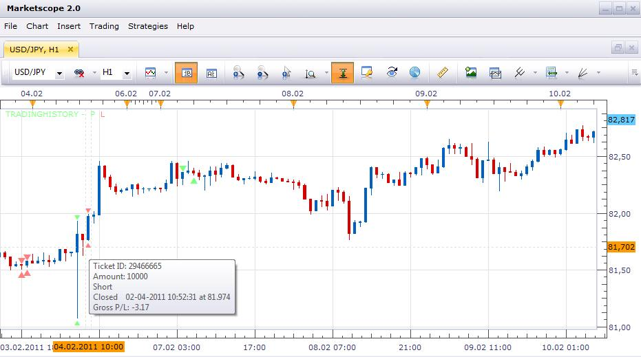

# Display Trading History on a Chart

> Source: https://fxcodebase.com/code/viewtopic.php?f=17&t=3514  
> Forum: 17 · Topic 3514 · 38 post(s)

---

## Display Trading History on a Chart

**sunshine** · Wed Feb 23, 2011 7:03 am

The indicator uses FXCM Report API in order to load the history of trading and then display it on the chart. Just install the indicator and apply it.

The indicator displays historical trades. If you move the cursor over an arrow and wait a bit, the tooltip with details about the trades are shown:

 

By default, trade markers are shown above/below a bar. You can change markers position from "at bar" to "at price" in the indicator properties. Unfortunately there is an issue with the at "price" mode: currently the markers are displayed between bars instead of be shown at the center of the bar. This problem will be fixed in the next update of the Trading Station.

Please note that the indicator does not update automatically when the a bar appears, or a new trade is closed. This is made intentionally to avoid exceeding load on the report server. So to update the information just right click on the indicator legend (the text at the top left corner of the chart) and choose "Refresh" command.

---

## How to Install the Indicator?

**sunshine** · Wed Feb 23, 2011 7:08 am

The indicator requires the http_lua extension module. So, in addition to loading and installing the indicator, you must also download the http_lua.dll module and save it to the Trading Station folder (usually the folder is "c:\program files\candleworks\fxts2"). If you aren't sure whether you can install indicator and extension correctly, please use self-installer.

Please, don't use this indicator at the moment. Due to defect in the code, it will produce excessive load onto FXCM servers. Your account can be locked because of that.

The new optimized version is coming soon.

You can also find similar indicator [here.](https://fxcodebase.com/code/viewtopic.php?f=17&t=9754)

Note: Use either the installer (trading_history_installer.exe) or TradingHistory.lua and http_lua.dll files to install the indicator. Don't use both of them.

---

## Re: Display Trading History on a Chart

**TygerKrane** · Thu May 12, 2011 1:59 pm

Hi Sunshine,
I really like this indicator, Thanks alot!
I am having an issue with it now though.
When I first installed it, it worked fine, just as your picture shows it.
Then I got a new laptop, installed FXTS2 on it, and now when I put on the indicator (using "Manage Custom Indicators"), instead of getting the nice little empty and filled triangles, I now get different sets of letters, based on whether I chose empty/filled triangle & at bar/at price.
Could you tell me what I need to do to get the triangles back? Is it perhaps a font issue?

Thanks

---

## Re: Display Trading History on a Chart

**Victor.Tereschenko** · Fri May 13, 2011 4:50 am

> **TygerKrane wrote:**
> Hi Sunshine,
> I really like this indicator, Thanks alot!
> I am having an issue with it now though.
> When I first installed it, it worked fine, just as your picture shows it.
> Then I got a new laptop, installed FXTS2 on it, and now when I put on the indicator (using "Manage Custom Indicators"), instead of getting the nice little empty and filled triangles, I now get different sets of letters, based on whether I chose empty/filled triangle & at bar/at price.
> Could you tell me what I need to do to get the triangles back? Is it perhaps a font issue?
>
> Thanks

It looks like Marketscope didn't manage to find the "**Wingdings 3**" font. Could you check whether Windows on your new laptop has this font? (In the Control Panel->Fonts)

---

## Re: Display Trading History on a Chart

**TygerKrane** · Fri May 13, 2011 8:15 am

Fantastic!!
Thanks Victor, you guys bring a tear to my eye, I swear.
Even though both laptops came with Windows7(x64), the newer laptop didn't have the font.
So everything's back on track now; time to get back to destroying the market.

Also, I'll attach my **"Wingdings 3"** font for anyone else that might have the issue.

 

---

## Re: Display Trading History on a Chart

**eeesea** · Fri Aug 05, 2011 4:25 am

Thanks sunshine.

I fixed a bug where the Long / Short label was not working and I changed the format for the tool tips.

I also have a few questions:
-When "At bar" is selected options, all arrows are filled even if "empty arrow" is selected and the connection bar is not aligned with the center of the arrows. Rather it is placed at the left side of the candle on which the arrows are centered, shouldn't it be aligned with the arrows center like when "At price" is selected?)
-Selecting "At price" correctly shows the empty arrows and correct connection line placement, but why does it only show the formatFullTooltip from ConnectionLines rather than formatTooltip when hovering over the arrows (like in "At bar")?

---

## Re: Display Trading History on a Chart

**SergePoldi** · Wed Aug 31, 2011 1:22 pm

Hi there!
I have installed the indicator as directed, together with the DLL. The problem I face, is that as I hover the mouse over older transactions, I get multiple instances of the trade itself. The further back I go the more of them I get. I have a feeling that it repeats the same amount of times as the number of trades going back in history for that pair... IN this case, if I went back two trades, I would get it twice....
 i.e.
Long
OPEN:...
CLOSE:....
AMOUNT:....
GROSS P/L
TICKET
==========
Long
OPEN:...
CLOSE:....
AMOUNT:....
GROSS P/L
TICKET
==========

Thank you!
Serge

---

## Re: Display Trading History on a Chart

**chemhead** · Sat Oct 13, 2012 10:39 am

Thanks for the executable for showing prior day trading information.

Is it possible to make the P/L (and optionally other detail) show up 'permanently' without having to roll-over the arrowheads? This would be a nice feature.

Thanks, chemhead

---

## Re: Display Trading History on a Chart

**pipsqueak** · Sun Nov 25, 2012 8:02 pm

Curious I discovered this.

I was using the "trading History" indicator for a short time when I was contacted by tech support that my PC was requesting thousands of reports creating a tremendous strain on data transmission. Consequently they shut down my trading station.

On the second remote login to my laptop they were finally able to ascertain that it was the "Trading History" indicator that was the culprit.

I see that this indicator was developed prior to my situation. To make matters more interesting, I see that this indicator uses the "Trading History" routine that caused all of the commotion. and has been configured so that it will NOT create the problem that the "Trading History" indicator did.

If indeed this indicator does circumvent the issue, then why wasn't the tech department aware of it? Why did I have to be reprimanded for something that already had a solution?

---

## Re: Display Trading History on a Chart

**pexxie** · Sun Mar 31, 2013 10:38 am

Hi all.

Sorry, I know this thread's 'ancient' by today's measure, but I'm trying this indicator out at the moment and am finding that it reads all my entries/exits an hour off. It's as if 1 hour is being added to each piece of activity. The prices are correct, and profit/loss is correct, but times are always offset an hour forward.

Anyone have any ideas? I'm looked at the code to try understand and figure it out, but am new to it all. Only thing I can see is a timezone conversion, and there might be something funny going on there. I have an account with FXCM's UK office.

Thanks in advance for anyone willing to invest any interest in solving this !

-pexxie

---

## Re: Display Trading History on a Chart

**Apprentice** · Mon Apr 01, 2013 7:15 am

Can you post the version you're using.

---

## Re: Display Trading History on a Chart

**pexxie** · Mon Apr 01, 2013 9:02 pm

> **Apprentice wrote:**
> Can you post the version you're using.

Thanks for your reply, Apprentice.

I don't see a version number per se, but it's the one **eeesea** last posted.

It's definitely related to US daylight savings, which is what I initially suspected, because my trades since it began now reflect correctly. I'm in a GMT+2 timezone with no daylight savings altho my trading station times are set to "Server." Dunno if that helps to understand it.

So it's fine now - I'll just remember not to use it when US daylight savings ends.

---

## Re: Display Trading History on a Chart

**Bda001** · Fri Dec 23, 2016 4:30 am

Hi Everyone!

The TradingHistory and the Trading_History indicator suddenly have stoped working on both my PC's.
What's odd, because they have worked for years.
Same error witth both of them:
An error occurred during the calculation of the indicator 'TRADINGHISTORY'.
/TradingHistory.lua:555: expat 45(2) : mismatched tag.
or
An error occurred during the calculation of the indicator 'TRADING_HISTORY'.
/LuaLib/reportapi.lua:399: expat 45(2) : mismatched tag.

i allready reinstalled Indicators and the Trading Stadtion with no effect.

Anyone else having the same error?

---

## Re: Display Trading History on a Chart

**elsigis** · Sun Jan 08, 2017 9:25 pm

Yes.
I too have experienced the same thing: the tradinghistory indicator is not working. I wonder if it has anything to do with a server update that FXCM may have done.

---

## Re: Display Trading History on a Chart

**Mountaintrader** · Mon Jan 16, 2017 10:27 pm

Hi,

 Yes I contacted FXCM about the trading history indicator failure and they confirmed its highly probable the recent update now prevents the indicator from working. They suggested that some alteration to the indicator code would fix the issue.

---

## Re: Display Trading History on a Chart

**Apprentice** · Tue Jan 17, 2017 4:30 am

From previous posts.

> Please, don't use this indicator at the moment. Due to defect in the code, it will produce excessive load onto FXCM servers. Your account can be locked because of that.
>
> The new optimized version is coming soon.
>
> You can also find similar indicator [here.](https://fxcodebase.com/code/viewtopic.php?f=17&t=9754)

Does Trading History functioning as expected.

---

## Re: Display Trading History on a Chart

**Mountaintrader** · Mon Jan 23, 2017 2:52 pm

Thanks Apprentice for your post.

Followed your link and installed the additional file and even re installed TS2 but Trading History still doesn't install. Please see attached.

Regards

MountainTrader

---

## Re: Display Trading History on a Chart

**Victor.Tereschenko** · Wed Jan 25, 2017 5:38 am

> **Mountaintrader wrote:**
> Thanks Apprentice for your post.
>
> Followed your link and installed the additional file and even re installed TS2 but Trading History still doesn't install. Please see attached.
>
> Regards
>
> MountainTrader

It seems you are missing [LuaLib](https://fxcodebase.com/code/viewtopic.php?f=28&t=9753&p=20771#p20771). Try to install it into FXTS2 folder

---

## Re: Display Trading History on a Chart

**Mountaintrader** · Wed Jan 25, 2017 10:06 pm

Ok I just cant open the file LuaLib in FXST2... would appreciate any suggestion.

Please see attached

---

## Re: Display Trading History on a Chart

**Bda001** · Wed Feb 01, 2017 3:29 pm

Can it be, that because of an update the expat_lua.dll file has been changed?
The error i get is:
 /LuaLib/reportapi.lua:399: expat 45(2) : mismatched tag.

I allready reinstalled the Tradingstation, the LuaLib file and the Indicator.
(The one that needs the LuaLib)

---

## Re: Display Trading History on a Chart

**Gentle** · Thu Feb 02, 2017 4:37 am

I have exactly the same error as Mountaintrader. That error with output folder empty.
I don't have the error with expat.
So possibly there two problems here.

If anyone got these and discovered a solution, please give a sign here.

---

## Re: Display Trading History on a Chart

**robocod** · Fri Feb 03, 2017 10:55 am

It seems that the URL generated by the core.host:execute("getTradingProperty", "ReportURL", nil, account) is not generating the report as expected (so the expat parser fails). It seems to be loading a new webpage which then requires a further submission.

Currently debugging this.

---

## Re: Display Trading History on a Chart

**robocod** · Mon Feb 06, 2017 8:47 am

> **robocod wrote:**
> It seems that the URL generated by the core.host:execute("getTradingProperty", "ReportURL", nil, account) is not generating the report as expected (so the expat parser fails). It seems to be loading a new webpage which then requires a further submission.
>
> Currently debugging this.

It requires a "&report_name=REPORT_NAME_STATEMENT_SUMMARY" appended to the URL used to generate the report. Then it works. (This is with the TradingHistory.lua indicator).

---

## Re: Display Trading History on a Chart

**Alexander.Gettinger** · Mon Feb 06, 2017 2:02 pm

> **Mountaintrader wrote:**
> Ok I just cant open the file LuaLib in FXST2... would appreciate any suggestion.
>
> Please see attached

Please, try to reinstall the Trading Station.

---

## Re: Display Trading History on a Chart

**Bda001** · Wed Feb 08, 2017 11:40 am

> **robocod wrote:**
>
>
> > **robocod wrote:**
> > It seems that the URL generated by the core.host:execute("getTradingProperty", "ReportURL", nil, account) is not generating the report as expected (so the expat parser fails). It seems to be loading a new webpage which then requires a further submission.
> >
> > Currently debugging this.
>
>
>
> It requires a "&report_name=REPORT_NAME_STATEMENT_SUMMARY" appended to the URL used to generate the report. Then it works. (This is with the TradingHistory.lua indicator).

Thanks robocod,
but can you more specific? can you give us a line number and how to rewrite it?

---

## Re: Display Trading History on a Chart

**robocod** · Sun Feb 12, 2017 12:01 pm

> **Bda001 wrote:**
>
>
> > **robocod wrote:**
> >
> >
> > > **robocod wrote:**
> > > It seems that the URL generated by the core.host:execute("getTradingProperty", "ReportURL", nil, account) is not generating the report as expected (so the expat parser fails). It seems to be loading a new webpage which then requires a further submission.
> > >
> > > Currently debugging this.
> >
> >
> >
> > It requires a "&report_name=REPORT_NAME_STATEMENT_SUMMARY" appended to the URL used to generate the report. Then it works. (This is with the TradingHistory.lua indicator).
>
>
>
>
> Thanks robocod,
> but can you more specific? can you give us a line number and how to rewrite it?

Here it is (attached). Sorry, for not posting it before, but I wasn't sure if I had the up-to-date version since I'd pulled it from an old PC some time ago.

 [TradingHistory.lua](files/111037/TradingHistory.lua)

---

## Re: Display Trading History on a Chart

**lwiart** · Tue Feb 21, 2017 8:05 pm

Hi guys,

I had the same issues than most of you, guys. Reading the posts helped, but there were missing steps.
So I thought it would help the community to summarize here the steps:
1- Have FXCM Trading Station / Marketscope installed
2- Download the file LuaLib: [http://fxcodebase.com/code/download/file.php?id=9231](https://fxcodebase.com/code/download/file.php?id=9231) (originaly in Post [http://fxcodebase.com/code/viewtopic.php?f=28&t=9753&p=20771#p20771](https://fxcodebase.com/code/viewtopic.php?f=28&t=9753&p=20771#p20771)
3- If when you launch it you get an error "Error opening file for writing: \LuaLib\commons.lua", go to your hardrive c:\ and create the directory C:\LuaLib, then launch it again. Now it should work fine
4- Now, go to your Trading Station directory. By default, it is C:\Program Files (x86)\Candleworks\FXTS2
5- Create a directory "lua" there
6- Move the LuaLib directory in this "lua" directory. You should now have the directory C:\Program Files (x86)\Candleworks\FXTS2\lua\LuaLib, with 3 files there: commons.lua, reportapi.lua, and reportcache.lua
7- Open Marketscope
8- Install the TradingHistory.lua attached to my post (it has the parameter "&report_name=REPORT_NAME_STATEMENT_SUMMARY" on line 110, as recommended by robocod). To install it: drag the TradingHistory.lua file into the Marketscope window
9- Add it to your chart --> it will display the trading history

---

## Re: Display Trading History on a Chart

**andyforex2016** · Thu Sep 28, 2017 8:00 am

I was successfully able to install the trading history indicator by following the steps outlined by lwiart . However, my charts are not showing trade history. Can somebody pls help.

---

## Re: Display Trading History on a Chart

**lwiart** · Fri Sep 29, 2017 5:44 am

Hi andyforex,

Unfortunately, I noticed that as well...
I think that something changed in the FXCM API and I (or somebody else) need to dig deeper to find out how the call to FXCM API has changed.

I'll try to do that in the next few days, and if I find the answer/change to bring to the lua code, I'll post the new code here.

---

## Re: Display Trading History on a Chart

**lwiart** · Sun Oct 01, 2017 5:16 pm

So, I did some testing this week-end and realized that the URL doesn't work anymore:
when the URL call getreport.app is made (URL: [https://fxpa.fxcorporate.com/fxpa/getre ... 09/29/2017](https://fxpa.fxcorporate.com/fxpa/getreport.app/?S=UNIQUESTRINGFORAUTHENTICATION&cn=EURREAL&account=ACCOUNTNUMBER&report_name=REPORT_NAME_STATEMENT_SUMMARY&outFormat=xml&from=09/20/2017&till=09/29/2017))
The message returned is :
"Database error. Please contact application technical support."

I contacted FXCM support to have some feedback on that (temporary problem? change in the way the getreport.app must be called?).

I will keep you posted and will post the new code if it is about a change that has to be made in the indicator code.

---

## Re: Display Trading History on a Chart

**robocod** · Wed Oct 04, 2017 6:03 am

It seems that the API has changed back to how it used to be, and to request the correct report you need to specify "&report_name=REPORT_NAME_CUSTOMER_ACCOUNT_STATEMENT".

See attached version.

However, I notice that the history is not drawn correctly, seems like it has wrongly imported the dates. I think the dates in the report are local, but they are drawn as EST (so in my case all data is +5 hours).

I don't use this indicator myself, and I'm not sure how it used to happen (maybe I just need to set my chart preferences?), or perhaps the report dates used to be in EST, and now they're local?

The code probably needs to be further modified to handle the time-change.

---

## Re: Display Trading History on a Chart

**Mountaintrader** · Thu Oct 05, 2017 5:12 pm

Thanks Robocod, works great now,I'm on EST which is why my trade times are correct. Much appreciated.

Mountaintrader

---

## Re: Display Trading History on a Chart

**RVK2211** · Wed Oct 11, 2017 9:04 am

Hi,

Is there anyone who could modify it to include a Timezone offset?

The trade history indicator works great, accept it displays in the wrong location.
I use local time AWST +8 - see attached.

RVK

---

## Re: Display Trading History on a Chart

**Apprentice** · Thu Oct 12, 2017 3:44 am

Your request is added to the development list under Id Number 3919

---

## Re: Display Trading History on a Chart

**Alexander.Gettinger** · Fri Oct 13, 2017 12:33 pm

> **RVK2211 wrote:**
> Hi,
>
> Is there anyone who could modify it to include a Timezone offset?
>
> The trade history indicator works great, accept it displays in the wrong location.
> I use local time AWST +8 - see attached.
>
> RVK

I added the timezone offset.
Please, try this strategy:

 [TradingHistory.lua](files/115422/TradingHistory.lua)

---

## Re: Display Trading History on a Chart

**RVK2211** · Tue Oct 31, 2017 9:43 pm

Works a treat - thanks a lot!!!

---

## Re: Display Trading History on a Chart

**Apprentice** · Wed Oct 03, 2018 5:29 am

The Indicator was revised and updated.

---

## Re: Display Trading History on a Chart

**Mountaintrader** · Wed Mar 30, 2022 4:52 pm

Hello,

Anybody else experienced this indicator stop working recently ?

MT
