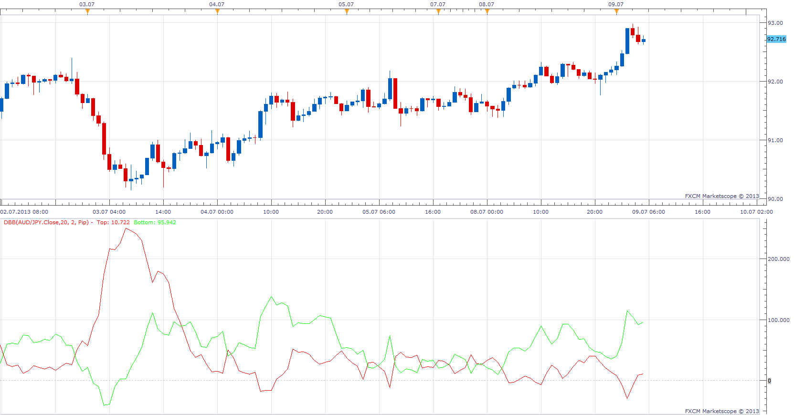
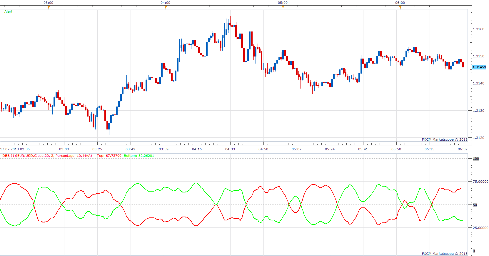

# Distance from Bollinger Band

> Source: https://fxcodebase.com/code/viewtopic.php?f=17&t=52853  
> Forum: 17 · Topic 52853 · 6 post(s)

---

## Distance from Bollinger Band

**Apprentice** · Tue Jul 09, 2013 4:55 am

Provides a Distance between Price and Bollinger Bands.
Percentage and Pip mode of presentation is available.

 [DBB.lua](files/74750/DBB.lua)

The indicator was revised and updated

---

## Re: %B (percent b) updated version.

**gnarlyarbitrage** · Wed Jul 17, 2013 4:30 am

I don't wanna make a new thread, so I'll request here. Can you add the option or make an entirely separate indicator to show the amount of pips the top and bottom bands are from the MA source?

---

## Re: Distance from Bollinger Band

**Apprentice** · Wed Jul 17, 2013 5:56 am

Provides a Distance between Moving Average and Bollinger Bands.
Percentage and Pip mode of presentation is available.

 [DBBMA.lua](files/80339/DBBMA.lua)

---

## Re: Distance from Bollinger Band

**gnarlyarbitrage** · Wed Jul 17, 2013 3:23 pm

Thanks!

---

## Re: Distance from Bollinger Band

**Alexander.Gettinger** · Fri Sep 12, 2014 4:58 pm

MQL4 version of "Distance from Bollinger Band" oscillator: [viewtopic.php?f=38&t=61139](https://fxcodebase.com/code/viewtopic.php?f=38&t=61139).

---

## Re: Distance from Bollinger Band

**Apprentice** · Mon Jun 26, 2017 4:33 am

The indicator was revised and updated.
