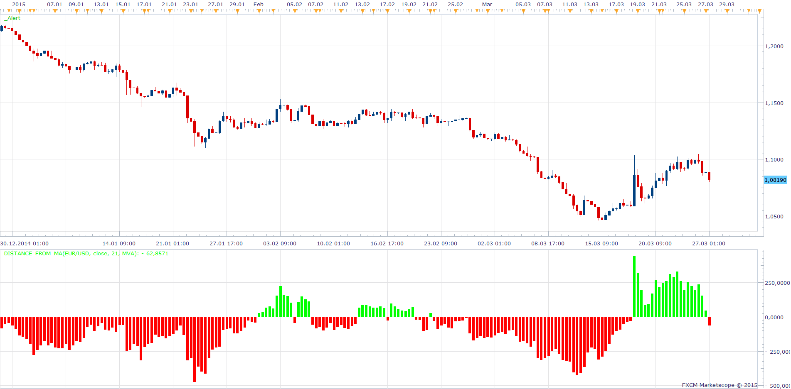

# Distance From MA

> Source: https://fxcodebase.com/code/viewtopic.php?f=17&t=62047  
> Forum: 17 · Topic 62047 · 3 post(s)

---

## Distance From MA

**Apprentice** · Fri Mar 27, 2015 3:46 am

Based on request.
[viewtopic.php?f=27&t=62043](https://fxcodebase.com/code/viewtopic.php?f=27&t=62043)

Code: [Select all](https://fxcodebase.com/code/)
`local Dist_Crt_High = math.abs(source.high[period] - ma.DATA[period-1]); 
local Dist_Crt_Low  = math.abs(source.low[period]  - ma.DATA[period-1]);   
       
      if (Dist_Crt_High >= Dist_Crt_Low) then
      Distance[period] = (source.high[period] - ma.DATA[period-1])/source:pipSize();
      end
       if (Dist_Crt_High < Dist_Crt_Low) then
      Distance[period]  = (source.low[period]  - ma.DATA[period-1])/source:pipSize()
       end`

 [Distance_From_MA.lua](files/99496/Distance_From_MA.lua)

The indicator was revised and updated

---

## Re: Distance From MA

**NicolaeZ** · Sat Mar 28, 2015 7:23 am

Thank you!
Nicolae

---

## Re: Distance From MA

**Apprentice** · Thu Aug 03, 2017 6:24 am

The indicator was revised and updated.
