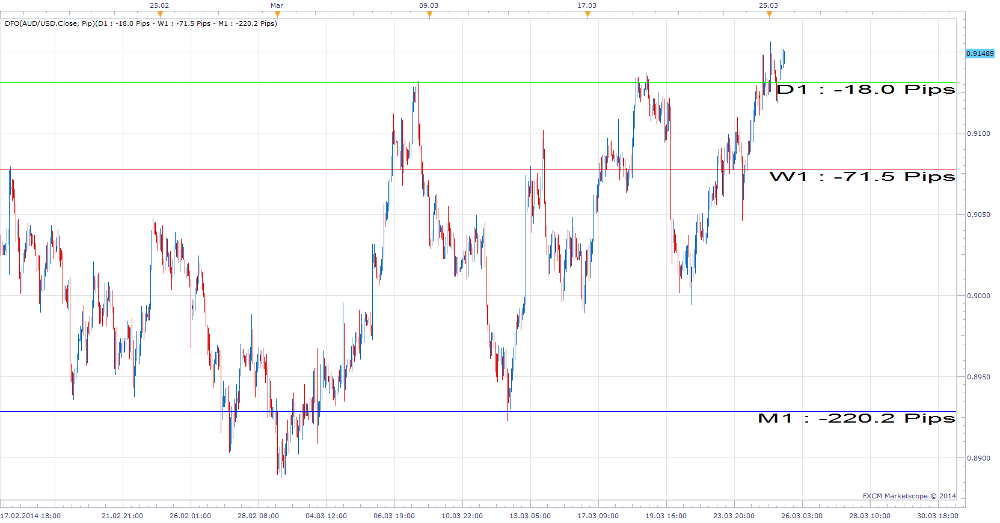
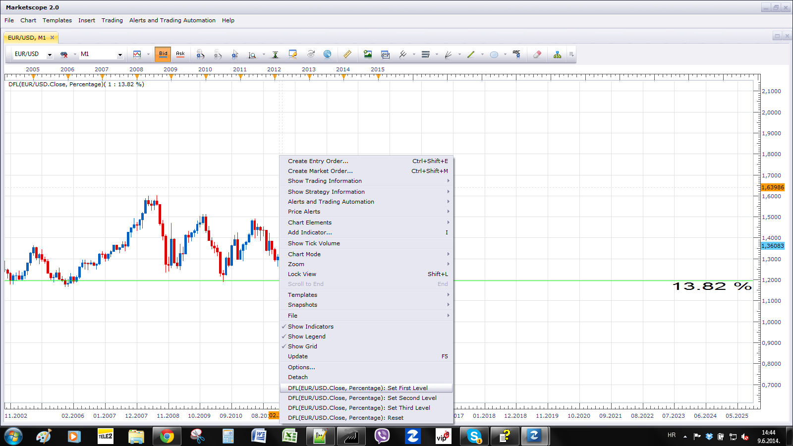

# Distance from Open/Line

> Source: https://fxcodebase.com/code/viewtopic.php?f=17&t=60454  
> Forum: 17 · Topic 60454 · 18 post(s)

---

## Distance from Open/Line

**Apprentice** · Tue Mar 25, 2014 6:34 am

Will show the difference between Open and Closing price for up to three time frames.
U can choose between Percentage, Pip and Value.

 [DFO.lua](files/93216/DFO.lua)

 

Distance from Line will show the distance from the closing price to arbitrary lines.
Use Context menu for the level definition.

 [DFL.lua](files/93216/DFL.lua)

 [DFL with Alert.lua](files/93216/DFL%20with%20Alert.lua)

 [DFO with Alert.lua](files/93216/DFO%20with%20Alert.lua)

The indicator was revised and updated

---

## Re: Distance from Open

**Jeffreyvnlk** · Wed Mar 26, 2014 3:07 am

> **Apprentice wrote:**
>
>
> DFO.png
>
>
> Will show the difference between Open and Closing price for up to three time frames.
> U can choose between Percentage, Pip and Value.
>
>
> DFO.lua

This is great.Thanks
Appreciated if you change the numbers from positive to negative and vice verses.

---

## Re: Distance from Open

**SvenStp** · Sun Apr 27, 2014 6:50 am

Yes, i agree with Jeffreyvnlk. I can't find logic with bearish going plus and bullish going minus/negative numbers. Interesting indicator. Thx.

---

## Re: Distance from Open

**Apprentice** · Mon Apr 28, 2014 2:37 am

Sign reversal parameter is introduced.
Please Re-Download.

---

## Re: Distance from Open

**amazon1a** · Sun Jun 08, 2014 10:44 pm

Hi Apprentice, would it be possible to add Line Style options to this indi? Thanks, AG

---

## Re: Distance from Open

**Apprentice** · Mon Jun 09, 2014 4:36 am

Style Options Added.

---

## Re: Distance from Open

**Apprentice** · Mon Jun 09, 2014 7:48 am

Distance from Line Added.

---

## Re: Distance from Open/Line

**Checkz** · Sun Nov 02, 2014 12:09 am

CAN A ALARM OR ALERT BE MADE FOR WHEN THE MONTHLY OPEN LINE IS HIT OR CROSSED. FOR EXAMPLE THE MONTHLY CANDLE OPENS AT 112.200 ON USD/JPY AND PRICE GOES DOWN TO 112.100 THEN 20 MINUTES LATER IT COMES BACK AND HITS THE MONTHLY OPENING PRICE OF 112.200. CAN A ALERT OR ALARM BE MADE EVERYTIME THAT LINE IS HIT OR CROSSED IN THE OPPOSITE DIRECTION. THANKS.

---

## Re: Distance from Open/Line

**Apprentice** · Mon Nov 03, 2014 5:08 am

DFL with Alert.lua / DFO with Alert.lua Added.

---

## Re: Distance from Open/Line

**Stance** · Wed Sep 02, 2015 7:59 pm

Hi,

A quick question regarding what is possible for a strategy.

If I use this indicator to draw arbitrary lines, can a strategy take these as input as a trading condition?

Thankyou,

---

## Re: Distance from Open/Line

**Apprentice** · Thu Sep 03, 2015 2:33 am

As it is DFO do not provide any output available to strategys.
Would not be a problem to calculate this from within strategy.

---

## Re: Distance from Open/Line

**Stance** · Thu Sep 03, 2015 9:22 am

Could you create a strategy with the options to either BUY/SELL when the price gets to X amounts (a variable defined number) of pips to 2 of the lines.

Thankyou,

---

## Re: Distance from Open/Line

**Apprentice** · Sun Sep 06, 2015 4:25 am

Your request is added to the development list.

---

## Re: Distance from Open/Line

**Apprentice** · Mon Sep 07, 2015 4:07 am

Please try this strategy.
[viewtopic.php?f=31&t=12455&p=24588#p24588](https://fxcodebase.com/code/viewtopic.php?f=31&t=12455&p=24588#p24588)

---

## Re: Distance from Open/Line

**Stance** · Tue Sep 08, 2015 1:32 am

Thanks Apprentice,

Is it possible for the strategy to automatically obtain the "Entry Level" from a horiztonal line drawn on the chart instead of having to manually enter in a "Entry Level" ?

---

## Re: Distance from Open/Line

**Apprentice** · Tue Sep 08, 2015 3:55 am

It is, unfortunately I did not have time to work on it.

---

## Re: Distance from Open/Line

**Apprentice** · Mon Dec 14, 2015 6:42 am

Dec 14, 2015: Compatibility issue Fixed. _Alert helper is not longer needed.

If you want to use updated version of this indicator,
please make sure to use TS Version 01.14.101415. or higher.

---

## Re: Distance from Open/Line

**Apprentice** · Wed Aug 02, 2017 7:18 am

The indicator was revised and updated.
