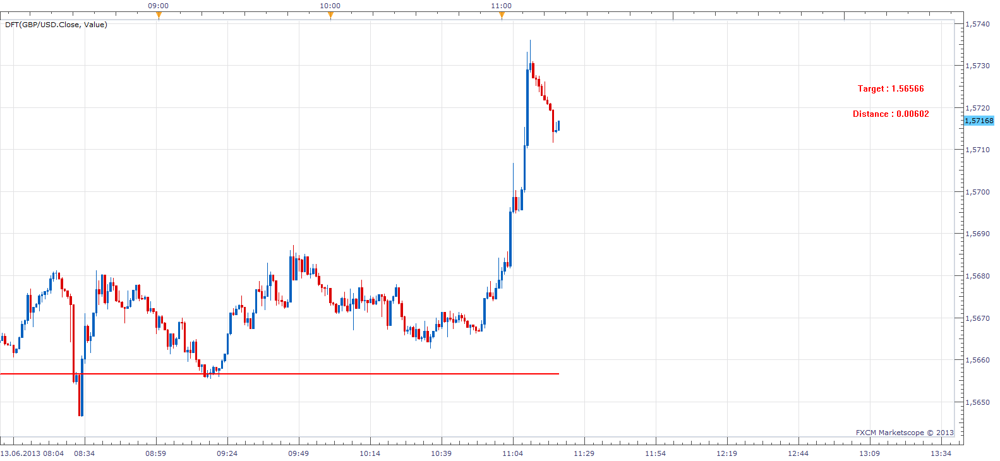
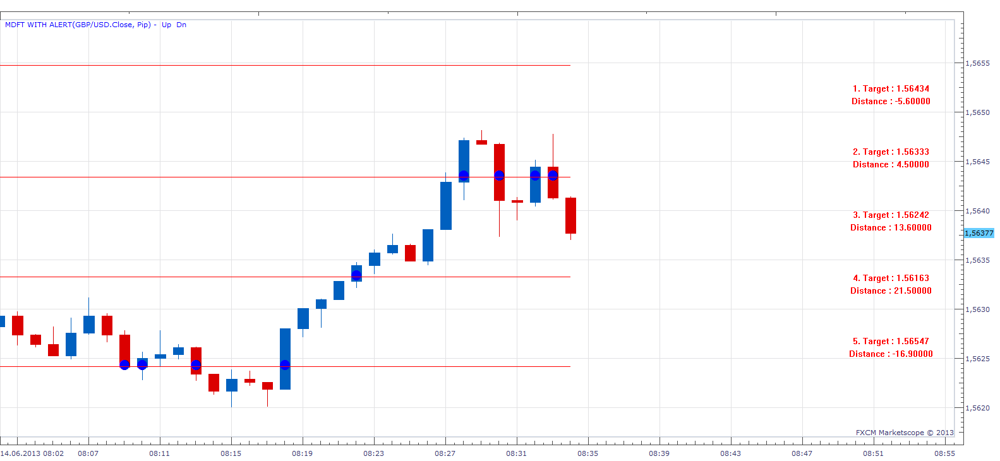

# Distance from Target

> Source: https://fxcodebase.com/code/viewtopic.php?f=17&t=40833  
> Forum: 17 · Topic 40833 · 10 post(s)

---

## Distance from Target

**Apprentice** · Thu Jun 13, 2013 10:21 am

This indicator will show the distance from the selected level to the closing price.
U can select Level, using the mouse and left click mouse menus.

 [DFT.lua](files/66859/DFT.lua)

 

Allows you to define more than one level.

 [MDFT with Alert.lua](files/66859/MDFT%20with%20Alert.lua)

This indicator provides Audio / Email Alerts if and when Price cross over/under one of defined levels.
Dec 27, 2015: Compatibility issue Fix. _Alert helper is not longer needed.

 [MDFT with Alert.lua](files/66859/MDFT%20with%20Alert%20%282%29.lua)

In this version, Levels are defined by keyboard input.

The indicator was revised and updated

---

## Re: Distance from Target

**speakinmymind** · Thu Jun 13, 2013 2:42 pm

This is great!

Can you add the ability to add up to three targets?

---

## Re: Distance from Target

**Apprentice** · Fri Jun 14, 2013 7:36 am

Please test Multiple Alert Version.

---

## Re: Distance from Target

**speakinmymind** · Fri Jun 14, 2013 8:24 am

Thanks! Great indicator! Very useful!

---

## Re: Distance from Target

**Hailkayy** · Wed Jun 19, 2013 2:35 am

Agree, very useful Apprentice.

Great job.

---

## Re: Distance from Target

**speakinmymind** · Sat Feb 22, 2014 4:50 pm

Could please allow the ability to type in the price targets?

---

## Re: Distance from Target

**Apprentice** · Mon Feb 24, 2014 4:25 am

Your request is added to the development list.

---

## Re: Distance from Target

**Apprentice** · Thu Feb 27, 2014 4:15 am

Keyboard input, version added.

---

## Re: Distance from Target

**Apprentice** · Sun Dec 27, 2015 10:18 am

Dec 26, 2015: Compatibility issue Fix. _Alert helper is not longer needed.

---

## Re: Distance from Target

**Apprentice** · Tue Aug 01, 2017 5:59 am

The indicator was revised and updated.
