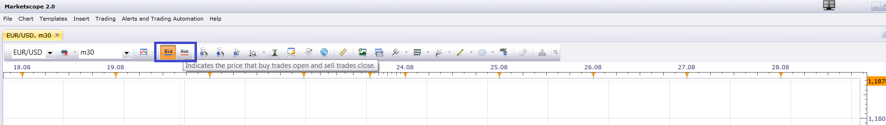

# Distance from the moving average

> Source: https://fxcodebase.com/code/viewtopic.php?f=17&t=61337  
> Forum: 17 · Topic 61337 · 31 post(s)

---

## Distance from the moving average

**Apprentice** · Fri Oct 17, 2014 7:13 am

Based on request.
[viewtopic.php?f=17&t=61335](https://fxcodebase.com/code/viewtopic.php?f=17&t=61335)
Will provide difference between the closing price of the moving average of it.

 [Distance from the moving average.lua](files/96576/Distance%20from%20the%20moving%20average.lua)

Distance = Price - MVA

 [Distance from the moving average with Bid Ask Selector.lua](files/96576/Distance%20from%20the%20moving%20average%20with%20Bid%20Ask%20Selector.lua)

 [Distance from the moving average with Alert.lua](files/96576/Distance%20from%20the%20moving%20average%20with%20Alert.lua)

 [Tick Time Frame Distance from the moving average.lua](files/96576/Tick%20Time%20Frame%20Distance%20from%20the%20moving%20average.lua)

 [Tick Time Frame Distance from the moving average with Alert.lua](files/96576/Tick%20Time%20Frame%20Distance%20from%20the%20moving%20average%20with%20Alert.lua)

Indicator based strategy.
[viewtopic.php?f=31&t=70733](https://fxcodebase.com/code/viewtopic.php?f=31&t=70733)

---

## Re: Distance from the moving average

**Alexander.Gettinger** · Mon Mar 09, 2015 3:54 pm

MQL4 version of oscillator: [viewtopic.php?f=38&t=61981](https://fxcodebase.com/code/viewtopic.php?f=38&t=61981).

---

## Re: Distance from the moving average

**ekonom29** · Wed Aug 19, 2015 7:25 am

hi could you make option in tick to use bid or ask stream ?

---

## Re: Distance from the moving average

**Apprentice** · Wed Aug 26, 2015 9:20 am

You can use the chart Bid / Ask selector,
to select preferred indicator source.

---

## Re: Distance from the moving average

**ekonom29** · Sat Aug 29, 2015 10:46 am

yes i know i can select the prefered source, but i want to be able to see both bid and ask in the same sub window, is it possible ?

thank you

---

## Re: Distance from the moving average

**Apprentice** · Tue Sep 01, 2015 4:21 am

Your request is added to the development list.

---

## Re: Distance from the moving average

**Paul W** · Wed Sep 09, 2015 11:22 am

could you add a simple audio up/down cross alert thx

---

## Re: Distance from the moving average

**Apprentice** · Thu Sep 10, 2015 4:50 am

Distance from the moving average with Bid Ask Selector.lua Added.

---

## Re: Distance from the moving average

**Apprentice** · Thu Sep 10, 2015 5:06 am

Distance from the moving average with Alert.lua Added

---

## Re: Distance from the moving average

**ekonom29** · Thu Sep 17, 2015 2:49 am

thank you apprentice for your hardwork

---

## Re: Distance from the moving average

**Apprentice** · Mon Dec 14, 2015 6:50 am

Dec 14, 2015: Compatibility issue Fixed. _Alert helper is not longer needed.

If you want to use updated version of this indicator,
please make sure to use TS Version 01.14.101415. or higher.

---

## Re: Distance from the moving average

**Apprentice** · Tue Aug 16, 2016 4:35 am

Minor Update.

---

## Re: Distance from the moving average

**Apprentice** · Sat Sep 02, 2017 5:36 am

The indicator was revised and updated.

---

## Re: Distance from the moving average

**Paul W** · Mon Sep 04, 2017 11:58 am

I have been using DMA to look for entries - works well, for me

is it possible to add an alert (dot) for when the "Method2" line crosses the center line ?

thanks

---

## Re: Distance from the moving average

**Apprentice** · Mon Sep 04, 2017 12:37 pm

Try the updated version of Distance from the moving average with Alert.lua.

---

## Re: Distance from the moving average

**Paul W** · Tue Sep 05, 2017 10:28 am

got it - was using an older, previous version

awsome

thanks

---

## Re: Distance from the moving average

**Paul W** · Wed Oct 18, 2017 12:06 pm

Is it possible to add "Ticks" as an string alternative parameter ?

thanks

---

## Re: Distance from the moving average

**Apprentice** · Thu Oct 19, 2017 3:21 am

As alternative sources for MA?

---

## Re: Distance from the moving average

**Paul W** · Thu Oct 19, 2017 9:23 am

Yes,

am using "tick" based MAs's on tick-chart - and a time-based oscillator (same chart)

would like to test using a "tick" based oscillator - for continuity (on tick-chart)

not even sure if it's a good idea - but makes sense to me, to have a look

if it is possible ?

thanks

---

## Re: Distance from the moving average

**Apprentice** · Mon Oct 23, 2017 5:14 am

You want to add Period/Tick/Time selection for Distance from the moving average?

---

## Re: Distance from the moving average

**Paul W** · Mon Oct 23, 2017 5:47 pm

Yes

would like to be able to select "Ticks" as a "Period Method(s)" option

if that is possible

Thanks

---

## Re: Distance from the moving average

**Apprentice** · Tue Oct 24, 2017 4:17 am

Tick Time Frame Distance from the moving average.lua added.

---

## Re: Distance from the moving average

**Paul W** · Tue Oct 24, 2017 2:02 pm

awsome

works well using "Ticks"

if you could add the "with alert" feature - would be very much appreciated

thanks

---

## Re: Distance from the moving average

**Apprentice** · Wed Oct 25, 2017 9:44 am

Tick Time Frame Distance from the moving average with Alert.lua added.

---

## Re: Distance from the moving average

**Paul W** · Wed Oct 25, 2017 1:59 pm

So very close - apologizes for not providing a better detailed explanation/request earlier

am using "Smoothed/Zero Alert" feature

if this could be added - would very much be appreciated

Thanks

---

## Re: Distance from the moving average

**Apprentice** · Thu Oct 26, 2017 3:36 am

"Smoothed/Zero Alert" feature added.

---

## Re: Distance from the moving average

**Paul W** · Mon Oct 30, 2017 11:21 am

works well

scalping strategy - mean reversion

thanks

---

## Re: Distance from the moving average

**Apprentice** · Thu Apr 26, 2018 7:22 am

The Indicator was revised and updated.

---

## Re: Distance from the moving average

**ANTONIO** · Wed Dec 16, 2020 4:06 am

Hi apprentice,
Can you make a strategy with this indicator?

That is, if DISTANCE LINE cross above the SMOOTHED LINE to open a buy trade (end of turn / live)
and
if it cross down the SMOOTHED LINE  to open a sale trade (end of turn / live).
TRAILING STOP    
ALERT (EMAILS) FOR OPENING THE TRADES (IMPORTANT)
Position Cap
Max. of open positions  

Thank you

---

## Re: Distance from the moving average

**Apprentice** · Wed Dec 16, 2020 9:30 am

Your request is added to the development list.
Development reference 2481.

---

## Re: Distance from the moving average

**Apprentice** · Fri Dec 18, 2020 8:19 am

Try this version.
[viewtopic.php?f=31&t=70733](https://fxcodebase.com/code/viewtopic.php?f=31&t=70733)
