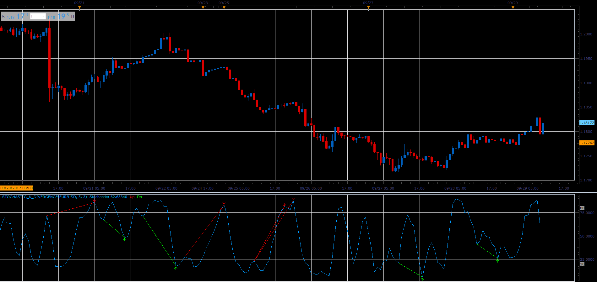

# Divergence on Stochastic Indicator

> Source: https://fxcodebase.com/code/viewtopic.php?f=17&t=65133  
> Forum: 17 · Topic 65133 · 10 post(s)

---

## Divergence on Stochastic Indicator

**Alexander.Gettinger** · Fri Sep 29, 2017 11:40 am

Based on the request: [viewtopic.php?f=27&t=64873](https://fxcodebase.com/code/viewtopic.php?f=27&t=64873)

 

Download:

 [Stochastic_K_Divergence.lua](files/115166/Stochastic_K_Divergence.lua)

 [Stochastic_K_Divergence with Alert.lua](files/115166/Stochastic_K_Divergence%20with%20Alert.lua)

MT5 version.
[https://fxcodebase.com/code/viewtopic.php?f=38&t=72537](https://fxcodebase.com/code/viewtopic.php?f=38&t=72537)

---

## Re: Divergence on Stochastic Indicator

**Apprentice** · Sun Oct 21, 2018 5:22 am

The Indicator was revised and updated.

---

## Re: Divergence on Stochastic Indicator

**Mountaintrader** · Fri Jun 17, 2022 6:37 pm

Hi Apprentice,

Please could a sound alert be added to play a .wav file when each new Stochastic K Divergence is detected.

Regards
MT

---

## Re: Divergence on Stochastic Indicator

**Apprentice** · Mon Jun 20, 2022 11:33 am

We have added your request to the development list.
Development reference 368.

---

## Re: Divergence on Stochastic Indicator

**Apprentice** · Wed Jun 22, 2022 4:44 am

Stochastic_K_Divergence with Alert.lua Added.

---

## Re: Divergence on Stochastic Indicator

**Mountaintrader** · Mon Jun 27, 2022 4:13 pm

Thank you Apprentice.

MT

---

## Re: Divergence on Stochastic Indicator

**jacryptoking** · Tue Jul 05, 2022 1:56 am

Can this stochastic divergence indicator convert to mql5 please?

Have alert to identify when hidden Divergences are formed.

---

## Re: Divergence on Stochastic Indicator

**Apprentice** · Fri Jul 08, 2022 3:36 am

We have added your request to the development list.
Development reference 411.

---

## Re: Divergence on Stochastic Indicator

**jacryptoking** · Mon Jul 11, 2022 11:01 am

> **Alexander.Gettinger wrote:**
> Based on the request: [viewtopic.php?f=27&t=64873](https://fxcodebase.com/code/viewtopic.php?f=27&t=64873)
>
>
>
> Stochastic_K_Divergence.PNG
>
>
>
> Download:
>
>
> Stochastic_K_Divergence.lua
>
>
>
>
> Stochastic_K_Divergence with Alert.lua

Can you convert to Mt5 ?

Also add an alert feature that indicates when there is a hidden Divergence?

Stochastic hidden Divergences are great for Trend continuation.

Also add a feature when stochastic is oversold and overbought. Where the stochastic lines are color coded . Have a option to select the level Oversold and overbought levels.

---

## Re: Divergence on Stochastic Indicator

**Apprentice** · Thu Jul 21, 2022 1:44 am

MT5 version.
[https://fxcodebase.com/code/viewtopic.php?f=38&t=72537](https://fxcodebase.com/code/viewtopic.php?f=38&t=72537)
