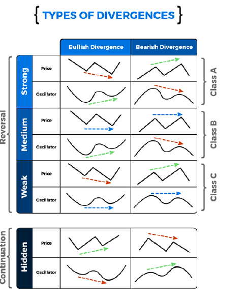

# Divergences Indicator

> Source: https://fxcodebase.com/code/viewtopic.php?f=17&t=70545  
> Forum: 17 · Topic 70545 · 5 post(s)

---

## Divergences Indicator

**Apprentice** · Mon Oct 19, 2020 3:09 am

 

As you know, divergence can be problematic to implement.
Based on the above specifications, this is my attempt.
We use fractals are used as a reference point, other alternatives, like zig zag should be considered.

The indicator is designed as a helper only, and will not provide any alert.
Only most recent pivot points are consiresed, historical alert are not provided.

This is only a starting point to build on, your suggestions are welcome, feel free to modify.

 [Divergences Indicator.lua](files/138324/Divergences%20Indicator.lua)

 [Divergences Oscillator.lua](files/138324/Divergences%20Oscillator.lua)

---

## Re: Divergences Indicator

**khanatd** · Mon Sep 29, 2025 1:51 am

hi respected sir, mt4 version with arrows in it, thanks

---

## Re: Divergences Indicator

**Apprentice** · Wed Oct 01, 2025 6:13 am

We have added your request to the development list.
Development reference 618

---

## Re: Divergences Indicator

**khanatd** · Fri Oct 03, 2025 2:17 pm

hi sir mt4 version with NRP ARROWS at close of current candle

---

## Re: Divergences Indicator

**khanatd** · Fri Nov 21, 2025 2:29 am

Hi sir any update about it plz
