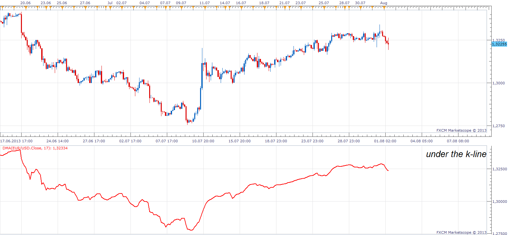

# DMA

> Source: https://fxcodebase.com/code/viewtopic.php?f=17&t=58535  
> Forum: 17 · Topic 58535 · 3 post(s)

---

## DMA

**Apprentice** · Thu Aug 01, 2013 9:44 am

 [DMA Indicator.doc](files/87731/DMA%20Indicator.doc)

 [DMA.lua](files/87731/DMA.lua)

Duzhaoping can you explain how this indicator is used.
Also, DMA stands for.
D... M... A...

---

## Re: DMA

**Alexander.Gettinger** · Thu Aug 29, 2013 10:57 am

MQL4 version of DMA oscillator: [http://www.fxcodebase.com/code/viewtopi ... 38&t=59349](http://www.fxcodebase.com/code/viewtopic.php?f=38&t=59349).

---

## Re: DMA

**Apprentice** · Fri Jun 22, 2018 8:19 am

The indicator was revised and updated.
