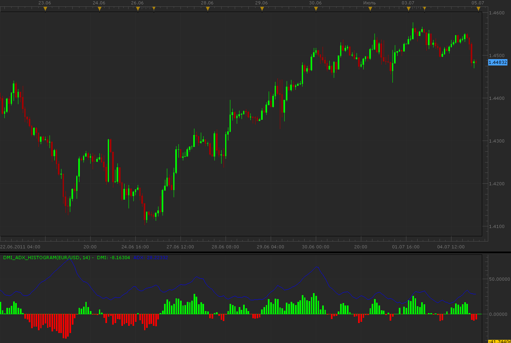
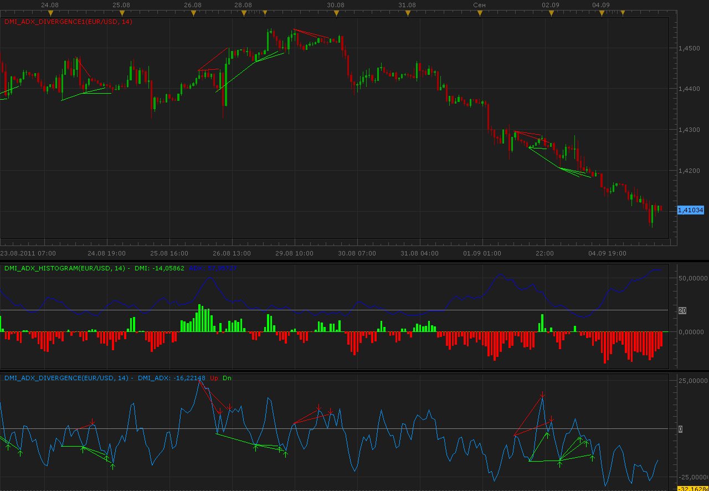

# DMI Histogram

> Source: https://fxcodebase.com/code/viewtopic.php?f=17&t=5003  
> Forum: 17 · Topic 5003 · 33 post(s)

---

## DMI Histogram

**Alexander.Gettinger** · Mon Jul 04, 2011 11:01 pm

Histogram is a difference between DMI+ and DMI-.
Also oscillator draw ADX indicator in same window.

 

Download:

 [DMI_ADX_Histogram.lua](files/12332/DMI_ADX_Histogram.lua)

 

1. Alert
Zero Line Cross
2. Alert
Weakening trend
After a given number of consecutive EQUAL or bigger DMI bars in the direction of the trend.
We have reduction in DMI length.

 [DMI_ADX_Histogram with Alert.lua](files/12332/DMI_ADX_Histogram%20with%20Alert.lua)

Compatibility issue Fix. _Alert helper is not longer needed.

---

## Re: DMI Histogram

**zeuspower2012** · Thu Jul 07, 2011 9:20 am

I love adx/dmi indicator...
and this one looks great ...let's try it !

---

## Re: DMI Histogram

**nookie** · Fri Jul 08, 2011 6:48 am

HI Nikolay,

Is it possible this to be done in a strategy trigering entry when ADX >20 and closing position on DMI cross ?

Thanks

Nookie

---

## Re: DMI Histogram

**Apprentice** · Fri Jul 08, 2011 11:45 am

Your request is added to the developmental cue.

---

## Re: DMI Histogram

**Alexander.Gettinger** · Tue Jul 12, 2011 3:12 am

Please, see this strategies: [viewtopic.php?f=31&t=5159](https://fxcodebase.com/code/viewtopic.php?f=31&t=5159)

---

## Re: DMI Histogram

**DS0167** · Wed Jul 20, 2011 10:08 am

Hello,

It's been a while I have not made a request

Would it be possible to create a divergence indicator **and/or signal** on this histogram (divergence on bear and bull trend) ?

Thank you in advance for your always wonderful work !

D

---

## Re: DMI Histogram

**Apprentice** · Wed Jul 20, 2011 1:48 pm

when I come back to the office, from vacation.
I'll try to do something, if someone does not do before.

---

## Re: DMI Histogram

**DS0167** · Sun Jul 24, 2011 8:54 am

This indicator is very good. Thank you Alexander.

Would it be possible to add the option to put an horizontal line (@ 20 for instance) to see more easily where is the ADX?

Thank in advance for your great help to catch some pips

D

---

## Re: DMI Histogram

**Alexander.Gettinger** · Mon Sep 05, 2011 12:03 pm

> **DS0167 wrote:**
> Would it be possible to create a divergence indicator **and/or signal** on this histogram (divergence on bear and bull trend) ?

Indicators show a divergence between price and DMI_ADX_Histogram.

 

Download:

 [DMI_ADX_Divergence.lua](files/14552/DMI_ADX_Divergence.lua)

 [DMI_ADX_Divergence1.lua](files/14552/DMI_ADX_Divergence1.lua)

For this indicators must be installed DMI_ADX_Histogram.lua

---

## Re: DMI Histogram

**nookie** · Mon Nov 21, 2011 6:06 am

This looks really nice, thanks for it. Can it be made also for different timeperiods to be shown all in one like a heatmap?

---

## Re: DMI Histogram

**Apprentice** · Tue Nov 22, 2011 4:29 am

What information do you want to be displayed.
DMI> 0
and
DMI <0?

---

## Re: DMI Histogram

**nookie** · Wed Nov 23, 2011 10:35 am

To look like this:

[viewtopic.php?f=17&t=8084&p=17842&hilit=heat+map#p17842](https://fxcodebase.com/code/viewtopic.php?f=17&t=8084&p=17842&hilit=heat+map#p17842)

And calculated like If DMI+ is dominant ( > DMI- ) then a blue bar is shown, and if DMI- is dominant a red bar is shown. And this for H1, H2, H4, H6 and D1

---

## Re: DMI Histogram

**Apprentice** · Wed Nov 23, 2011 12:55 pm

Requested can be found here.
[viewtopic.php?f=17&t=8388](https://fxcodebase.com/code/viewtopic.php?f=17&t=8388)

---

## Re: DMI Histogram

**nookie** · Thu Nov 24, 2011 7:16 am

Cool, thanks, but can it be changed the output from bar to tick as Im not sure how to be done this "barsize".

An option on this one would be nice like this if can be added:

Green
DMI+ > DMI-
DarkGreen
if DMI+ rising

Red
DMI+ < DMI-
DarkRed
if DMI- rising

Also, from the help, cant find where to put this expression in a code.. there is not an example also there, can you please point me to the right diection?

public method host:execute("removeLabel", ...)

---

## Re: DMI Histogram

**Apprentice** · Sat Nov 26, 2011 4:41 am

"changed the output from bar to tick"
 I am not sure what you thought by this line.

---

## Re: DMI Histogram

**nookie** · Sat Nov 26, 2011 5:48 am

I'm sorry maybe I got it wrong.. but this is the visualization thing I was talking about, mentioned in this post, is it possible this dmi thing to look similar ?

[viewtopic.php?f=30&t=6541&p=17230#p16990](https://fxcodebase.com/code/viewtopic.php?f=30&t=6541&p=17230#p16990)

> Re: Optimizing/Fixing Heat Map Indicator (Elder Impulse System)
> by vstrelnikov » Fri Oct 28, 2011 12:45 am
>
> Strictly speaking that is not the calculation error, but just an visualization issue.
> New version of indicator uses 5-pixel wide line instead of 'text output' to improve displaying performance. Unfortunately, line is drawn between centers of time periods, so it looks like the indicator is delayed for 1 period.
>
> I've added the new method of visualization based on the 'candles group' output. (See attached)
> It is painted like a filled bar from beginning to the end of period.
> Would you please take a look on it, and if it looks fine I'll update the version in original post.

---

## Re: DMI Histogram

**Apprentice** · Sun Nov 27, 2011 6:03 pm

Added to developmental cue.

Triangle Indicator use core.host:execute("removeAll");
[viewtopic.php?f=17&t=1643&p=7535&hilit=triangle#p7535](https://fxcodebase.com/code/viewtopic.php?f=17&t=1643&p=7535&hilit=triangle#p7535)

core.host: execute ("removeLabel", id) is similar.
Using id variable, you can define the label you want to delete.

---

## Re: DMI Histogram

**Apprentice** · Wed Nov 30, 2011 3:26 am

Filter Added.
[viewtopic.php?f=17&t=8388](https://fxcodebase.com/code/viewtopic.php?f=17&t=8388)

---

## Re: DMI Histogram

**nookie** · Wed Nov 30, 2011 5:09 am

Thanks a lot for it. A thing I'm noticing as a problem with this is its "repainting" itself cause of the different timeframes. I'm wondering if it can be made like this that indicator reloads itself every time it has some new data painted on it? This will remove this repainting thing

Thanks

---

## Re: DMI Histogram

**jay1994** · Wed Jul 24, 2013 6:59 pm

Is there a mq4 or mt4 version of this indicator? It looks very promising, thanks in advanced.

---

## Re: DMI Histogram

**Apprentice** · Sat Jul 27, 2013 3:19 am

No.
Your request is added to the development list.

---

## Re: DMI Histogram

**Apprentice** · Sun Jul 28, 2013 7:03 am

Requested can be found here.
[viewtopic.php?f=38&t=57207](https://fxcodebase.com/code/viewtopic.php?f=38&t=57207)

---

## Re: DMI Histogram

**Jeffreyvnlk** · Tue Oct 21, 2014 12:22 pm

> **Alexander.Gettinger wrote:**
> Histogram is a difference between DMI+ and DMI-.
> Also oscillator draw ADX indicator in same window.
>
>
>
> DMI_ADX_Histogram.png
>
>
>
> Download:
>
>
> DMI_ADX_Histogram.lua

It is a nice indicator, however could you give an option to turn off/on ADX line.Thanks

---

## Re: DMI Histogram

**Apprentice** · Wed Oct 22, 2014 4:20 am

On/Off Option Added.

---

## Re: DMI Histogram

**Jeffreyvnlk** · Wed Oct 22, 2014 9:35 am

> **Apprentice wrote:**
> On/Off Option Added.

Superb.Thank Apprentice

---

## Re: DMI Histogram

**FRO4EX** · Mon Jul 13, 2015 3:05 pm

Hello,

I would like to request an alert for the DMI Histogram indicator.

MAIN GOAL
Is it possible to make an alert on the FIRST histogram bar in either BUY or Sell direction.
- live or end of turn
- dialogue box option
- arrow over bar or preferably the ability select bar color
EXTRA GOAL if possible
- an alert created after the FIRST SMALLER BAR created following 3 or more consecutive EQUAL or
 HIGHER BARS in either BUY or SELL direction.

I believe there is already something similar being used in a strategy but it is not based on the histogram model. The HISTOGRAM bar indicator alert is all I'd like. No strategy, at this point.

Thanks for the really good work you all do!!

---

## Re: DMI Histogram

**Apprentice** · Thu Jul 16, 2015 6:11 am

DMI_ADX_Histogram with Alert.lua Added.

---

## Re: DMI Histogram

**giopo67** · Tue Dec 29, 2015 5:53 am

Hi Apprentice and Thanks for your good job. In this indicator can you add change colors to the adx trigger line for ascending and descending please ? Thanks and regards

---

## Re: DMI Histogram

**Apprentice** · Mon Jan 04, 2016 5:27 am

Compatibility issue Fix. _Alert helper is not longer needed.

---

## Re: DMI Histogram

**Apprentice** · Mon Jan 04, 2016 5:34 am

Additional coloring options added to DMI_ADX_Histogram

---

## Re: DMI Histogram

**MarkMcCoskey** · Tue Apr 19, 2016 8:53 pm

Would like to request that the live ADX level be added to the right (as shown in the attached picture). Also, an adjustable line to signify that the ADX has entered into a strong trend. I show this in the attached picture with the black dotted line, at perhaps 30.

Thank you very much for your consideration.

---

## Re: DMI Histogram

**Apprentice** · Wed Apr 20, 2016 4:28 am

Line added.

---

## Re: DMI Histogram

**Apprentice** · Wed Aug 15, 2018 7:04 am

The indicator was revised and updated.
