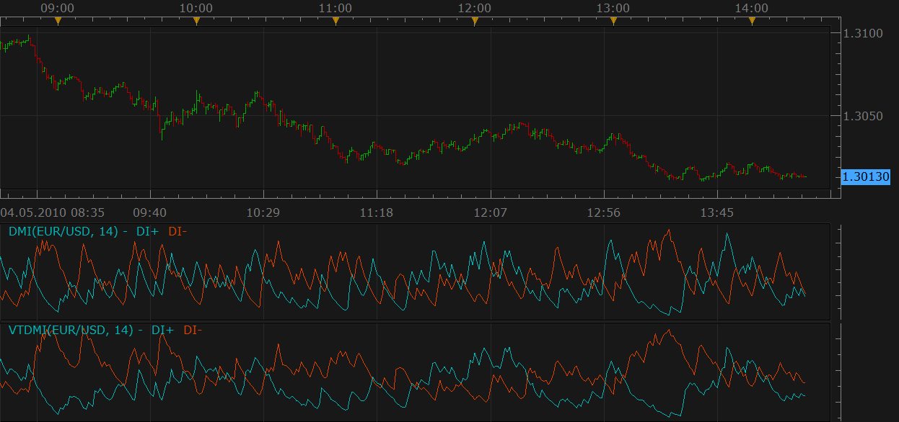
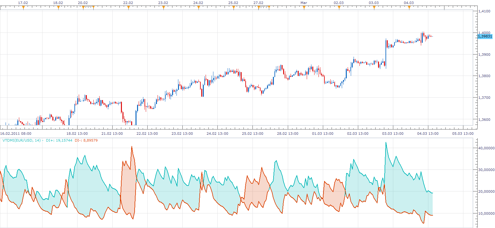

# DMI VTTrader Version (Upd: Jun 18 10)

> Source: https://fxcodebase.com/code/viewtopic.php?f=17&t=950  
> Forum: 17 · Topic 950 · 8 post(s)

---

## DMI VTTrader Version (Upd: Jun 18 10)

**Nikolay.Gekht** · Tue May 04, 2010 1:28 pm

Upd Jun 18 2010. The first version of the indicator was always calculated as DMI(14), regardless the parameter. The problem is fixed now.

The MT4 and FXCM Trading Station DMI (Directional Movement Index) implementation uses EMA smoothing instead of Wilder's smoothing.

This is the implementation of the DMI indicator on the base of Wilders smoothing.

See [ADX VTTrader version](https://fxcodebase.com/code/viewtopic.php?f=17&t=511) topic for more details about the algorithms.

 

Download the indicator:

 [VTDMI.lua](files/1742/VTDMI.lua)

This indicator uses WMA indicator. Please, do not forget to download and install it. Find the WMA indicator here: [WMA (Wilder's moving average)](https://fxcodebase.com/code/viewtopic.php?f=17&t=248).

Code: [Select all](https://fxcodebase.com/code/)
`-- Indicator profile initialization routine
-- Defines indicator profile properties and indicator parameters
-- TODO: Add minimal and maximal value of numeric parameters and default color of the streams
function Init()
    indicator:name("Directional Movement Index (VTTrader version)");
    indicator:description("");
    indicator:requiredSource(core.Bar);
    indicator:type(core.Oscillator);

    indicator.parameters:addGroup("Calculation");
    indicator.parameters:addInteger("N", "Number of periods", "", 14, 1, 1000);
    indicator.parameters:addGroup("Style");
    indicator.parameters:addColor("clrDIP", "Color of DI+", "", core.rgb(0, 183, 183));
    indicator.parameters:addColor("clrDIM", "Color of DI-", "", core.rgb(219, 64, 0));

end

-- Indicator instance initialization routine
-- Processes indicator parameters and creates output streams
-- TODO: Refine the first period calculation for each of the output streams.
-- TODO: Calculate all constants, create instances all subsequent indicators and load all required libraries
-- Parameters block
local N;

local first;
local firstTR;
local source = nil;

-- Streams block
local TR = nil;
local TR_W = nil;
local PlusDM = nil;
local PlusDM_W = nil;
local PlusDI = nil;
local MinusDM = nil;
local MinusDM_W = nil;
local MinusDI = nil;
local H, L, C;
local DIP = nil;
local DIM = nil;

-- Routine
function Prepare()
    N = instance.parameters.N;
    source = instance.source;
    firstTR = source:first() + 1;
    H = source.high;
    L = source.low;
    C = source.close;

    TR = instance:addInternalStream(firstTR, 0);
    PlusDM = instance:addInternalStream(firstTR, 0);
    MinusDM = instance:addInternalStream(firstTR, 0);

    TR_W = core.indicators:create("WMA", TR, N);
    PlusDM_W = core.indicators:create("WMA", PlusDM, N);
    MinusDM_W = core.indicators:create("WMA", MinusDM, N);

    first = TR_W.DATA:first();

    local name = profile:id() .. "(" .. source:name() .. ", " .. N .. ")";
    instance:name(name);
    DIP = instance:addStream("DIP", core.Line, name .. ".DIP", "DI+", instance.parameters.clrDIP, first)
    DIM = instance:addStream("DIM", core.Line, name .. ".DIM", "DI-", instance.parameters.clrDIM, first)
end

-- Indicator calculation routine
function Update(p, mode)
    if p >= firstTR then
        local th, tl;

        if C[p - 1] > H[p] then
            th = C[p - 1];
        else
            th = H[p];
        end

        if C[p - 1] < L[p] then
            tl = C[p - 1];
        else
            tl = L[p];
        end

        TR[p] = th - tl;

        if H[p] > H[p - 1] and L[p] >= L[p - 1] then
            PlusDM[p] = H[p] - H[p - 1];
        elseif  H[p] > H[p - 1] and L[p] < L[p - 1] and ((H[p] - H[p - 1]) > (L[p - 1] - L[p])) then
            PlusDM[p] = H[p] - H[p - 1];
        else
            PlusDM[p] = 0;
        end
        if L[p] < L[p - 1] and H[p] <= H[p - 1] then
            MinusDM[p] = L[p - 1] - L[p];
        elseif  L[p] < L[p - 1] and H[p] > H[p - 1] and ((H[p] - H[p - 1]) < (L[p - 1] - L[p])) then
            MinusDM[p] = L[p - 1] - L[p];
        else
            MinusDM[p] = 0;
        end
    end

    TR_W:update(mode);
    PlusDM_W:update(mode);
    MinusDM_W:update(mode);

    if p >= first then
        DIP[p] = 100 * PlusDM_W.DATA[p] / TR_W.DATA[p]
        DIM[p] = 100 * MinusDM_W.DATA[p] / TR_W.DATA[p]
    end
end`

 

Simple VTDMI based strategy.
[viewtopic.php?f=31&t=65666&p=117209#p117209](https://fxcodebase.com/code/viewtopic.php?f=31&t=65666&p=117209#p117209)

The indicator was revised and updated

---

## Re: DMI VTTrader Version

**Blackcat2** · Thu Jun 17, 2010 11:25 pm

I'm currently testing this indicator but for some reason the lines don't change if I change the number of period, I changed it to 1,7,14,18 but doesn't change anything..

Am I missing something?

Cheers..
BC

---

## Re: DMI VTTrader Version

**Nikolay.Gekht** · Fri Jun 18, 2010 11:10 am

> **Blackcat2 wrote:**
> Am I missing something?

It's me who was missing something. The first version was always calculated N=14. I apologize for the inconvenience. The indicator is fixed. Thank you very much for reporting the problem.

---

## Re: DMI VTTrader Version (Upd: Jun 18 10)

**Apprentice** · Sat Jan 08, 2011 9:02 am

Style Option Added.

---

## Re: DMI VTTrader Version (Upd: Jun 18 10)

**DS0167** · Sun Mar 06, 2011 6:24 am

Hello gentlemen

Could you please improve the DMI TTrader so that it colored like on the image below ?

Also, want to know if you can create the signal for DMI Vttrader cross (with level option) ?

Many kind thank you in advance,

Danielle

---

## Re: DMI VTTrader Version (Upd: Jun 18 10)

**Apprentice** · Sun Mar 06, 2011 9:43 am

Danielle,
Here you can find an indicator.
I hope that i will finish signal today as well.

 [VTDMI.lua](files/8653/VTDMI.lua)

---

## Re: DMI VTTrader Version (Upd: Jun 18 10)

**DS0167** · Sun Mar 06, 2011 10:54 am

Wonderful !!!

You are the best team ever

Thank you again )

---

## Re: DMI VTTrader Version (Upd: Jun 18 10)

**Apprentice** · Fri Feb 17, 2017 10:50 am

Indicator was revised and updated.
