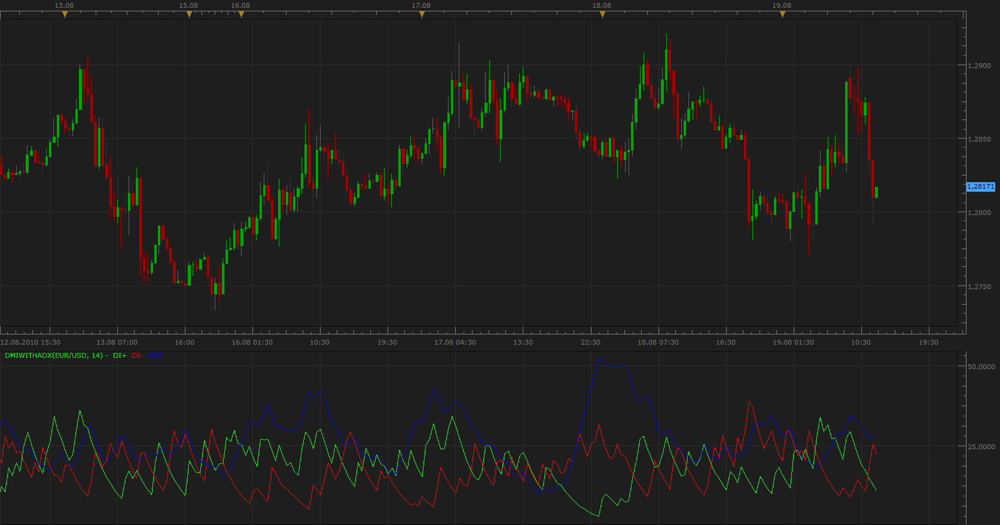

# DMI with ADX

> Source: https://fxcodebase.com/code/viewtopic.php?f=17&t=1867  
> Forum: 17 · Topic 1867 · 21 post(s)

---

## DMI with ADX

**Apprentice** · Thu Aug 19, 2010 12:00 pm

As the name says, DMI and ADX joint in a single indicator.
You have the option to remove individual components.

 [DMIwithADX.lua](files/3749/DMIwithADX.lua)

MT4/MQ4 version.
[viewtopic.php?f=38&t=69282](https://fxcodebase.com/code/viewtopic.php?f=38&t=69282)

---

## Re: DMI with ADX

**DS0167** · Thu Sep 02, 2010 8:39 am

Hello,

When you have a moment... would it be possible to get a version with the option to adjust the thickness of the lines?

I have big glasses

Thanks in advance.

Kind regards,
DS

---

## Re: DMI with ADX

**Apprentice** · Thu Sep 02, 2010 1:35 pm

Added to development cue.

---

## Re: DMI with ADX

**DS0167** · Thu Sep 02, 2010 2:08 pm

Thank you

Hope the cue is as shorter as the last time

Kind regards,
Danielle

---

## Re: DMI with ADX

**Apprentice** · Fri Sep 03, 2010 3:25 am

Updates.
Line Style
Signal Level added

---

## Re: DMI with ADX

**DS0167** · Fri Sep 03, 2010 6:08 pm

You are the best. Thank you very much

---

## Re: DMI with ADX

**Apprentice** · Wed Feb 16, 2011 4:11 am

The second signal lines added.

 [DMIwithADX.lua](files/8168/DMIwithADX.lua)

---

## Re: DMI with ADX

**Apprentice** · Sat Feb 18, 2017 4:52 am

Indicator was revised and updated.

---

## Re: DMI with ADX

**aikibo** · Thu Dec 12, 2019 12:48 pm

> **Apprentice wrote:**
> Indicator was revised and updated.

I WAS LOOK FOR ADX , WITH CHANGEABLE DMI INPUTS

---

## Re: DMI with ADX

**Apprentice** · Thu Dec 12, 2019 4:55 pm

In TS2 you can add DMI/ADX separately.

---

## Re: DMI with ADX

**MemphisRokudo** · Wed Dec 25, 2019 4:42 pm

is there a mt4 version of this?

---

## Re: DMI with ADX

**Apprentice** · Thu Dec 26, 2019 9:23 am

Your request is added to the development list.
Development reference 484.

---

## Re: DMI with ADX

**Apprentice** · Mon Dec 30, 2019 5:31 am

MT4/MQ4 version.
[viewtopic.php?f=38&t=69282](https://fxcodebase.com/code/viewtopic.php?f=38&t=69282)

---

## Re: DMI with ADX

**amvt85** · Thu Jul 23, 2020 5:15 pm

Could this indicator be the cause of my chart crashes?

---

## Re: DMI with ADX

**Apprentice** · Fri Jul 24, 2020 7:26 am

Can you specify the exact file version, or post it here?

---

## Re: DMI with ADX

**amvt85** · Fri Jul 24, 2020 8:15 am

> **Apprentice wrote:**
> Can you specify the exact file version, or post it here?

> For the past two weekends when I opened my chart on Sunday, I got a chart crash using your indicators from fxcodebase then all of a sudden my template is all that's left. All the indicators I'm using have gone from the trade station folder? I think one of the indicators is causing a crash? It would be great if you can help me figure this out.

Here it is, it's the same indicator I emailed you with my template.

---

## Re: DMI with ADX

**Apprentice** · Sun Jul 26, 2020 3:39 pm

Your request is added to the development list.
Development reference 1766.

---

## Re: DMI with ADX

**Apprentice** · Mon Jul 27, 2020 4:07 pm

It's impossible to tell. Only get soft could tell by looking in the dump.
Can you send the crash folder next time that happens?

---

## Re: DMI with ADX

**amvt85** · Mon Jul 27, 2020 4:53 pm

> **Apprentice wrote:**
> It's impossible to tell. Only get soft could tell by looking in the dump.
> Can you send the crash folder next time that happens?

Done, emailed you the crash folder.

---

## Re: DMI with ADX

**Apprentice** · Thu Jul 30, 2020 4:22 pm

We reviewed the crash dumps. It is a known issue.
It relates to the updates of the '% Change' column in the 'Simple Dealing Rates' window.
We already provided the build with a possible fix of the issue to FXCM.
The build is waiting for the FXCM testing phase.

---

## Re: DMI with ADX

**amvt85** · Sat Aug 01, 2020 6:34 am

> **Apprentice wrote:**
> We reviewed the crash dumps. It is a known issue.
> It relates to the updates of the '% Change' column in the 'Simple Dealing Rates' window.
> We already provided the build with a possible fix of the issue to FXCM.
> The build is waiting for the FXCM testing phase.

This is positive news! Thank you very much!
