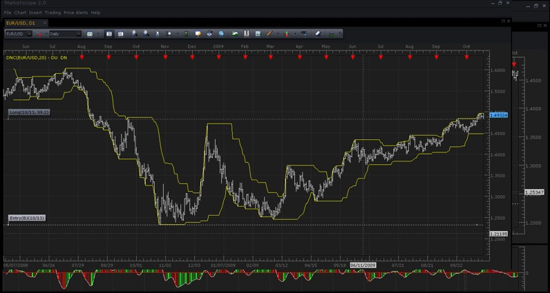
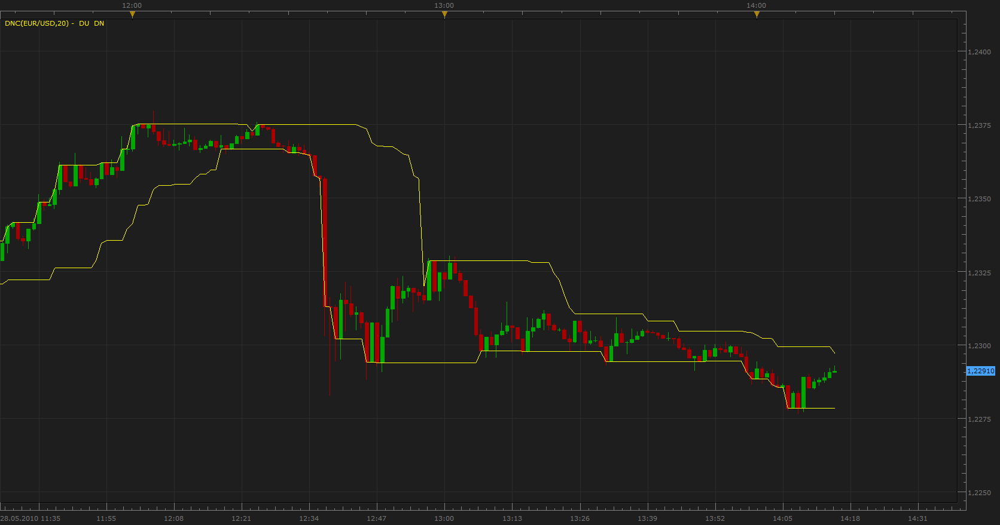
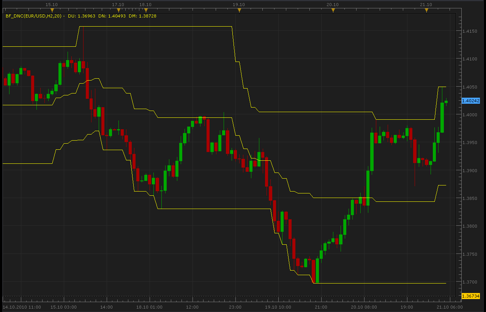
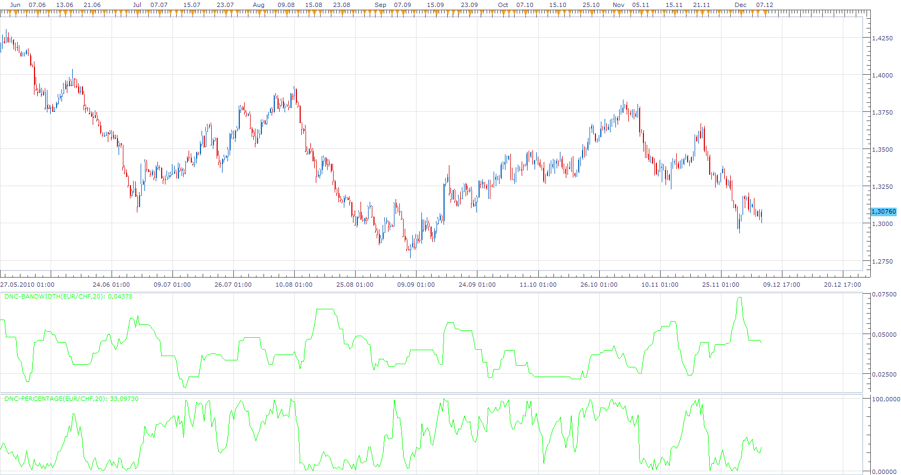
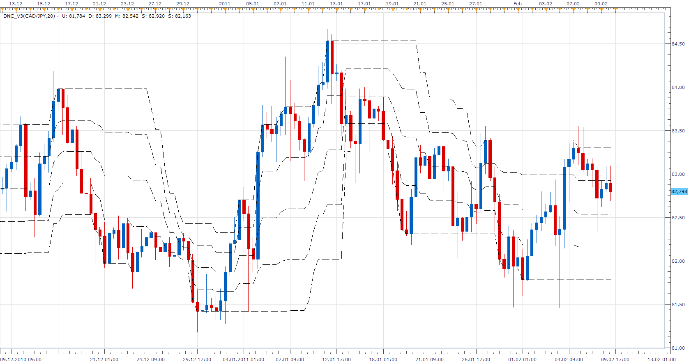
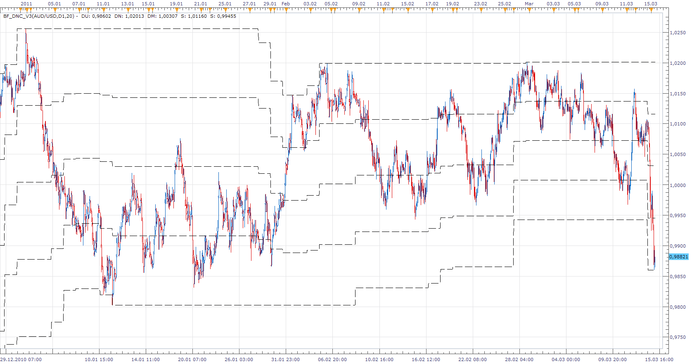
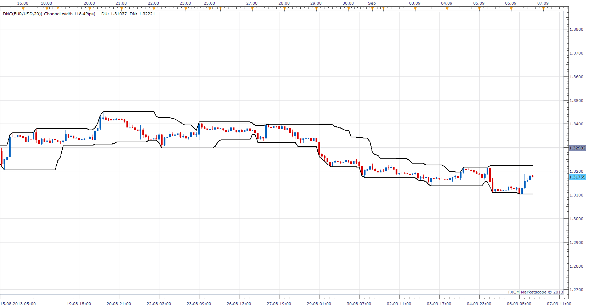
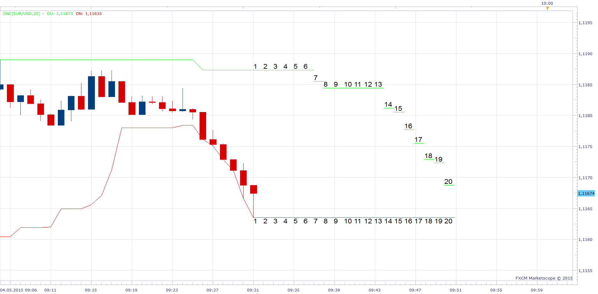
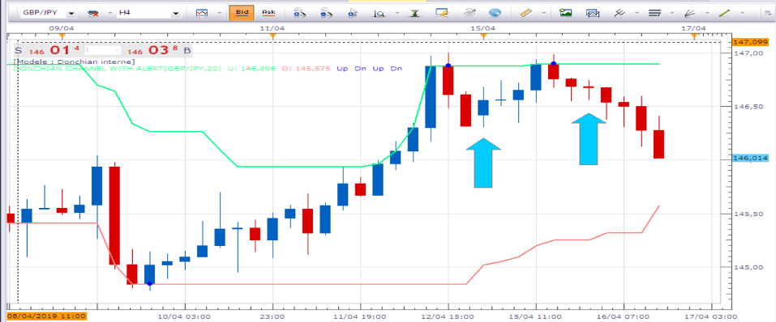
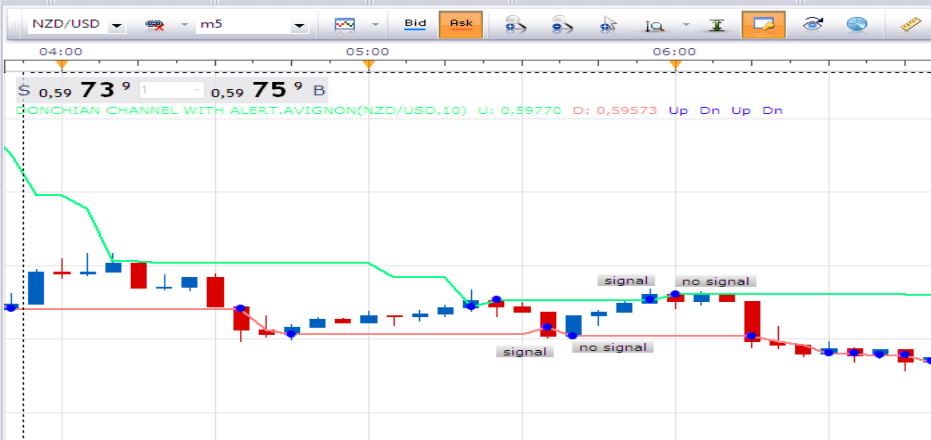

# Dochian Channel Indicator

> Source: https://fxcodebase.com/code/viewtopic.php?f=17&t=20  
> Forum: 17 · Topic 20 · 91 post(s)

---

## Dochian Channel Indicator

**admin** · Tue Oct 20, 2009 3:45 pm

**DESCRIPTION:**
This indicator displays a simple marker of the Highest High in the last few periods, and the Lowest Low in the last few periods. Usually this indicator is configured to use 20 periods. Center line displays average between highest high and lowest low. Dochian Channel Indicator is useful because previous highs and lows usually show significant resistance to further currency price movement.

**CALCULATION:**
UP(N) = MAX(HIGH, N)
DOWN(N) = MIN(LOW, N)
DNC(N) = (UP(N) + DOWN(N)) / 2

 

*Screenshot of Dochian Channel Indicator*

 [DNC.lua](files/21/DNC.lua)

 [Donchian Channel with Alert.lua](files/21/Donchian%20Channel%20with%20Alert.lua)

This Version will give Audio / Email Alerts on Price/Line Cross.

Dec 14, 2015: Compatibility issue Fixed. _Alert helper is not longer needed.

 [Tick DNC.lua](files/21/Tick%20DNC.lua)

MT4/MQ4 version
[viewtopic.php?f=38&t=20206](https://fxcodebase.com/code/viewtopic.php?f=38&t=20206)

Indicator-based strategy.
[viewtopic.php?f=31&t=68575](https://fxcodebase.com/code/viewtopic.php?f=31&t=68575)

MT4/MQ4 version.
[viewtopic.php?f=38&t=68979](https://fxcodebase.com/code/viewtopic.php?f=38&t=68979)

---

## Re: Dochian Channel Indicator

**gerrysta** · Sat May 08, 2010 11:40 am

Could someone tell me what program I use to open a '.lua file for the Donchian Channel? Thanks

---

## Re: Dochian Channel Indicator

**Nikolay.Gekht** · Sun May 09, 2010 9:24 am

It is the FXCM Trading Station (dbFX Trading Station is the same).
Please read the instruction:
[viewtopic.php?f=17&t=17](https://fxcodebase.com/code/viewtopic.php?f=17&t=17)

---

## Re: Dochian Channel Indicator

**Apprentice** · Fri May 28, 2010 1:21 pm

*Dochian Channel Indicator*

This version has the option to choose between High / Low and Close values as a basis for drawing Dochian Channel.

 [DNC_V2.lua](files/2270/DNC_V2.lua)

---

## Re: Dochian Channel Indicator

**abcdefg** · Tue Oct 19, 2010 7:07 am

Can I please request a bigger timeframe of this indicator for my tick chart.
Placing a 1440 or 2180 donchian channel on tick charts are very limiting and also inaccurate, due to the repaints.
(Please do not remove the mid line as it is a very effective alternative compared to pivots.)

It would be great for all trend-followers (scalping the ticks) and in honor to Mr.Donchian

Thank you guys in advance. no rush

---

## Re: Dochian Channel Indicator

**Apprentice** · Tue Oct 19, 2010 8:38 am

Added to developmental cue.

---

## Re: Dochian Channel Indicator

**Alexander.Gettinger** · Thu Oct 21, 2010 4:35 am

Bigger timeframe DNC.

 

Code: [Select all](https://fxcodebase.com/code/)
`function Init()
    indicator:name("Bigger timeframe DNC");
    indicator:description("");
    indicator:requiredSource(core.Bar);
    indicator:type(core.Indicator);

    indicator.parameters:addGroup("Calculation");
    indicator.parameters:addString("BS", "Time frame to calculate DNC", "", "D1");
    indicator.parameters:setFlag("BS", core.FLAG_PERIODS);
    indicator.parameters:addInteger("N", "Number of periods", "", 20, 2, 10000);
    indicator.parameters:addString("AC", "Analyze the current period", "", "yes");
    indicator.parameters:addStringAlternative("AC", "no", "", "no");
    indicator.parameters:addStringAlternative("AC", "yes", "", "yes");
    indicator.parameters:addString("SM", "Show middle line", "", "no");
    indicator.parameters:addStringAlternative("SM", "no", "", "no");
    indicator.parameters:addStringAlternative("SM", "yes", "", "yes");

    indicator.parameters:addGroup("Display");
    indicator.parameters:addColor("clrDU", "Color of the Up line", "", core.rgb(255, 255, 0));
    indicator.parameters:addColor("clrDN", "Color of the Down line", "", core.rgb(255, 255, 0));
    indicator.parameters:addColor("clrDM", "Color of the middle line", "", core.rgb(255, 255, 0));

end

local source;                   -- the source
local bf_data = nil;          -- the high/low data
local N;
local BS;
local bf_length;                 -- length of the bigger frame in seconds
local dates;                    -- candle dates
local host;
local day_offset;
local week_offset;
local extent;
local dn=nil;
local du=nil;
local dm=nil;

function Prepare()
    source = instance.source;
    host = core.host;

    day_offset = host:execute("getTradingDayOffset");
    week_offset = host:execute("getTradingWeekOffset");

    BS = instance.parameters.BS;
    N = instance.parameters.N;
    extent = N*2;

    local s, e, s1, e1;

    s, e = core.getcandle(source:barSize(), core.now(), 0, 0);
    s1, e1 = core.getcandle(BS, core.now(), 0, 0);
    assert ((e - s) <= (e1 - s1), "The chosen time frame must be bigger than the chart time frame!");
    bf_length = math.floor((e1 - s1) * 86400 + 0.5);

    local name = profile:id() .. "(" .. source:name() .. "," .. BS .. "," .. N .. ")";
    instance:name(name);
    dn = instance:addStream("DU", core.Line, name .. ".DU", "DU", instance.parameters.clrDU,  0);
    du = instance:addStream("DN", core.Line, name .. ".DN", "DN", instance.parameters.clrDN,  0);
    if (instance.parameters.SM=="yes") then
        dm = instance:addStream("DM", core.Line, name .. ".DM", "DM", instance.parameters.clrDM,  0);
    end

end

local loading = false;
local loadingFrom, loadingTo;
local pday = nil;

-- the function which is called to calculate the period
function Update(period, mode)
    -- get date and time of the hi/lo candle in the reference data
    local bf_candle;
    bf_candle = core.getcandle(BS, source:date(period), day_offset, week_offset);

    -- if data for the specific candle are still loading
    -- then do nothing
    if loading and bf_candle >= loadingFrom and (loadingTo == 0 or bf_candle <= loadingTo) then
        return ;
    end

    -- if the period is before the source start
    -- the do nothing
    if period < source:first() then
        return ;
    end

    -- if data is not loaded yet at all
    -- load the data
    if bf_data == nil then
        -- there is no data at all, load initial data
        local to, t;
        local from;

        if (source:isAlive()) then
            -- if the source is subscribed for updates
            -- then subscribe the current collection as well
            to = 0;
        else
            -- else load up to the last currently available date
            t, to = core.getcandle(BS, source:date(period), day_offset, week_offset);
        end

        from = core.getcandle(BS, source:date(source:first()), day_offset, week_offset);
        dn:setBookmark(1, period);
        -- shift so the bigger frame data is able to provide us with the stoch data at the first period
        from = math.floor(from * 86400 - (bf_length * extent) + 0.5) / 86400;
        local nontrading, nontradingend;
        nontrading, nontradingend = core.isnontrading(from, day_offset);
        if nontrading then
            -- if it is non-trading, shift for two days to skip the non-trading periods
            from = math.floor((from - 2) * 86400 - (bf_length * extent) + 0.5) / 86400;
        end
        loading = true;
        loadingFrom = from;
        loadingTo = to;
        bf_data = host:execute("getHistory", 1, source:instrument(), BS, loadingFrom, to, source:isBid());
        DNC = core.indicators:create("DNC", bf_data, instance.parameters.N,instance.parameters.AC,instance.parameters.clrDU,instance.parameters.clrDU,instance.parameters.clrDU,instance.parameters.SM);
        return ;
    end

    -- check whether the requested candle is before
    -- the reference collection start
    if (bf_candle < bf_data:date(0)) then
        dn:setBookmark(1, period);
        if loading then
            return ;
        end
        -- shift so the bigger frame data is able to provide us with the stoch data at the first period
        from = math.floor(bf_candle * 86400 - (bf_length * extent) + 0.5) / 86400;
        local nontrading, nontradingend;
        nontrading, nontradingend = core.isnontrading(from, day_offset);
        if nontrading then
            -- if it is non-trading, shift for two days to skip the non-trading periods
            from = math.floor((from - 2) * 86400 - (bf_length * extent) + 0.5) / 86400;
        end
        loading = true;
        loadingFrom = from;
        loadingTo = bf_data:date(0);
        host:execute("extendHistory", 1, bf_data, loadingFrom, loadingTo);
        return ;
    end

    -- check whether the requested candle is after
    -- the reference collection end
    if (not(source:isAlive()) and bf_candle > bf_data:date(bf_data:size() - 1)) then
        dn:setBookmark(1, period);
        if loading then
            return ;
        end
        loading = true;
        loadingFrom = bf_data:date(bf_data:size() - 1);
        loadingTo = bf_candle;
        host:execute("extendHistory", 1, bf_data, loadingFrom, loadingTo);
        return ;
    end

    DNC:update(mode);
    local p;
    p = findDateFast(bf_data, bf_candle, true);
    if p == -1 then
        return ;
    end
    if DNC:getStream(0):hasData(p) then
        dn[period] = DNC:getStream(0)[p];
    end
    if DNC:getStream(1):hasData(p) then
        du[period] = DNC:getStream(1)[p];
    end
    if (instance.parameters.SM=="yes") then
     if DNC:getStream(2):hasData(p) then
         dm[period] = DNC:getStream(2)[p];
     end
    end
   
end

-- the function is called when the async operation is finished
function AsyncOperationFinished(cookie)
    local period;

    pday = nil;
    period = dn:getBookmark(1);

    if (period < 0) then
        period = 0;
    end
    loading = false;
    instance:updateFrom(period);
end

function findDateFast(stream, date, precise)
    local datesec = nil;
    local periodsec = nil;
    local min, max, mid;

    datesec = math.floor(date * 86400 + 0.5)

    min = 0;
    max = stream:size() - 1;

    while true do
        mid = math.floor((min + max) / 2);
        periodsec = math.floor(stream:date(mid) * 86400 + 0.5);
        if datesec == periodsec then
            return mid;
        elseif datesec > periodsec then
            min = mid + 1;
        else
            max = mid - 1;
        end
        if min > max then
            if precise then
                return -1;
            else
                return min - 1;
            end
        end
    end
end`

For this indicator must be installed DNC indicator.

---

## Re: Dochian Channel Indicator

**Apprentice** · Mon Dec 06, 2010 8:56 am

DNC-Bandwidth
The difference between the highest and lowest prices within the period.
You used to determine the width of the channel,
measure of volatility.

DNC-Percentage
Shows the percentage position of the closing price within the DNC canal.
Can be used as simple indicators for overbought / oversold conditions.
Filter for possible Entry, Exit orders.

 [DNC-Bandwidth.lua](files/6574/DNC-Bandwidth.lua)

 [DNC-Percentage.lua](files/6574/DNC-Percentage.lua)

---

## Re: Dochian Channel Indicator

**pippelin** · Fri Jan 21, 2011 10:47 am

> **Apprentice wrote:**
>
>
> Close.png
>
>
>
> This version has the option to choose between High / Low and Close values as a basis for drawing Dochian Channel.
>
>
>
> DNC_V2.lua

Hi apprentice
even when i use your version 2 of your donchian channel i cant change the data source to close and its always history
can you help me to get the chance to just use the close price as the data source with this indicator

Thank you very much

---

## Re: Dochian Channel Indicator

**Apprentice** · Fri Jan 21, 2011 1:14 pm

Data source for this indicator Is always Bar. (All four data points)

You have the choice to select, whether the channel lines are to be drawn on High / Low or Close values.

---

## Re: Dochian Channel Indicator

**maxiefx** · Tue Jan 25, 2011 1:53 am

Hi code base team,

Can you make added line at donchian channel like this:
1. High Band
2. 75% Line*
3. Middle Line (50% Line)
4. 25% Line*
5. Low Band

and also line color, width and style too ?
Thanks in advance

*) new line

---

## Re: Dochian Channel Indicator

**bourik** · Sun Feb 06, 2011 4:35 am

Hello

i'm looking for de same things , its very helpful to analyse mouvements of price

---

## Re: Dochian Channel Indicator

**Apprentice** · Sun Feb 06, 2011 5:52 am

The request is in a development order.

---

## Re: Dochian Channel Indicator

**bourik** · Sun Feb 06, 2011 7:57 am

Great

Thanks a lot

---

## Re: Dochian Channel Indicator

**Apprentice** · Wed Feb 09, 2011 3:14 pm

Version 3 of this indicator has two new functionality.
Sub Level Lines and Line Style option.

1. High Band
2. 75% Line*
3. Middle Line (50% Line)
4. 25% Line*
5. Low Band

* Sub Levels

 [DNC_V3.lua](files/8040/DNC_V3.lua)

---

## Re: Dochian Channel Indicator

**bourik** · Wed Feb 09, 2011 5:08 pm

Thanks very much Apprentice

great job, I'm impressed by your reactivity and eficacity

Big respect

Look at this indicator with 90 periods, its give very goods reference points, especially the middle line

---

## Re: Dochian Channel Indicator

**maxiefx** · Tue Mar 15, 2011 4:39 am

Hello Apprentice,

Thank you for your nice indi based on my request, Salut for your work. I just want to request again for bigger time frame (BF_DNC_V3) too, can you help me again, please?

Thanks in advance

> **Apprentice wrote:**
>
>
> v3.png
>
>
>
> Version 3 of this indicator has two new functionality.
> Sub Level Lines and Line Style option.
>
> 1. High Band
> 2. 75% Line*
> 3. Middle Line (50% Line)
> 4. 25% Line*
> 5. Low Band
>
> * Sub Levels
>
>
>
> DNC_V3.lua

---

## Re: Dochian Channel Indicator

**Apprentice** · Tue Mar 15, 2011 5:51 am

Your request has been added to developmental cue.

---

## Re: Dochian Channel Indicator

**Apprentice** · Tue Mar 15, 2011 7:17 am

With Biger Time Frame Indicator version you must install the regular version as well.

 [BF_DNC_V3.lua](files/8795/BF_DNC_V3.lua)

---

## Re: Dochian Channel Indicator

**cyanidez** · Thu Mar 17, 2011 4:39 pm

Amazing work Apprentice, thanks!

---

## Re: Dochian Channel Indicator

**vstrelnikov** · Fri Apr 01, 2011 4:21 pm

Tiny update.
Parameter "Show High/Low lines" which can be "Both", "High" or "Low" added to DNC_V3.lua.

---

## Re: Dochian Channel Indicator

**maxiefx** · Thu Apr 14, 2011 6:48 am

> **Apprentice wrote:**
>
>
> BF_DNC_V3.png
>
>
> With Biger Time Frame Indicator version you must install the regular version as well.
>
>
> BF_DNC_V3.lua

Dear Apprentice,

Thanks again for your great indicator.

---

## Re: Dochian Channel Indicator

**Terminus** · Mon May 23, 2011 10:01 am

Hello,
i'am looking for a traduction of this Pro realtime code on Trade station II code... :
This is an indicator who is nearly like Donchian Channel but not the same....
If anybody have the nowledge from that i will be reconnaisant ... (sorry for the english...)
--------------------------------------------------------

CP=(open+high+low+2*close)/5
F=LinearRegression[3](CP)
E=std[7](F)

if barindex<8 then
Mediane = undefined
BandeHaute = undefined
BandeBasse = undefined

Else
BandeHaute = F+(E*2)
BandeBasse = F-(E*2)

if F<BandeHaute[1] and F>BandeBasse[1] then
E=E[1]
BandeHaute=BandeHaute[1]
BandeBasse=BandeBasse[1]
endif

Mediane =(BandeHaute+BandeBasse)/2
Endif

return BandeHaute coloured (255,154,51) as"Mogalef Bande Haute", Mediane coloured (102,0,204) as "Mogalef Mediane", BandeBasse coloured (0,204,255) as "Mogalef Bande Basse"
--------------------------------------------------------

---

## Re: Dochian Channel Indicator

**Apprentice** · Mon May 23, 2011 5:10 pm

Requested can be found here.
[viewtopic.php?f=17&t=4449&p=10972#p10972](https://fxcodebase.com/code/viewtopic.php?f=17&t=4449&p=10972#p10972)

---

## Re: Dochian Channel Indicator

**Terminus** · Tue May 24, 2011 3:35 am

thank you,

i put an answer to Mogalef bands topic
Tis is not the same indicator

---

## Re: Dochian Channel Indicator

**Terminus** · Fri May 27, 2011 4:59 am

just a suggestion to the friendly programmer ...
Having the ability to adjust the size of the line of the channels

---

## Re: Dochian Channel Indicator

**Apprentice** · Fri Jun 03, 2011 3:34 am

Time Frame biger version compatibility issue resolved.

---

## Re: Dochian Channel Indicator

**Terminus** · Tue Jun 07, 2011 1:59 am

thanks a lot Apprentice !

---

## Re: Dochian Channel Indicator

**arindam89** · Sun Jun 03, 2012 10:13 am

> **maxiefx wrote:**
> Hello Apprentice,
>
> Thank you for your nice indi based on my request, Salut for your work. I just want to request again for bigger time frame (BF_DNC_V3) too, can you help me again, please?
>
> Thanks in advance
>
>
>
>
> > **Apprentice wrote:**
> >
> >
> > v3.png
> >
> >
> >
> > Version 3 of this indicator has two new functionality.
> > Sub Level Lines and Line Style option.
> >
> > 1. High Band
> > 2. 75% Line*
> > 3. Middle Line (50% Line)
> > 4. 25% Line*
> > 5. Low Band
> >
> > * Sub Levels
> >
> >
> >
> > DNC_V3.lua

hi Apprentice
i have no word to congratulate your good work
i have a request can you make a strategy that goes short if it crosses 75% downwards
and go long if it crosses 25% line upwards
i hope you understood what i meant to say
thanks
buy
arindam roy

---

## Re: Dochian Channel Indicator

**Apprentice** · Mon Jun 04, 2012 1:45 am

Your request is added to the development list.

---

## Re: Dochian Channel Indicator

**Apprentice** · Mon Jun 04, 2012 2:12 pm

Requested can be found here.
[viewtopic.php?f=31&t=19839](https://fxcodebase.com/code/viewtopic.php?f=31&t=19839)

---

## Re: Dochian Channel Indicator

**Bob NZ** · Sat Dec 01, 2012 1:11 am

Hi Apprentice.
 Any chance of getting a strategy on this DNC? CCI at an extreme, price at channel hi/lo. Variable Channel settings? I like 55 for a reason I can't explain .

If at/near low chanel and CCI at an extreme number Buy. Etc,. Or if price at/near low channel and CCI drops from extreme = Buy

Purhaps with an extreme input for CCI so nothing happens until CCI is past that point. Gets to an extreme and pulls back towards the o/bought/sold line?

Wish I knew how to do it myself .

Cheers

---

## Re: Dochian Channel Indicator

**Apprentice** · Sat Dec 01, 2012 5:29 am

Your request is added to the development list.

---

## Re: Dochian Channel Indicator

**TheLight** · Fri Sep 06, 2013 9:08 am

Dear Apprentice, I have a request, I would like to add a calculation to the original DNC.lua To both calculate and then show the result (the total pip difference from the upper band to the lower band displayed according to the user input) at the end of the "legend" of the DNC indicator? Thank you.

---

## Re: Dochian Channel Indicator

**Apprentice** · Sun Sep 08, 2013 1:28 am

Your request is added to the development list.

---

## Re: Dochian Channel Indicator

**Apprentice** · Sun Sep 08, 2013 2:08 am

Try This version

 [DNC.lua](files/89254/DNC.lua)

---

## Re: Dochian Channel Indicator

**TheLight** · Sun Sep 08, 2013 9:04 pm

Thanks Apprentice, it works great, exactly what I was looking for. Your work is exceptional.

---

## Re: Dochian Channel Indicator

**TheLight** · Tue Sep 17, 2013 6:09 pm

Hi Apprentice,

The DNC legend upgrade has been very useful in displaying the Channel width in pips. It would also be helpful to have the Channel width pips displayed automatically as a percent % as well.

Of course we need a specific market value to compare the Channel width to. My thought is that we could use the median price of the channel for a formula as follows; (Channel width pips / (Channel high - Channel low = Channel median)) We also need to account for different decimal pricing in different forex pairs as well as CFD's. You might find some insight for this by looking at the lua script for the ZigZag_Counter_V7.lua indicator as this issue was recently addressed in its latest enhancements.

Recent Example: On D1 (daily1) DNC (EUR/USD,20)(Channel width 304.9 Pips) - DU: 1.31046 DN: 1.34095

(DU: 1.31046 + DN: 1.34095 = 2.65141) / 2 = 1.3257 DM
Channel width 304.9 Pips / 13,257 = 0.0230 or 2.3%

Displayed in "Legend" as:
DNC(EUR/USD,20)(Channel width 304.9 Pips, 2.3%) - DU: 1.31046 DN: 1.34095 DM: 1.32570
or simplified could be
DNC(EUR/USD,20, 304.9 Pips, 2.3%) - DU 1.31046 DN 1.34095 DM 1.32570

Thanks again,
TheLight

---

## Re: Dochian Channel Indicator

**Apprentice** · Wed Sep 18, 2013 2:08 pm

Try Updated Version.

---

## Re: Dochian Channel Indicator

**TheLight** · Wed Sep 18, 2013 3:02 pm

Thanks Apprentice, your upgrade to the DNC is great! TheLight

---

## Re: Dochian Channel Indicator

**Coondawg71** · Sun Nov 24, 2013 6:00 am

Can we please request Alert Functions added to DNC V3 of this indicator upon breach of High Line, Low Line and Midline.

Thanks,

sjc

---

## Re: Dochian Channel Indicator

**Apprentice** · Sun Nov 24, 2013 2:47 pm

Donchian Channel with Alert.lua Added (See Topmost post)

---

## Re: Dochian Channel Indicator

**mulligan** · Wed Jan 29, 2014 5:02 pm

I'm using the DNC_V2. Would it be possible to add the style option to the center line of color up and color down?

Thanks

---

## Re: Dochian Channel Indicator

**Apprentice** · Thu Jan 30, 2014 4:18 am

Style Option Added.

---

## Re: Dochian Channel Indicator

**mulligan** · Thu Jan 30, 2014 11:00 am

Apologies for not being clear on the request. I was looking for color up as the indicator rises and color down as it goes down. Example, green as the center line goes up and red as it goes down.

Thanks.

---

## Re: Dochian Channel Indicator

**Apprentice** · Sun Feb 02, 2014 4:03 am

Try This Version.

 [DNC_V2.lua](files/92414/DNC_V2.lua)

---

## Re: Dochian Channel Indicator

**mulligan** · Sun Feb 16, 2014 6:51 pm

Thanks for the DNC_V2 with the up and down center line color option. With the additional neutral color, the line is predominantly neutral by the nature of the indicator. Is it possible to get a version with only the up and down without the neutral? It would be much clearer to read and follow with only up and down.

---

## Re: Dochian Channel Indicator

**Apprentice** · Mon Feb 17, 2014 2:36 am

Try This Version.

 [DNC_V2.lua](files/92706/DNC_V2.lua)

---

## Re: Dochian Channel Indicator

**STS Trading** · Wed Jan 21, 2015 4:34 am

Since yersterday I use Donchian Channel Indicator Version 3 (filename: DNC_V3.lua; post of Feb 09, 2011), cause I like the feature of the 25%- and 75%-lines. The middle-line is useless in my trading, so I deactivated it in the indicator setup, but this causes an error. In the update-function the dm-variable is used in case 25%- and 75%-lines are activated, but assigned with 0 in case the middle-line is deactivated.

So I added an else-part in the prepare-function as shown below:

Code: [Select all](https://fxcodebase.com/code/)
`if (sm) then
    dm = instance:addStream("DM", core.Line, name .. ".DM", "M", instance.parameters.clrDM,  first)
    dm:setWidth(instance.parameters.widthDM);
    dm:setStyle(instance.parameters.styleDM);
else
    dm = instance:addInternalStream(0);
end`

According to that change I revised the update-function as well and removed the if-statement:

Code: [Select all](https://fxcodebase.com/code/)
`dm[period] = (du[period] + dn[period]) / 2;`

Hopefuly it helps.

The revised version can be downloaded here:

 [DochianChannel.lua](files/98262/DochianChannel.lua)

Chris

---

## Re: Dochian Channel Indicator

**Apprentice** · Mon May 04, 2015 9:25 am

Projection option added to DNC.lua

---

## Re: Dochian Channel Indicator

**juju1024** · Wed May 06, 2015 7:07 pm

hi,
Can you convert DNC-Percentage.lua to mq4 ? Thx

---

## Re: Dochian Channel Indicator

**Apprentice** · Thu May 07, 2015 3:55 am

Requested can be found here.
[viewtopic.php?f=38&t=62193&p=100316#p100316](https://fxcodebase.com/code/viewtopic.php?f=38&t=62193&p=100316#p100316)

---

## Re: Dochian Channel Indicator

**Apprentice** · Mon Dec 14, 2015 5:31 am

Dec 14, 2015: Compatibility issue Fixed. _Alert helper is not longer needed.

If you want to use updated version of this indicator,
please make sure to use TS Version 01.14.101415. or higher.

---

## Re: Dochian Channel Indicator

**Panther** · Fri Aug 05, 2016 5:08 am

Could you make a tick based version of DNC_V2.lua? I tried the Timed Tick DNC. It's not the same.
Thanks.

---

## Re: Dochian Channel Indicator

**Apprentice** · Mon Aug 08, 2016 3:01 am

Tick DNC.lua added.

---

## Re: Dochian Channel Indicator

**Apprentice** · Wed Apr 25, 2018 3:09 pm

The indicator was revised and updated.

---

## Re: Dochian Channel Indicator

**Alexander.Gettinger** · Tue Feb 12, 2019 9:36 pm

> **Bob NZ wrote:**
> Hi Apprentice.
> Any chance of getting a strategy on this DNC? CCI at an extreme, price at channel hi/lo. Variable Channel settings? I like 55 for a reason I can't explain .
>
> If at/near low chanel and CCI at an extreme number Buy. Etc,. Or if price at/near low channel and CCI drops from extreme = Buy
>
> Purhaps with an extreme input for CCI so nothing happens until CCI is past that point. Gets to an extreme and pulls back towards the o/bought/sold line?
>
> Wish I knew how to do it myself .
>
> Cheers

Please try this strategy:

 [DNC_Str.lua](files/123859/DNC_Str.lua)

---

## Re: Dochian Channel Indicator

**Avignon** · Thu Apr 11, 2019 7:12 pm

Hello,

Can you add shift signal option?

Thanks.

---

## Re: Dochian Channel Indicator

**Apprentice** · Fri Apr 12, 2019 4:37 am

Can you define "shift signal"?

---

## Re: Dochian Channel Indicator

**Avignon** · Fri Apr 12, 2019 8:38 am

Actually there was a misunderstanding: it's forward signal.

Shift = 0 : signal on the current candle (default value)
Shift = 1 : signal on the forward candle
Shift = 10 : signal on the tenth candle

Thanks.

PS: Can you fix the bug? When I have the notification window and I scroller, the notification window comes back.

---

## Re: Dochian Channel Indicator

**Apprentice** · Sun Apr 14, 2019 9:56 am

I'm not sure I understand you.
You want to shift the line x periods left or right?
Can you specify/post indicator/strategy version?

---

## Re: Dochian Channel Indicator

**Avignon** · Tue Apr 16, 2019 12:25 pm

I want signal here (for example):

 

I use Donchian channel with alert ([viewtopic.php?f=17&t=20#p21](http://www.fxcodebase.com/code/viewtopic.php?f=17&t=20#p21))

Thanks.

---

## Re: Dochian Channel Indicator

**Apprentice** · Thu Apr 18, 2019 5:13 am

Your request is added to the development list under Id Number 4599

---

## Re: Dochian Channel Indicator

**Avignon** · Mon Apr 22, 2019 10:04 am

An indicator, in my name, and it works the way I want it to.

Thanks Apprentice.

---

## Re: Dochian Channel Indicator

**lshcube** · Tue Sep 17, 2019 4:52 pm

Hi

I just tested the Donchian Channel Indicator with alert. I am trying to catch breakouts of n period highs or lows. However, the alert does not sound when price make new high or lows. It only alerts when price crosses back when price retreats from new highs or lows. There are no alerts as price makes repeated new highs or lows. This means it is not possible to be alerted when price breaks out of the channel..

I noticed that the alert messages are either "Lower Outer Line : Cross Over" or "Upper Outer Line : Cross Under. Never "Lower Outer Line : Cross Under" or "Upper Outer Line : Cross Over". I think this proves there is a an error. In addition to the fact that the alert does not sound when price makes new highs or lows.

Regards

---

## Re: Dochian Channel Indicator

**Apprentice** · Wed Sep 18, 2019 6:20 am

Your request is added to the development list.
Development reference 100.

---

## Re: Dochian Channel Indicator

**lshcube** · Thu Sep 19, 2019 12:25 pm

Thanks !!!

I would like the option to be alerted either (a) the moment prices crosses the highs or lows or (b) on the close of the bar.

Would it be possible to place the indicator on one time frame (say H1) whilst monitoring the breakout on a lower time frame (say 15m)?

Regards

---

## Re: Dochian Channel Indicator

**Apprentice** · Thu Sep 19, 2019 1:01 pm

[Donchian_Channel_with_Alert.Avignon.lua](files/128784/Donchian_Channel_with_Alert.Avignon.lua)

Try this version.

---

## Re: Dochian Channel Indicator

**lshcube** · Fri Sep 20, 2019 12:35 pm

Hi

Same problem. New highs or lows do not trigger alert. It's as if the current high is compared to the high for n periods which also includes the high for the current period. So the current high will never exceed the 20 period high because the current high is being compared to itself.

Anyway, I discovered your "TBB with alert" indicator which should serve the same purpose - detect volatility breakout. I will use that indicator instead as it is working.

Regards.

---

## Re: Dochian Channel Indicator

**lshcube** · Mon Sep 23, 2019 12:20 pm

Hi Apprentice,

TBB WITH ALERT works fine. I couldn't find an MT4 version. Could you make an MT4 version? Thanks!

Regards.

---

## Re: Dochian Channel Indicator

**Apprentice** · Wed Sep 25, 2019 3:25 pm

Your request is added to the development list.
Development reference 131.

---

## Re: Dochian Channel Indicator

**lshcube** · Fri Sep 27, 2019 2:15 pm

Thank You !!!

---

## Re: Dochian Channel Indicator

**Apprentice** · Mon Sep 30, 2019 6:27 am

> **lshcube wrote:**
> Hi
>
> Same problem. New highs or lows do not trigger alert. It's as if the current high is compared to the high for n periods which also includes the high for the current period. So the current high will never exceed the 20 period high because the current high is being compared to itself.
>
> Anyway, I discovered your "TBB with alert" indicator which should serve the same purpose - detect volatility breakout. I will use that indicator instead as it is working.
>
> Regards.

 It detects cross over/under only

---

## Re: Dochian Channel Indicator

**Apprentice** · Thu Oct 03, 2019 4:42 am

MT4/MQ4 version.
[viewtopic.php?f=38&t=68979](https://fxcodebase.com/code/viewtopic.php?f=38&t=68979)

---

## Re: Dochian Channel Indicator

**lshcube** · Thu Oct 03, 2019 5:15 am

Thank you very much !!

---

## Re: Dochian Channel Indicator

**xpertize** · Mon Feb 24, 2020 1:41 am

Is it possible to add vertical shift to all the three bands?

Thanks,
Xpertize

---

## Re: Dochian Channel Indicator

**Apprentice** · Mon Feb 24, 2020 4:17 am

Your request is added to the development list.
Development reference 769.

---

## Re: Dochian Channel Indicator

**Apprentice** · Tue Feb 25, 2020 10:15 am

[DNC with vertical shift.lua](files/131500/DNC%20with%20vertical%20shift.lua)

Try this version.

---

## Re: Dochian Channel Indicator

**Avignon** · Thu Apr 23, 2020 6:22 pm

Hello,

Can you customize Alert Style?

 

(people might want the opposite?)

add "Allowed side" option (both, sell, buy)

And to correct the bug: if you scroll with the scroll wheel, the notification comes back.

Thanks.

---

## Re: Dochian Channel Indicator

**Apprentice** · Fri Apr 24, 2020 12:51 pm

Your request is added to the development list.
Development reference 1124.

---

## Re: Dochian Channel Indicator

**xpertize** · Sat Apr 25, 2020 2:53 am

> **Apprentice wrote:**
>
>
> DNC with vertical shift.lua
>
>
> Try this version.

Thanks Apprentice!

---

## Re: Dochian Channel Indicator

**hedging** · Sun Apr 26, 2020 6:52 am

Hello Apprentice,

Please add an option for horizontal shift to DNC too. It will be more useful than just vertical shift.
Thanks,

---

## Re: Dochian Channel Indicator

**Apprentice** · Mon Apr 27, 2020 4:40 am

[DNC with shift.lua](files/133226/DNC%20with%20shift.lua)

Try this version.

---

## Re: Dochian Channel Indicator

**Avignon** · Wed May 06, 2020 3:19 pm

> **Apprentice wrote:**
> Your request is added to the development list.
> Development reference 1124.

I haven't been forgotten?

---

## Re: Dochian Channel Indicator

**Apprentice** · Thu May 07, 2020 6:47 am

Indicators already has the ability to disable different sides. And it's not a bug. When you scroll the wheel the data has been updated and the old signals become invalid

---

## Re: Dochian Channel Indicator

**Avignon** · Mon May 11, 2020 2:24 pm

With the parameter option "Analyse the current period":

- true: signals when cross over and cross under only inside the channel

- false: signals when cross over and cross under inside and outside the channel

Me I want signal only outside the channel. Thanks.

---

## Re: Dochian Channel Indicator

**Apprentice** · Tue May 12, 2020 11:13 am

Your request is added to the development list.
Development reference 1274.

---

## Re: Dochian Channel Indicator

**Apprentice** · Wed May 13, 2020 4:29 am

[Donchian_Channel_with_Alert.Avignon.lua](files/133876/Donchian_Channel_with_Alert.Avignon.lua)

Try this version.

---

## Re: Dochian Channel Indicator

**Avignon** · Thu May 21, 2020 2:38 pm

Either it's not working, or I couldn't make it work, but we can put it on hold.

---

## Re: Dochian Channel Indicator

**Avignon** · Fri Jun 26, 2020 1:23 am

> **Avignon wrote:**
> With the parameter option "Analyse the current period":
>
> - true: signals when cross over and cross under only inside the channel
>
> - false: signals when cross over and cross under inside and outside the channel
>
>
> Me I want signal only outside the channel. Thanks.

Can you reconsider?

Thanks.

---

## Re: Dochian Channel Indicator

**Apprentice** · Fri Jun 26, 2020 3:37 am

The Live will give the instantaneous signals.
The end of turn will give delayed signals.
