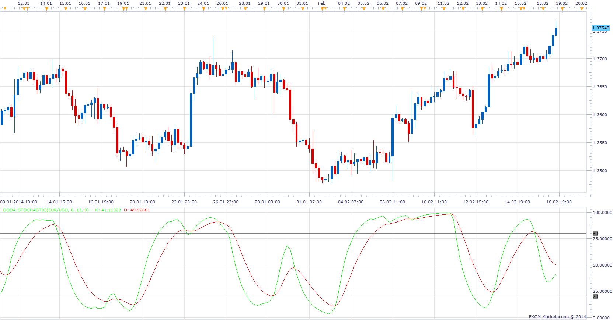

# Doda- Stochastic

> Source: https://fxcodebase.com/code/viewtopic.php?f=17&t=60317  
> Forum: 17 · Topic 60317 · 4 post(s)

---

## Doda- Stochastic

**Apprentice** · Tue Feb 18, 2014 12:58 pm

R is Stochastic K
K is Stochastic of R
D is Ma of K

 [Doda-Stochastic.lua](files/92734/Doda-Stochastic.lua)

The indicator was revised and updated

---

## Re: Doda- Stochastic

**Pandakker** · Tue Feb 18, 2014 2:53 pm

Thank you for the indicator. Much appreciated.

---

## Re: Doda- Stochastic

**Pandakker** · Thu Feb 20, 2014 3:03 pm

Hello Apprentice.

I installed the Doda stochastics on MarketScope. Looked ok. But after some compare on MT4 it looks different.
For example the GU 15 min. At this moment on MT4 Doda-stoch is at bottom. On Marketscope it is already pointing up and passed theh 50 line. Any idea why there is this difference?

Thanks

 

 

---

## Re: Doda- Stochastic

**Apprentice** · Sun Jun 18, 2017 1:00 pm

The indicator was revised and updated.
