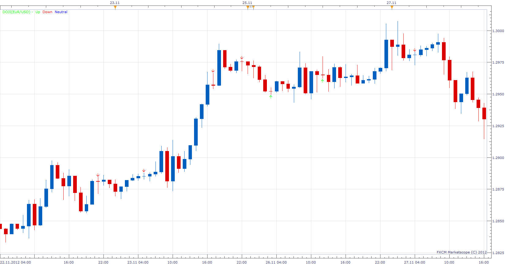

# Doji

> Source: https://fxcodebase.com/code/viewtopic.php?f=17&t=27419  
> Forum: 17 · Topic 27419 · 8 post(s)

---

## Doji

**Apprentice** · Thu Dec 06, 2012 6:42 am

Doji is generally an indicator of market indecision.
Open /Close Price of Doji are same or very close to one another.
And as such, do not give the bay and sell signals.
However, they may be an indication of weakening trend
and point to the possibility of changes in trend.
Indicator recognizes only Two Doji pattern, Dragonfly and Gravestone Doji
They can be used as trend reversal patterns.
If you know more Doji patterns I can added, ask.

All other indications of Doji, that are not Dragonfly or Gravestone,
are using trend reversal algorithm.
To try to guess the market direction after doji.
Trend reversal algorithm assumes that the market direction after Doji will be the opposite in direction than, last N Period Direction.

 [Doji.lua](files/47980/Doji.lua)

 [Doji with Alert.lua](files/47980/Doji%20with%20Alert.lua)

The indicator was revised and updated

---

## Re: Doji

**stainer** · Mon Mar 03, 2014 8:29 pm

Could you please make a alert for this, Just the same as the pin bar alert you made

---

## Re: Doji

**Apprentice** · Thu Mar 06, 2014 2:51 am

Your request is added to the development list.

---

## Re: Doji

**donfab31** · Mon May 15, 2017 8:23 am

This is a great indicator! I would like to know when the alert would be available? many thanks

---

## Re: Doji

**Apprentice** · Sat May 20, 2017 9:46 am

Doji with Alert.lua added.

---

## Re: Doji

**jaminjermaine** · Sun Aug 18, 2019 10:14 pm

Would you be able to add "Allow strategy to trade" ?

---

## Re: Doji

**Apprentice** · Tue Aug 20, 2019 6:12 am

Something like this?
[viewtopic.php?f=31&t=68535](https://fxcodebase.com/code/viewtopic.php?f=31&t=68535)

---

## Re: Doji

**jaminjermaine** · Wed Aug 21, 2019 4:11 pm

> **Apprentice wrote:**
> Something like this?
> [viewtopic.php?f=31&t=68535](https://fxcodebase.com/code/viewtopic.php?f=31&t=68535)

I will try to make that work. Thanks.
