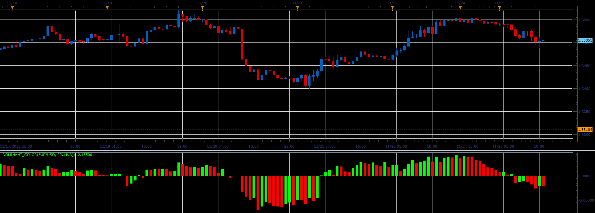

# Dominant color oscillator

> Source: https://fxcodebase.com/code/viewtopic.php?f=17&t=59972  
> Forum: 17 · Topic 59972 · 3 post(s)

---

## Dominant color oscillator

**Alexander.Gettinger** · Mon Nov 25, 2013 4:59 pm

The indicator helps to determine the dominant direction of closure of bars.

Formulas:
DC = MA(Diff), where
Diff = Close-Open.

 

Download:

 [Dominant_Color.lua](files/91108/Dominant_Color.lua)

For this indicator must be installed Averages indicator ([viewtopic.php?f=17&t=2430](https://fxcodebase.com/code/viewtopic.php?f=17&t=2430)).

---

## Re: Dominant color oscillator

**Alexander.Gettinger** · Mon Nov 25, 2013 5:00 pm

MQL4 version of oscillator: [viewtopic.php?f=38&t=59973](https://fxcodebase.com/code/viewtopic.php?f=38&t=59973).

---

## Re: Dominant color oscillator

**Apprentice** · Thu Sep 13, 2018 3:23 am

The indicator was revised and updated.
