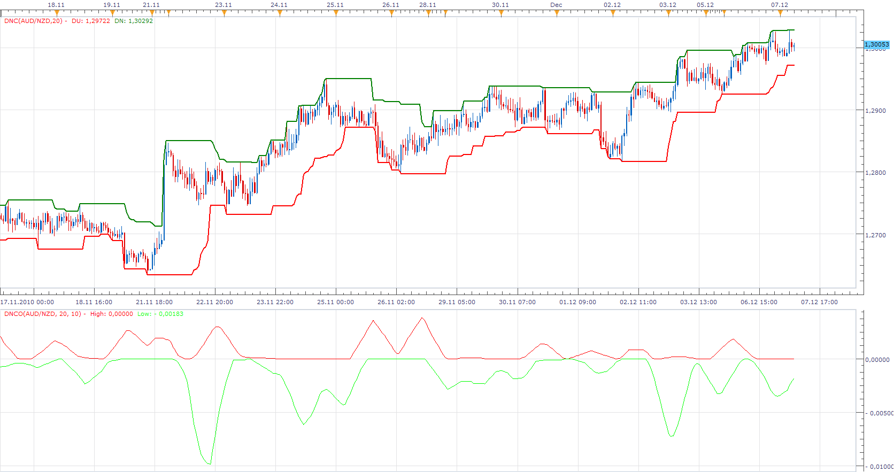

# Donchian Oscillator

> Source: https://fxcodebase.com/code/viewtopic.php?f=17&t=2892  
> Forum: 17 · Topic 2892 · 11 post(s)

---

## Donchian Oscillator

**Apprentice** · Tue Dec 07, 2010 6:58 am

This oscillator is based on written request.
In this oscillator, we use two Donchian channels, Fast and Slow.

HHF=highest high(fast)
HHS=highest high(slow)
LLF=Lowest low (fast)
LLS=Lowest low (slow)

HHFS = HHF- HHS (blue)
LLFS = LLF – LLS (red)

It have Averaging and Components Sum option.

 [DNCO.lua](files/6595/DNCO.lua)

---

## Re: Donchian Oscillator

**GBitaly** · Tue Dec 07, 2010 10:01 am

thanks for the work
I have tested it in a graph of 60min setting Fast 6 Slow 48 and avg 5 it goes well

but its necessary a little change
HHFS = HHS -HHF
LLFS = LLS - LLF
in up trend the indicator gives the end of trend of LOW and the begin of trend of HIGH

I believe that the component sum of HHFS+LLFS in not correct because must goes from positive to negative value and viceversa
I think that the sum must be plot with HHFS and LLFS

thanks in advance

---

## Re: Donchian Oscillator

**Apprentice** · Tue Dec 07, 2010 10:28 am

Update

---

## Re: Donchian Oscillator

**GBitaly** · Tue Dec 07, 2010 11:22 am

very good
I preferred with the sum plotted with HHFS and LLFS but there isn't
I attempt to attach an image to see the result but I don't succed

---

## Re: Donchian Oscillator

**Apprentice** · Tue Dec 07, 2010 1:24 pm

Like This.

 [DNCO.lua](files/6612/DNCO.lua)

---

## Re: Donchian Oscillator

**sdcasper** · Sun Dec 19, 2010 12:50 am

was wondering how i can download application. saw it on an fxcm seminar.

---

## Re: Donchian Oscillator

**Apprentice** · Sun Dec 19, 2010 6:06 am

I'm not sure what you mean by application.

If you are talking about the trading platform.
You can download it here.
[http://www.forexmicrolot.com/forex-soft ... wnload.jsp](http://www.forexmicrolot.com/forex-software-download.jsp)

Instructions on how to download and load indicator can be found here.

[viewtopic.php?f=17&t=17](https://fxcodebase.com/code/viewtopic.php?f=17&t=17)

---

## Re: Donchian Oscillator

**momo721** · Wed Dec 22, 2010 11:55 pm

Hi there,
I successfully loaded donchin indicator into FXCM platform. But, I see indicator data only as separate chart. No price channels show on the candels chart. Any suggestions?

---

## Re: Donchian Oscillator

**Apprentice** · Thu Dec 23, 2010 3:23 am

This is a case of identity swap.
The indicator can be found here.
[viewtopic.php?f=17&t=20&p=5334&hilit=donchian#p5334](https://fxcodebase.com/code/viewtopic.php?f=17&t=20&p=5334&hilit=donchian#p5334)

This oscillator is written upon request.

---

## Re: Donchian Oscillator

**momo721** · Thu Dec 23, 2010 8:32 am

Great, this one works just fine. thank you and Merry Xmas to U.

---

## Re: Donchian Oscillator

**Apprentice** · Mon Feb 05, 2018 9:45 am

The Indicator was revised and updated.
