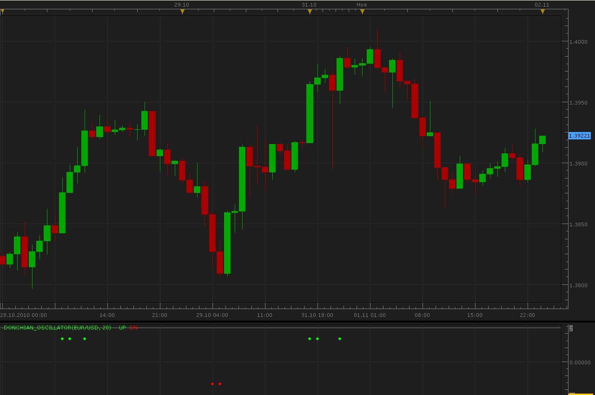

# Donchian Oscillator

> Source: https://fxcodebase.com/code/viewtopic.php?f=17&t=2570  
> Forum: 17 · Topic 2570 · 4 post(s)

---

## Donchian Oscillator

**Alexander.Gettinger** · Mon Nov 01, 2010 11:39 pm

If Close>max of previous [Period] Bars Oscillator=1
If Close<min of previous [Period] Bars Oscillator=-1

For current bar close price equivalent bid or ask.

 

MT4/MQ4 version
[viewtopic.php?f=38&t=64177](https://fxcodebase.com/code/viewtopic.php?f=38&t=64177)

The indicator was revised and updated

---

## Re: Donchian Oscillator

**Alexander.Gettinger** · Mon Nov 01, 2010 11:45 pm

Multitimeframe Donchian Heat Map.

 

For work this indicator must be installed Donchian Oscillator.

---

## Re: Donchian Oscillator

**sedraude** · Tue Nov 02, 2010 3:13 am

Hi Alexander

Thank you for your awesome indicator. Can you modify this indicator like this:

Middle Donchian Channel Period 1 > Middle Donchian Channel Period 2 = Blue/Up
Middle Donchian Channel Period 1 < Middle Donchian Channel Period 2 = Red/Down

NB. We use only middle Donchian Channel [(High+Low)/2].

Thank in advance

---

## Re: Donchian Oscillator

**Apprentice** · Mon Jan 30, 2017 7:43 am

Indicator was revised and updated.
