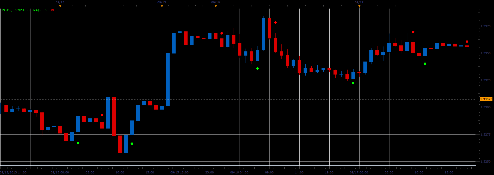

# Dots indicator

> Source: https://fxcodebase.com/code/viewtopic.php?f=17&t=59578  
> Forum: 17 · Topic 59578 · 3 post(s)

---

## Dots indicator

**Alexander.Gettinger** · Wed Sep 25, 2013 2:25 pm

Formulas:
UP - if MA(i)>MA(i-1) and MA(i-1)>MA(i-2),
DN - if MA(i)<MA(i-1) and MA(i-1)<MA(i-2).

The moving average is calculated for a Close price.

 

Download:

 [Dots.lua](files/89691/Dots.lua)

The indicator was revised and updated

---

## Re: Dots indicator

**Alexander.Gettinger** · Wed Sep 25, 2013 2:27 pm

MQL4 version of Dots indicator: [viewtopic.php?f=38&t=59579](https://fxcodebase.com/code/viewtopic.php?f=38&t=59579).

---

## Re: Dots indicator

**Apprentice** · Mon Jun 12, 2017 6:23 am

The indicator was revised and updated.
